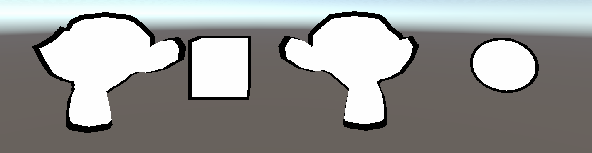

基于模板测试的外边框描边实现，和基于Cull 有明显的不同，它只会渲染外边框，不同于Cull 把猴头的眼眶、鼻子等有轮廓的地方都渲染出来了

基于模型扩展的外边框描边渲染方式，相比于基于法线扩展的方式，面对Cube 这种有“尖角”的模型，无论是基于模板测试，还是基于Cull 剔除，都有更好的效果

## 代码演示

```
Shader "Unlit/Outline_Stencil_Scale"
{
    Properties
    {
        _MainTex ("Texture", 2D) = "white" {}
        _Color("Color", Color) = (1, 1, 1, 1)
        _RefValue("Stencil RefValue", Int) = 1
        _OutlineScale("Outline Scale", Range(1, 2)) = 1.05
        _OutlineColor("Outline Color", Color) = (0, 0, 0, 1)
    }
    SubShader
    {
        Tags { "RenderType"="Opaque" "RenderPipeline" = "UniversalPipeline"}

        // 渲染固定颜色（缺少光照模型、贴图处理等）
        Pass
        {
            Stencil {
                Ref [_RefValue]
                Comp Always
                Pass Replace
            }

            Tags { "LightMode" = "SRPDefaultUnlit" }

            CGPROGRAM

            fixed4 _Color;

            #pragma vertex vert
            #pragma fragment frag

            float4 vert (float4 v : POSITION) : SV_POSITION 
            {       
                return UnityObjectToClipPos(v); 
            }

            float4 frag() : SV_Target 
            { 
                return _Color;
            }

            ENDCG
        }

        // 渲染偏大用于描边效果黑色模型
        Pass
        {
            Stencil {
                Ref [_RefValue]
                Comp NotEqual
            }

            Tags { "LightMode" = "UniversalForward" }

            CGPROGRAM

            #pragma vertex vert
            #pragma fragment frag
            #include "UnityCG.cginc"

            struct a2v
            {
                float4 vertex : POSITION;
            };

            struct v2f
            {
                float4 color : COLOR;
                float4 pos : SV_POSITION;
            };

            fixed _OutlineScale;
            fixed4 _OutlineColor;

            // 缩放矩阵
			float4x4 Scale()
			{
				return float4x4(_OutlineScale, 0.0, 0.0, 0.0,
					            0.0, _OutlineScale, 0.0, 0.0,
					            0.0, 0.0, _OutlineScale, 0.0,
					            0.0, 0.0, 0.0, 1.0);
			}

            v2f vert (a2v v) 
            {
                v2f o;

                // 在模型空间计算缩放，坐标和矩阵相乘
                v.vertex = mul(Scale(), v.vertex);

                //将坐标从模型空间转到裁切空间
                o.pos = UnityObjectToClipPos(v.vertex);
				o.color = float4(1, 0, 0, 1);

                return o;
            }

            float4 frag(v2f i) : SV_Target 
            { 
                return float4(_OutlineColor.rgb, 1);               
            }

            ENDCG
        }
    }

    FallBack "Diffuse"
}
```