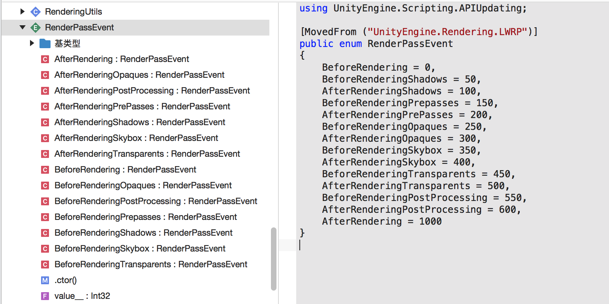
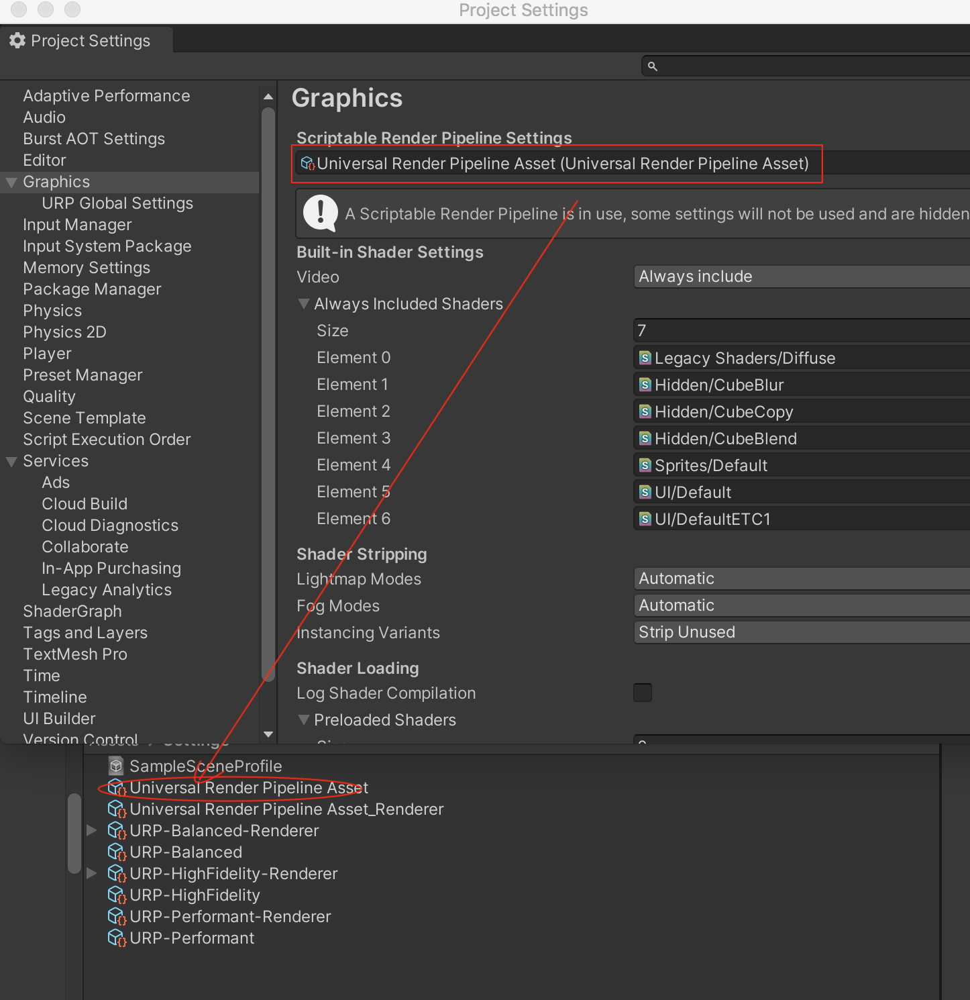
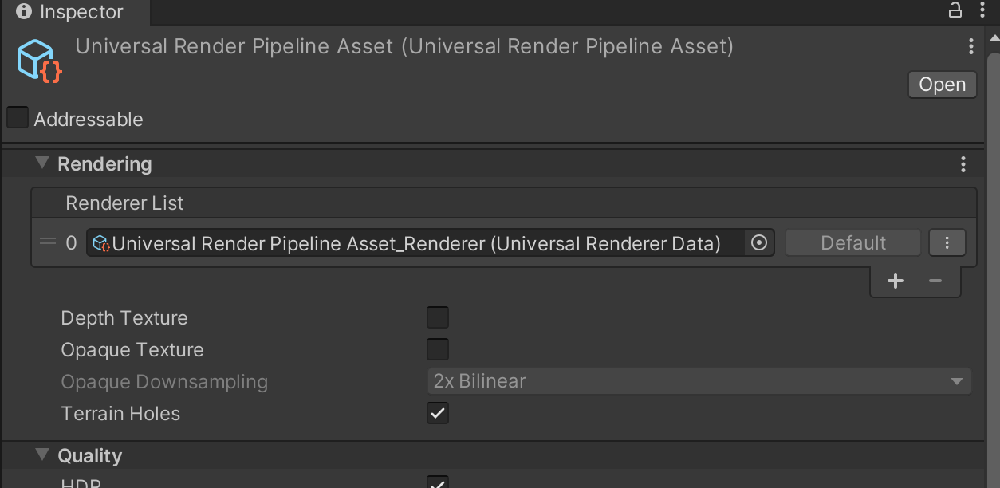
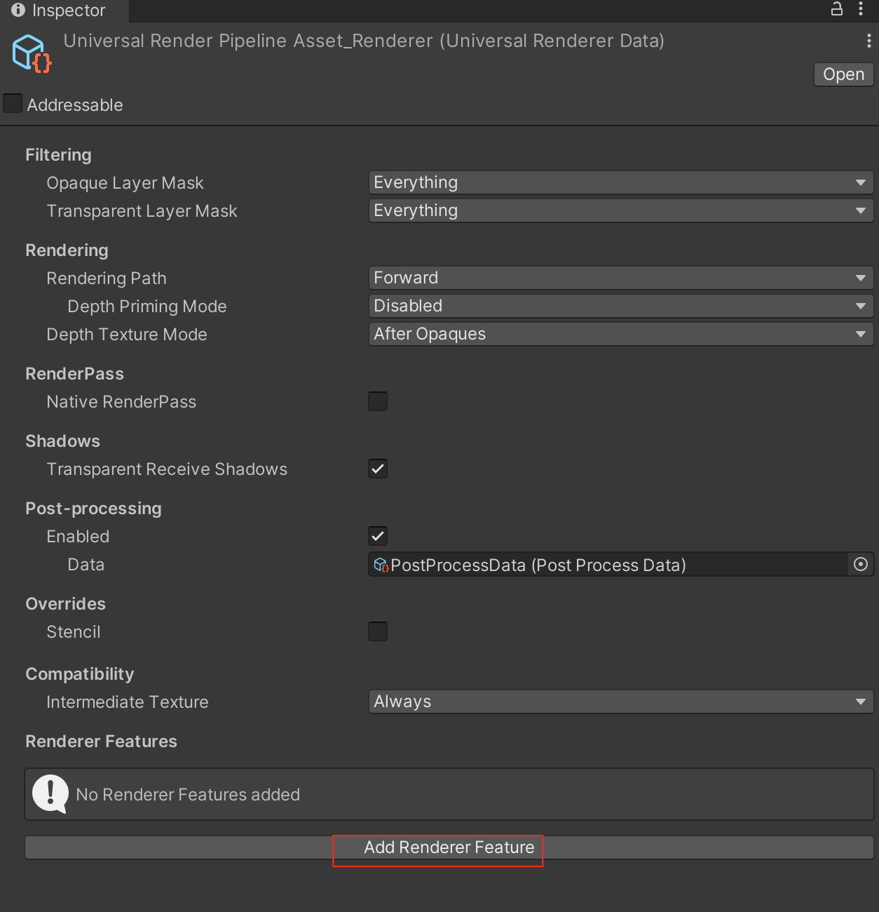
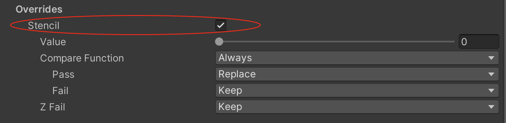

如上图，可以看到URP 管线的渲染顺序：阴影、PrePass、G Buffer、Deferred Lights（延迟光照）、不透明物体、天空盒子、透明物体、屏幕后处理

>G Buffer：就是把渲染表面Surface 所需的所有数据，写入Geometry Buffer，包括材质、位置、法线等

URP 的Render Feature 可以实现向URP Render 添加额外的渲染通道，支持进行Asset 资产配置来重写，从而可以自定义渲染的顺序、渲染的对象、材质等。比如描边这种事情，在不透明物体渲染完成

在【Project Settings】->【Graphics】 下面的Scriptable Render Pipeline Settings 找到Universal Render Pipeline Asset.asset

在Universal Render Pipeline Asset.asset 的Renderer List，找到Universal Render Pipeline Asset_Renderer.asset，当然可以在这里再添加一个Render 资产

点击Universal Render Pipeline Asset_Renderer.asset，可以【Add Renderer Feature】增加Render Object

可以增加的Render Feature 包括

* Render Objects（Experimental）
* Decal
* Screen Space Ambient Occlusion
* Screen Space Shadows
* Draw Fullscreen Feature

还可以通过勾选Overrides 来实现修改模板值

## 参考资料

* [URP系列教程 | 手把手教你如何用Renderer Feature](https://zhuanlan.zhihu.com/p/348500968)
* [URP使用RendererFeature实现体积光](https://zhuanlan.zhihu.com/p/481912143)
* [URP系列教程 | 如何使用Scriptable Renderer Feature来自定义后处理效果](https://zhuanlan.zhihu.com/p/373273390)
* [[笔记]URP-RenderFeature实践](https://www.bilibili.com/read/cv16055160/)
* [URP RenderFeature 基础入门教学](https://www.bilibili.com/read/cv22119596?jump_opus=1)
* [URP RenderFeature 基础入门教学](https://www.bilibili.com/video/BV1GX4y1X7f1/?vd_source=ed20940085ea48bad04b3ab28bd0ddfc)