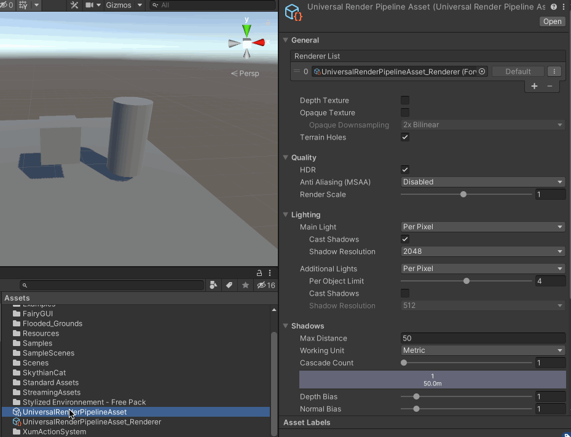
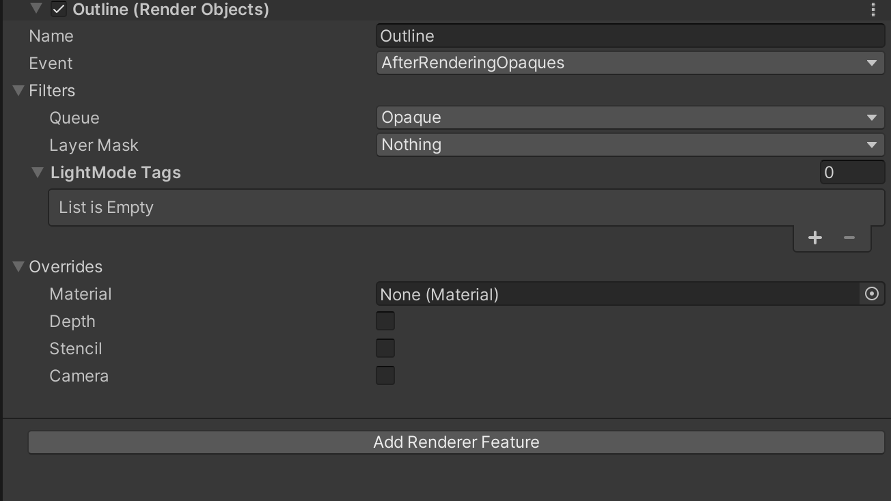
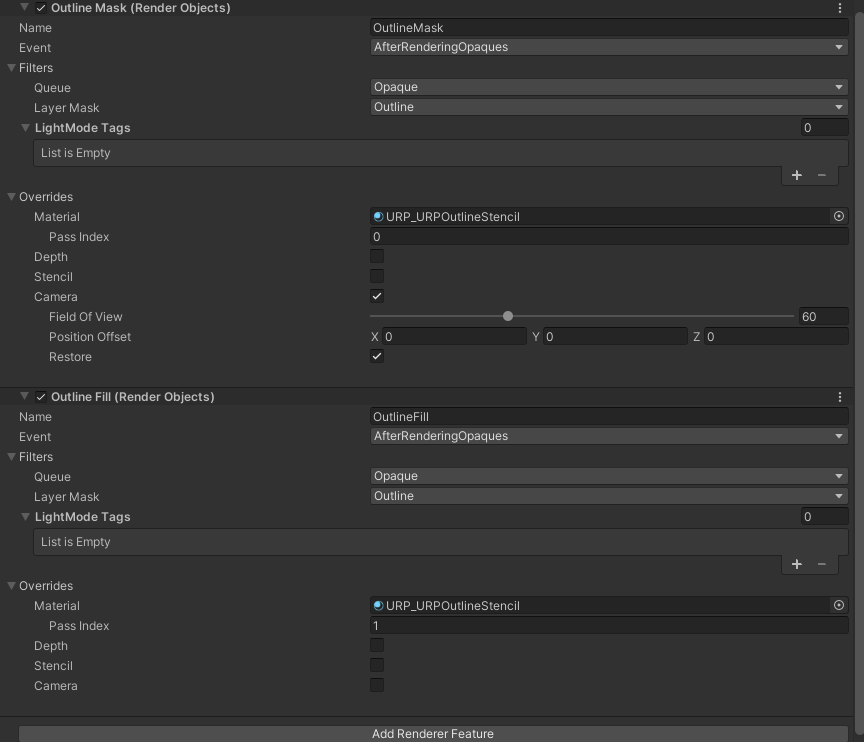
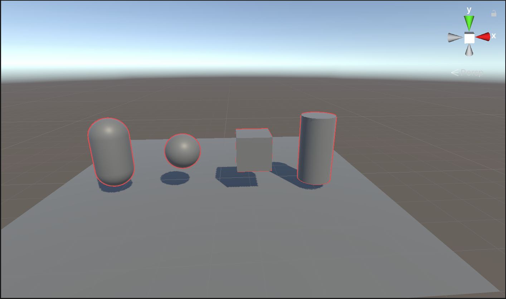

## URP Render Feature 介绍

URP管线中，有2种方式可以做Render Feature，一个是Render Object，另一种是Scriptable Renderer Feature，后者需要编写代码

本文先展示第一种Render Object 方式



比如创建了一个Outline 的Render Feature，它包含下面这些属性



* Name：Render Feature 的名字
* Event：当Unity 执行这个Renderer Feature 的时候，这个事件Event 在通用渲染管线中的执行顺序
* Filters：给这个Renderer Feature 去配置要渲染哪些对象；这里面有两个参数，一个是Queue，一个是Layer Mask
	* Queue：这个Feature选择渲染透明物体还是不透明物体；
	* Layer Mask：这个Feature选择渲染哪个图层中的对象；
* LightMode Tags：如果Shader 中的一个pass 具有LightMode Pass 这个标记的话，那Renderer Feature 仅处理LightMode Pass Tag 等于这个Shader Passes Name 的Pass
* Overrides：使用这个Renderer Feature 进行渲染时，这部分的设置可让我们配置某些属性进行重写覆盖
	* Material：渲染对象时，Unity会使用该材质替换分配给它的材质
	* Depth：选择此选项可以指定这个Renderer Feature如何影响或使用深度缓冲区。此选项包含以下各项
	* Stencil：选中此复选框后，Renderer将处理模板缓冲区值
	* Camera：可以Override 相机的相关属性，比如Field of View、Position Offset、Restore

## 基于Render Object 实现描边

下面开始基于Render Object 实现描边功能

在工程中增加一个Outline 层，然后在Filters 的Layer Mask 中选择Outline

编写用于描边的Shader

```
Shader "URP/URPOutlineStencil"
{
	Properties{
		_MainTex("MainTex",2D) = "white"{}
		_OutlineWidth("Outline Width", Range(0, 1.0)) = 1.0
		_OutlineColor("Outline Color", Color) = (1,1,1,1)
	}
	SubShader
	{
		Tags{
			"RenderPipeLine"="UniversalRenderPipeline"
		}

		HLSLINCLUDE

		#include "Packages/com.unity.render-pipelines.universal/ShaderLibrary/Core.hlsl"

		CBUFFER_START(UnityPerMaterial)
			float4 _MainTex_ST;
			float _OutlineWidth;
			float4 _OutlineColor;
		CBUFFER_END

		TEXTURE2D(_MainTex);
		SAMPLER(sampler_MainTex);

		struct a2v{
			float4 positionOS: POSITION;
			float3 normalOS: NORMAL;
		};
		struct v2f{
			float4 positionCS: SV_POSITION;
		};
		ENDHLSL

		Pass
		{
			ZWrite Off
			ZTest Always
			ColorMask 0
			Stencil
			{
				Ref 1
				Pass Replace
			}
		}
		Pass
		{
			ZWrite Off
			ZTest Always
			Cull Off
			Stencil
			{
				Ref 1
				Comp NotEqual
			}
			HLSLPROGRAM

			#pragma vertex vert
			#pragma fragment frag

			v2f vert(a2v v)
			{
				v2f o;
				float3 normalVS = mul((float3x3)UNITY_MATRIX_IT_MV, v.normalOS);
				normalVS.z = -0.5;
				float4 positionVS = mul(UNITY_MATRIX_MV,v.positionOS);

				positionVS.xyz += normalVS * _OutlineWidth;
				o.positionCS = mul(UNITY_MATRIX_P,positionVS);
				return o;
			}

			real4 frag(v2f i):SV_TARGET
			{
				return _OutlineColor;
			}
			ENDHLSL
		}
	}
}
```

之前的渲染顺序是不透明->天空盒->透明物体->后处理的绘制顺序。现在则改成是不透明->描个边->天空盒->透明物体->后处理这样的绘制顺序。所以Render Fearure 的Event 设置为AfterRenderingOpaques

基于上面的Shader 创建材质球，然后AddRenderFeature，增加两个RenderObject。第一个为OutlineMask，指定Pass Index 为0，来处理mask；第二个指定Pass Index 为1，用来法线外扩填充描边

最终Render Object 的配置如下所示



为场景中需要描边的物体设置Layer 为Outline，然后效果如下所示



>很明显，正方体存在硬边外描边断边的问题，参考[https://zhuanlan.zhihu.com/p/130921684](https://zhuanlan.zhihu.com/p/130921684) 的思路解决

参考资料

* [[笔记]URP-RenderFeature实践](https://www.bilibili.com/read/cv16055160/)
* [使用Render Feature做描边效果](https://zhuanlan.zhihu.com/p/64138757)
* [硬边外描边断边问题](https://zhuanlan.zhihu.com/p/130921684)
