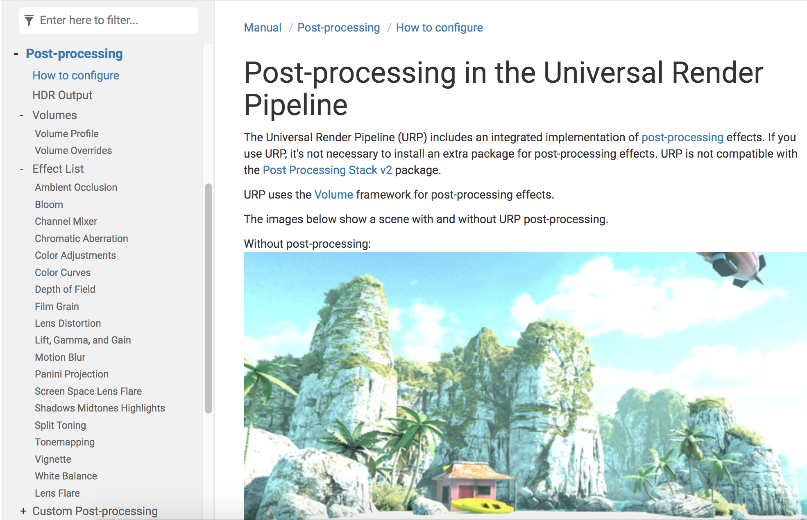
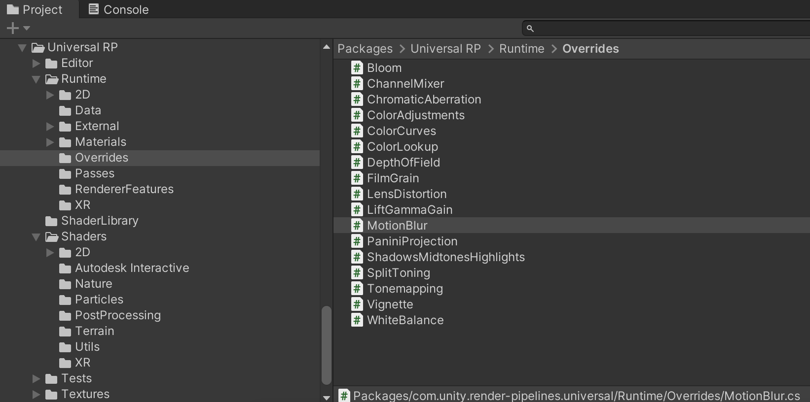
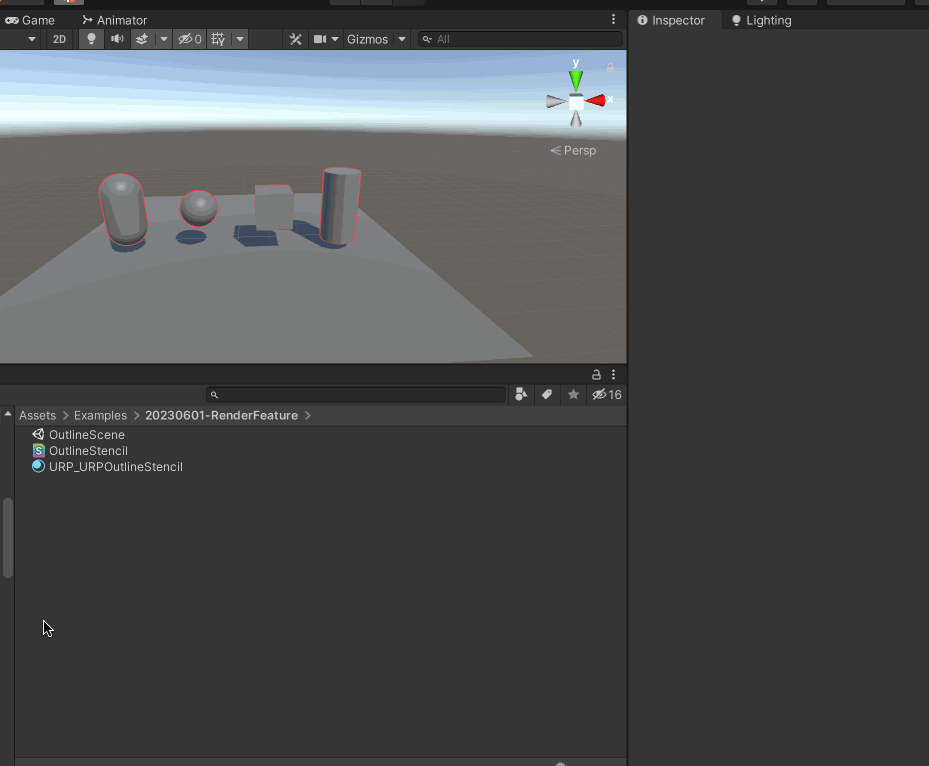

## URP 后处理效果

>[https://docs.unity3d.com/Packages/com.unity.render-pipelines.universal@16.0/manual/integration-with-post-processing.html](https://docs.unity3d.com/Packages/com.unity.render-pipelines.universal@16.0/manual/integration-with-post-processing.html)

URP 已经提供了很多的后处理效果，但是如果想得到更多的效果的话，这里就要去扩展URP 的Volume。这就要用到URP 提供的RendererFeature 的功能，可以通过这个自行添加一个Pass 管理自定义Volume



对应在Universal RP 的代码如下



比如Bloom 后处理效果的代码是这样的

```c#
using System;

namespace UnityEngine.Rendering.Universal
{
    [Serializable, VolumeComponentMenu("Post-processing/Bloom")]
    public sealed class Bloom : VolumeComponent, IPostProcessComponent
    {
        [Tooltip("Filters out pixels under this level of brightness. Value is in gamma-space.")]
        public MinFloatParameter threshold = new MinFloatParameter(0.9f, 0f);

        [Tooltip("Strength of the bloom filter.")]
        public MinFloatParameter intensity = new MinFloatParameter(0f, 0f);

        [Tooltip("Changes the extent of veiling effects.")]
        public ClampedFloatParameter scatter = new ClampedFloatParameter(0.7f, 0f, 1f);

        [Tooltip("Clamps pixels to control the bloom amount.")]
        public MinFloatParameter clamp = new MinFloatParameter(65472f, 0f);

        [Tooltip("Global tint of the bloom filter.")]
        public ColorParameter tint = new ColorParameter(Color.white, false, false, true);

        [Tooltip("Use bicubic sampling instead of bilinear sampling for the upsampling passes. This is slightly more expensive but helps getting smoother visuals.")]
        public BoolParameter highQualityFiltering = new BoolParameter(false);

        [Tooltip("The number of final iterations to skip in the effect processing sequence.")]
        public ClampedIntParameter skipIterations = new ClampedIntParameter(1, 0, 16);

        [Tooltip("Dirtiness texture to add smudges or dust to the bloom effect.")]
        public TextureParameter dirtTexture = new TextureParameter(null);

        [Tooltip("Amount of dirtiness.")]
        public MinFloatParameter dirtIntensity = new MinFloatParameter(0f, 0f);

        public bool IsActive() => intensity.value > 0f;

        public bool IsTileCompatible() => false;
    }
}
```

## 新建ScriptableRendererFeature

如下面的动图，可以创建ScriptableRendererFeature



可以看到默认生成的代码是这样的


CustomRenderPassFeature 继承自ScriptableRendererFeature；CustomRenderPass 类继承自 ScriptableRenderPass。CustomRenderPassFeature 负责把这个Render Pass 加到Render 中，Render Feature 可以在渲染管线的某个时间点增加一个或多个Pass

其中Create() 是用来初始化这个Feature 的资源。AddRenderPasses() 每一帧都会调用，在Renderer 中插入一个或多个ScriptableRenderPass，对这个Renderer 每个摄像机都设置一次

```c#
using UnityEngine;
using UnityEngine.Rendering;
using UnityEngine.Rendering.Universal;

public class CustomRenderPassFeature : ScriptableRendererFeature
{
    class CustomRenderPass : ScriptableRenderPass
    {
        // This method is called before executing the render pass.
        // It can be used to configure render targets and their clear state. Also to create temporary render target textures.
        // When empty this render pass will render to the active camera render target.
        // You should never call CommandBuffer.SetRenderTarget. Instead call <c>ConfigureTarget</c> and <c>ConfigureClear</c>.
        // The render pipeline will ensure target setup and clearing happens in a performant manner.
        public override void OnCameraSetup(CommandBuffer cmd, ref RenderingData renderingData)
        {
        }

        // Here you can implement the rendering logic.
        // Use <c>ScriptableRenderContext</c> to issue drawing commands or execute command buffers
        // https://docs.unity3d.com/ScriptReference/Rendering.ScriptableRenderContext.html
        // You don't have to call ScriptableRenderContext.submit, the render pipeline will call it at specific points in the pipeline.
        public override void Execute(ScriptableRenderContext context, ref RenderingData renderingData)
        {
        }

        // Cleanup any allocated resources that were created during the execution of this render pass.
        public override void OnCameraCleanup(CommandBuffer cmd)
        {
        }
    }

    CustomRenderPass m_ScriptablePass;

    /// <inheritdoc/>
    public override void Create()
    {
        m_ScriptablePass = new CustomRenderPass();

        // Configures where the render pass should be injected.
        m_ScriptablePass.renderPassEvent = RenderPassEvent.AfterRenderingOpaques;
    }

    // Here you can inject one or multiple render passes in the renderer.
    // This method is called when setting up the renderer once per-camera.
    public override void AddRenderPasses(ScriptableRenderer renderer, ref RenderingData renderingData)
    {
        renderer.EnqueuePass(m_ScriptablePass);
    }
}
```