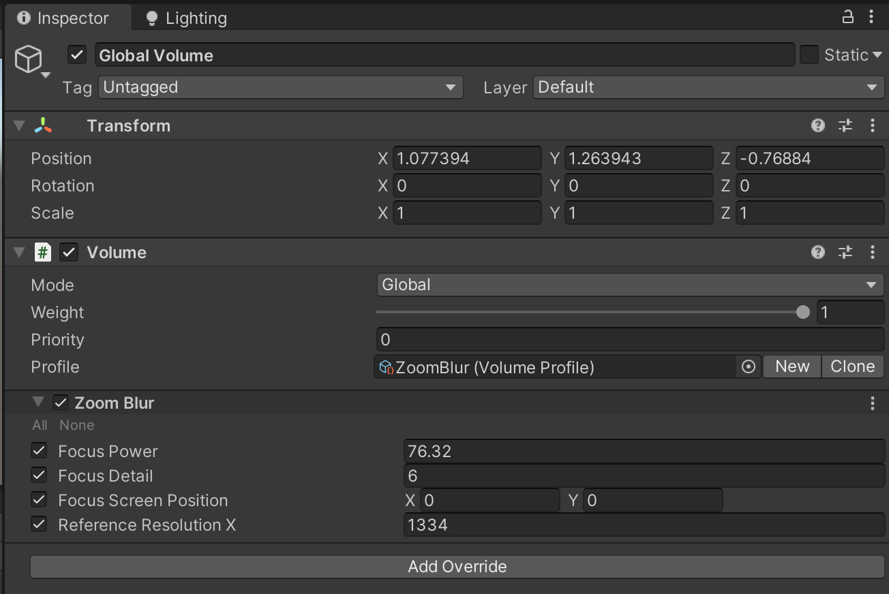
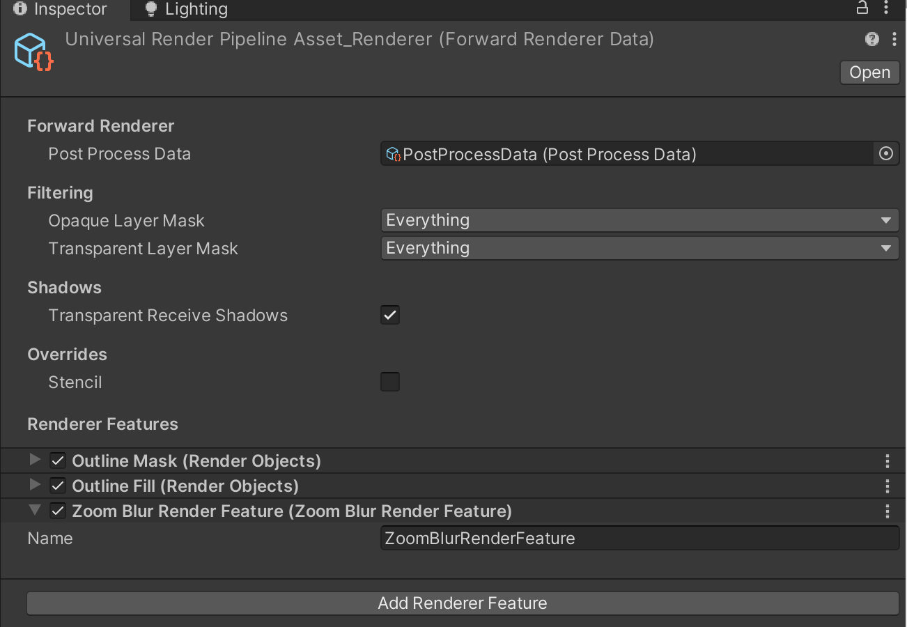
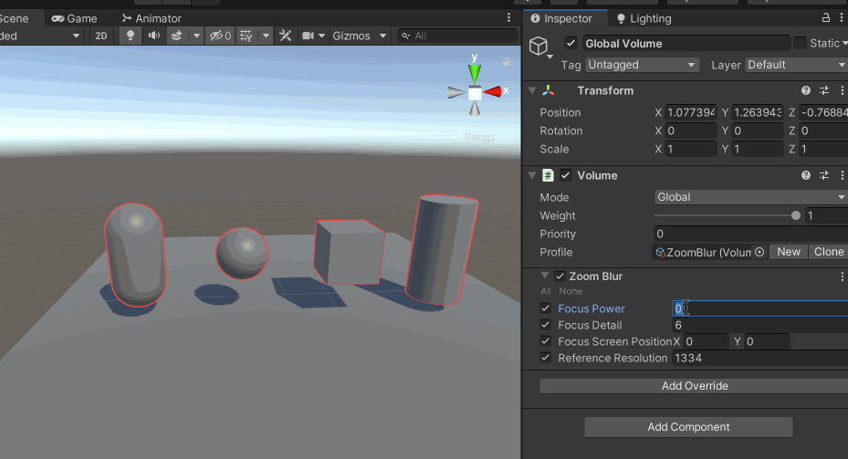

文章参考[URP系列教程：如何使用Scriptable Renderer Feature来自定义后处理效果](https://zhuanlan.zhihu.com/p/373273390)

编写ZoomBlur，要求继承自VolumeComponent, IPostProcessComponent

```c#
using System.Collections;
using System.Collections.Generic;
using UnityEngine;
using UnityEngine.Rendering;
using UnityEngine.Rendering.Universal;

public class ZoomBlur : VolumeComponent, IPostProcessComponent
{
    [Range(0f, 100f), Tooltip("加强效果使模糊效果更强")]
    public FloatParameter focusPower = new FloatParameter(0f);

    [Range(0, 10), Tooltip("值越大越好，但是负载将增加")]
    public IntParameter focusDetail = new IntParameter(5);

    [Tooltip("模糊中心坐标已经在屏幕的中心(0, 0")]
    public Vector2Parameter focusScreenPosition = new Vector2Parameter(Vector2.zero);

    [Tooltip("参考宽度分辨率")]
    public IntParameter referenceResolutionX = new IntParameter(1334);

    public bool IsActive()
    {
        return (focusPower.value > 0f);
    }

    public bool IsTileCompatible()
    {
        return false;
    }
}
```

实现ZoomBlurRenderFeature、ZoomBlurPass，以及对应的逻辑实现如下

```c#
using UnityEngine;
using UnityEngine.Rendering;
using UnityEngine.Rendering.Universal;

public class ZoomBlurRenderFeature : ScriptableRendererFeature
{
    class ZoomBlurPass : ScriptableRenderPass
    {
        // 后续需要在 CommandBufferPool 中去获取到它，这样的话我们在 FrameDebugger 中也可以找到它
        static readonly string k_RenderTag = "Render ZoomBlur Effects";


        static readonly int MainTexId = Shader.PropertyToID("_MainTex");
        static readonly int TempTargetId = Shader.PropertyToID("_TempTargetZoomBlur");
        static readonly int FocusPowerId = Shader.PropertyToID("_FocusPower");
        static readonly int FocusDetailId = Shader.PropertyToID("_FocusDetail");
        static readonly int FocusScreenPositionId = Shader.PropertyToID("_FocusScreenPosition");
        static readonly int ReferenceResolutionXId = Shader.PropertyToID("_ReferenceResolutionX");


        ZoomBlur zoomBlur;
        Material zoomBlurMaterial;
        RenderTargetIdentifier currentTarget;


        public ZoomBlurPass(RenderPassEvent evt)
        {
            renderPassEvent = evt;

            // 按照命名查找对应的Shader
            var shader = Shader.Find("PostEffect/ZoomBlur");

            if (null == shader)
            {
                Debug.LogError("PostEffect/ZoomBlur Shader not found.");
                return;
            }

            // 创建材质
            zoomBlurMaterial = CoreUtils.CreateEngineMaterial(shader);
        }

        public void Setup(in RenderTargetIdentifier currentTarget)
        {
            this.currentTarget = currentTarget;
        }

        // This method is called before executing the render pass.
        // It can be used to configure render targets and their clear state. Also to create temporary render target textures.
        // When empty this render pass will render to the active camera render target.
        // You should never call CommandBuffer.SetRenderTarget. Instead call <c>ConfigureTarget</c> and <c>ConfigureClear</c>.
        // The render pipeline will ensure target setup and clearing happens in a performant manner.
        public override void OnCameraSetup(CommandBuffer cmd, ref RenderingData renderingData)
        {
        }

        // Execute() 核心方法实现执行规则，也就是做具体的后处理
        // Here you can implement the rendering logic.
        // Use <c>ScriptableRenderContext</c> to issue drawing commands or execute command buffers
        // https://docs.unity3d.com/ScriptReference/Rendering.ScriptableRenderContext.html
        // You don't have to call ScriptableRenderContext.submit, the render pipeline will call it at specific points in the pipeline.
        public override void Execute(ScriptableRenderContext context, ref RenderingData renderingData)
        {
            // 检查是否创建材质
            if (null == zoomBlurMaterial)
            {
                Debug.LogError("PostEffect/ZoomBlur Material not found.");
                return;
            }

            // 后处理是否生效
            if (!renderingData.cameraData.postProcessEnabled) return;

            // 使用 VolumeManager.instance.stack 的 GetComponent 方法来获得自定义 Volume 类的实例；并获取里面的属性变量来做具体的后处理
            var stack = VolumeManager.instance.stack;
            zoomBlur = stack.GetComponent<ZoomBlur>();

            if (null == zoomBlur) return;
            if (!zoomBlur.IsActive()) return;

            // 从命令缓存池中获取一个gl命令缓存，CommandBuffer主要用于收集一系列gl指令，然后之后执行
            var cmd = CommandBufferPool.Get(k_RenderTag);

            // 在Render中实现渲染逻辑
            Render(cmd, ref renderingData);

            // 执行和回收
            context.ExecuteCommandBuffer(cmd);
            CommandBufferPool.Release(cmd);
        }

        // 在Render中实现渲染逻辑，这里用到了两次 Blit
        // 另外使用camera buffer的CommandBuffer.GetTemporaryRT方法来申请这样一张texture
        // 传入着色器属性 ID 以及与相机像素尺寸相匹配的纹理宽高
        void Render(CommandBuffer cmd, ref RenderingData renderingData)
        {
            ref var cameraData = ref renderingData.cameraData;
            var source = currentTarget;
            int destination = TempTargetId;

            var w = cameraData.camera.scaledPixelWidth;
            var h = cameraData.camera.scaledPixelHeight;

            // 设置
            zoomBlurMaterial.SetFloat(FocusPowerId, zoomBlur.focusPower.value);
            zoomBlurMaterial.SetInt(FocusDetailId, zoomBlur.focusDetail.value);
            zoomBlurMaterial.SetVector(FocusScreenPositionId, zoomBlur.focusScreenPosition.value);
            zoomBlurMaterial.SetInt(ReferenceResolutionXId, zoomBlur.referenceResolutionX.value);

            // shader 的第一个passs
            int shaderPass = 0;

            cmd.SetGlobalTexture(MainTexId, source);

            // 在清理Render Target前，如果存在后处理栈就需要申请一张临时的render texture
            // 使用camera buffer的CommandBuffer/GetTemporaryRT 方法来申请这样一张texture
            // 传入着色器属性ID以及与相机像素尺寸相匹配的纹理宽高
            // FilterMode、RenderTextureFormat（可以试着修改后看一下效果）
            cmd.GetTemporaryRT(destination, w, h, 0, FilterMode.Point, RenderTextureFormat.Default);
            cmd.Blit(source, destination);
            cmd.Blit(destination, source, zoomBlurMaterial, shaderPass);
        }

        // Cleanup any allocated resources that were created during the execution of this render pass.
        public override void OnCameraCleanup(CommandBuffer cmd)
        {
        }
    }

    ZoomBlurPass m_ScriptablePass;

    /// <inheritdoc/>
    public override void Create()
    {
        // 指定在后处理渲染之前执行
        m_ScriptablePass = new ZoomBlurPass(RenderPassEvent.BeforeRenderingPostProcessing);

    }

    // AddRenderPasses：Render中插入一个或多个ScriptableRenderPass
    // Here you can inject one or multiple render passes in the renderer.
    // This method is called when setting up the renderer once per-camera.
    public override void AddRenderPasses(ScriptableRenderer renderer, ref RenderingData renderingData)
    {
        m_ScriptablePass.Setup(renderer.cameraColorTarget);

        // 通过 renderer.EnqueuePass 将 Pass 添加到 Render 中
        renderer.EnqueuePass(m_ScriptablePass);
    }
}
```

编写Shader 着色器脚本

```
Shader "PostEffect/ZoomBlur"
{
    Properties
    {
        _MainTex ("Texture", 2D) = "white" {}
    }
    SubShader
    {
        Cull Off
        ZWrite Off
        ZTest Always
        Tags { "RenderPipeline" = "UniversalPipeline" }

        Pass
        {
            CGPROGRAM
                #pragma vertex Vert
                #pragma fragment Frag

                sampler2D _MainTex;
                float2 _FocusScreenPosition;
                float _FocusPower;
                int _FocusDetail;
                int _ReferenceResolutionX;

                struct appdata
                {
                    float4 vertex: POSITION;
                    float2 uv: TEXCOORD0;
                };

                struct v2f
                {
                    float2 uv: TEXCOORD0;
                    float4 vertex: SV_POSITION;
                };

                v2f Vert(appdata v)
                {
                    v2f o;
                    o.vertex = UnityObjectToClipPos(v.vertex);
                    o.uv = v.uv;
                    return o;
                }

                float4 Frag(v2f i): SV_Target
                {
                    float2 screenPoint = _FocusScreenPosition + _ScreenParams.xy/2;
                    float2 uv = i.uv;
                    float2 mousePos = (screenPoint.xy / _ScreenParams.xy);
                    float2 focus = uv - mousePos;
                    fixed aspectX = _ScreenParams.x / _ReferenceResolutionX;
                    float4 outColor = float4(0, 0, 0, 1);
                    for (int i = 0; i < _FocusDetail; i++) {
                        float power = 1.0 - _FocusPower * (1.0 / _ScreenParams.x * aspectX) * float(i);
                        outColor.rgb += tex2D(_MainTex, focus * power + mousePos).rgb;
                    }
                    outColor.rgb *= 1.0 / float(_FocusDetail);
                    return outColor;
                }
            ENDCG
        }
    }
}
```

在场景中，右键->Volume->Global Volume，然后参考下面的设置

1. Profile，点击【New】新增
2. Add Override，增加Zoom Blur



在UniversalRenderPipelineAsset_Renderer 中Add Render Feature，增加ZoomBlurRenderFeature



然后运行效果如下


