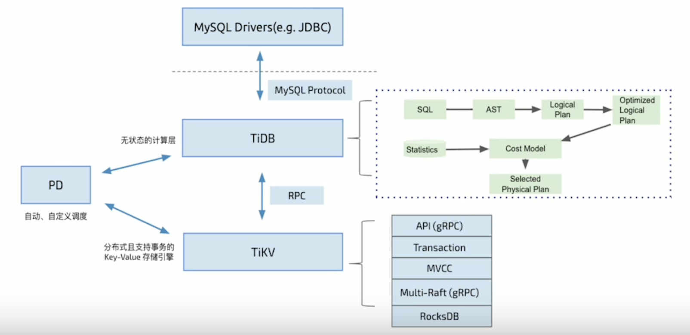

TiDB 是一款国产的、开源的分布式数据库，对应的github 地址为：[https://github.com/pingcap/tidb](https://github.com/pingcap/tidb)

其官方文档的地址为：[https://docs.pingcap.com/zh/](https://docs.pingcap.com/zh/)

## TiDB 架构

TiDB 是PingCAP 公司自主设计、研发的开源分布式关系型数据库，是一款同时支持在线事务处理与在线分析处理的融合型分布式数据库产品，具备水平扩容或缩容、金融级高可用、事实HTAP、云原生的分布式数据库，兼容MySQL 5.7 协议和MySQL 生态

TiDB 适用于高可用、强一致性要求较高、数据规模较大等各种应用场景

TiDB 采用高度分层架构，实现计算与存储的分离

第一层是支持标准SQL 的计算引擎，即TiDB-Server，TiDB-Server 以MySQL 5.7 为主，在逐步兼容MySQL 8.0，包括对MySQL 的语法语义、方言、DDL 等

第二层是分布式存储引擎TiKV，TiDB-Server 本身并不存储数据，只是进行计算，实际的数据存储在存储层，即TiKV

第三层是Placement Driver，简称PD，负责元信息管理和调度的引擎。负责集群元信息的管理，包括分片的分布、拓扑结构等；负责分布式事务ID 的分配，可以简单理解为一个全局唯一的序列号授时的服务；调度中心，默认每个TiKV 节点会在一个周期内定向发送相关元信息给PD，包括所在节点的分片数量、Leader 数量、最近一份周期内读写吞吐量等，PD 接收新数据后进行计算，然后发出再平衡调度，比如将部分Region 从Region 较多的节点调度到较少的节点

PD 是整个集群的大脑，为了保证集群的高可用，PD 也至少是三个节点，通过Raft 进行副本复制

## TiDB 五大核心特效

[https://docs.pingcap.com/zh/tidb/stable/overview](https://docs.pingcap.com/zh/tidb/stable/overview)

>一键水平扩容或者缩容

得益于TiDB 存储计算分离的架构的设计，可按需对计算、存储分别进行在线扩容或者缩容，扩容或者缩容过程中对应用运维人员透明

>金融级高可用

数据采用多副本存储，数据副本通过Multi-Raft 协议同步事务日志，多数派写入成功事务才能提交，确保数据强一致性且少数副本发生故障时不影响数据的可用性。可按需配置副本地理位置、副本数量等策略满足不同容灾级别的要求

>实时 HTAP

提供行存储引擎TiKV、列存储引擎TiFlash 两款存储引擎，TiFlash 通过Multi-Raft Learner 协议实时从TiKV 复制数据，确保行存储引擎TiKV 和列存储引擎TiFlash 之间的数据强一致。TiKV、TiFlash 可按需部署在不同的机器，解决HTAP 资源隔离的问题

>云原生的分布式数据库

专为云而设计的分布式数据库，通过TiDB Operator 可在公有云、私有云、混合云中实现部署工具化、自动化

>兼容MySQL 5.7 协议和MySQL 生态

兼容MySQL 5.7 协议、MySQL 常用的功能、MySQL 生态，应用无需或者修改少量代码即可从MySQL 迁移到TiDB。提供丰富的数据迁移工具帮助应用便捷完成数据迁移

## TiDB 四大核心应用场景

[https://docs.pingcap.com/zh/tidb/stable/overview](https://docs.pingcap.com/zh/tidb/stable/overview)

>对数据一致性及高可靠、系统高可用、可扩展性、容灾要求较高的金融行业属性的场景

众所周知，金融行业对数据一致性及高可靠、系统高可用、可扩展性、容灾要求较高。传统的解决方案是同城两个机房提供服务、异地一个机房提供数据容灾能力但不提供服务，此解决方案存在以下缺点：资源利用率低、维护成本高、RTO (Recovery Time Objective) 及RPO (Recovery Point Objective) 无法真实达到企业所期望的值。TiDB 采用多副本 + Multi-Raft 协议的方式将数据调度到不同的机房、机架、机器，当部分机器出现故障时系统可自动进行切换，确保系统的RTO <= 30s 及RPO = 0

>对存储容量、可扩展性、并发要求较高的海量数据及高并发的OLTP 场景

随着业务的高速发展，数据呈现爆炸性的增长，传统的单机数据库无法满足因数据爆炸性的增长对数据库的容量要求，可行方案是采用分库分表的中间件产品或者NewSQL 数据库替代、采用高端的存储设备等，其中性价比最大的是NewSQL 数据库，例如：TiDB。TiDB 采用计算、存储分离的架构，可对计算、存储分别进行扩容和缩容，计算最大支持512 节点，每个节点最大支持1000 并发，集群容量最大支持PB 级别

>Real-time HTAP 场景

随着5G、物联网、人工智能的高速发展，企业所生产的数据会越来越多，其规模可能达到数百TB 甚至 PB 级别，传统的解决方案是通过OLTP 型数据库处理在线联机交易业务，通过ETL 工具将数据同步到OLAP 型数据库进行数据分析，这种处理方案存在存储成本高、实时性差等多方面的问题。TiDB 在4.0 版本中引入列存储引擎TiFlash 结合行存储引擎TiKV 构建真正的HTAP 数据库，在增加少量存储成本的情况下，可以在同一个系统中做联机交易处理、实时数据分析，极大地节省企业的成本

>数据汇聚、二次加工处理的场景

当前绝大部分企业的业务数据都分散在不同的系统中，没有一个统一的汇总，随着业务的发展，企业的决策层需要了解整个公司的业务状况以便及时做出决策，故需要将分散在各个系统的数据汇聚在同一个系统并进行二次加工处理生成T+0 或T+1 的报表。传统常见的解决方案是采用ETL + Hadoop 来完成，但Hadoop 体系太复杂，运维、存储成本太高无法满足用户的需求。与Hadoop 相比，TiDB 就简单得多，业务通过ETL 工具或者TiDB 的同步工具将数据同步到TiDB，在TiDB 中可通过SQL 直接生成报表
