模型资源来自：[《原神pmx 格式模型怎么导入Unity？》](http://www.xumenger.com/unity-blender-pmx-20221127/)

Magica Cloth 的官网地址：[https://magicasoft.jp/en/magica-cloth-2/](https://magicasoft.jp/en/magica-cloth-2/)

B 站有相关的介绍视频：[【插件介绍】使用 Unity Magica Cloth一站式解决头发、衣服和胸部的物理模拟](https://www.bilibili.com/video/BV1m3411L75p)、[Unity Magica Cloth布料系统插件使用教程](https://www.bilibili.com/video/BV1uY4y1C7TU)

Magica Cloth 是基于Unity Job System 和Burst 编译器进行快速布料模拟，可以实现由骨骼（变形）驱动的BoneCloth 和由网格驱动的MeshCloth

## 环境搭建

Magica Cloth 是基于Unity Job System 和Burst 编译器进行快速布料模拟，所以需要在Package Manager 中安装两个基础的包：Burst、Jobs（Jobs 从2021 之后改名为Collection 了）

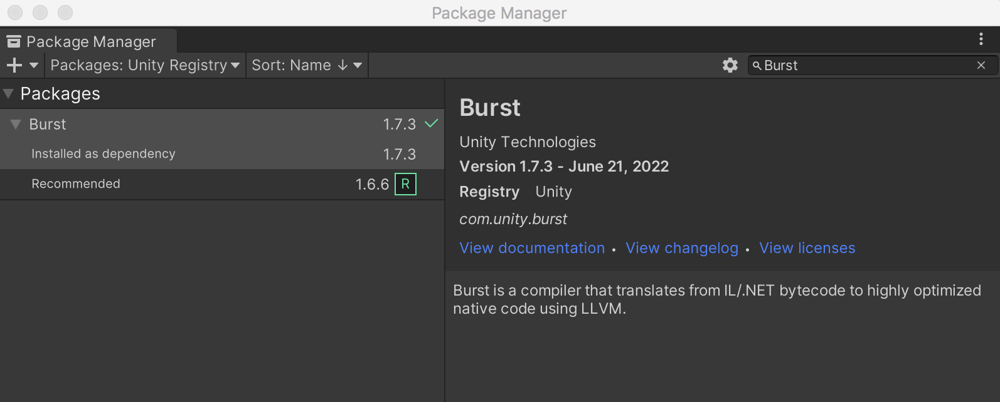

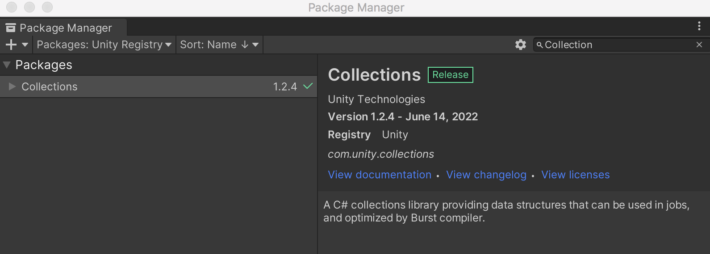

否则可能出现这样的报错

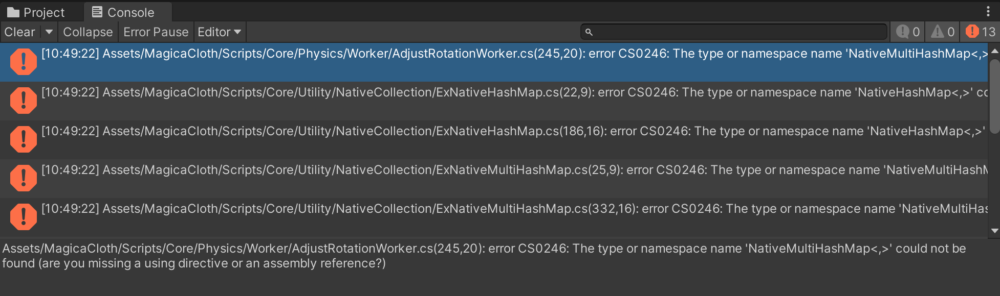

## BoneCloth 骨骼驱动的布料模拟

>带骨骼的模型使用BoneCloth，不带骨骼的MeshCloth，MeshCloth 更加耗费性能！建议使用BoneCloth，当然使用BoneCloth 的话就需要美术人员为衣服、头发做好骨骼绑定！

本次演示使用的模型的骨骼如下所示（头发和衣服上都是有骨骼的）：

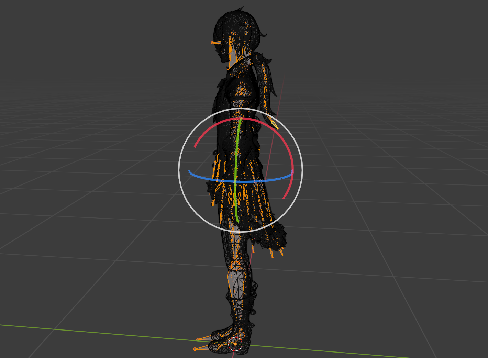

先处理头发部分，找到头发对应的骨骼，对于这个模型是Bz\_0\_1，在这里增加一个MagicaBoneCloth 组件，效果是这样的

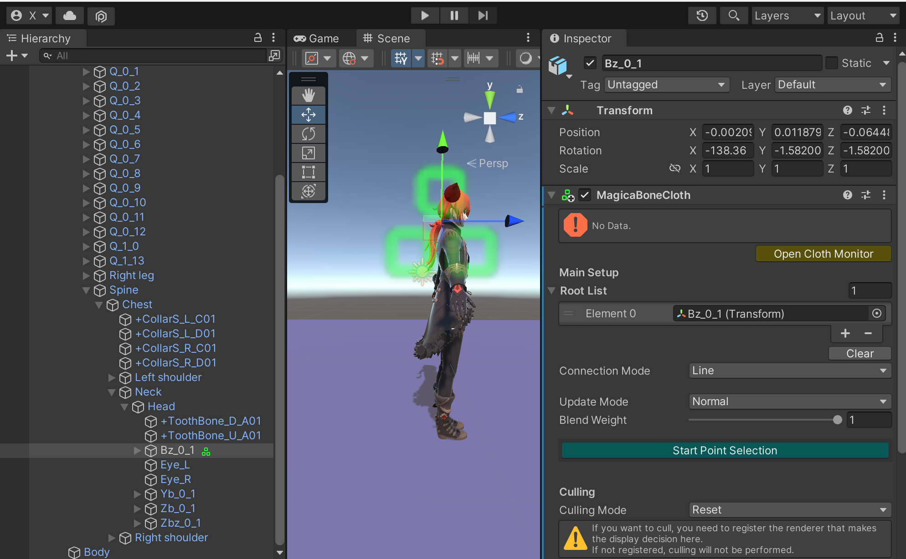

然后进行各种设置，增加RootList，Bz\_0\_1 作为头发的根结点添加到这里面，这个是作为一个布料或者头发的根结点，否则无法正确运行！

点击【Start Point Selection】，可以看到以Bz\_0\_1 为根结点的所有骨骼，根结点是红色的，其他的后续节点是绿色的

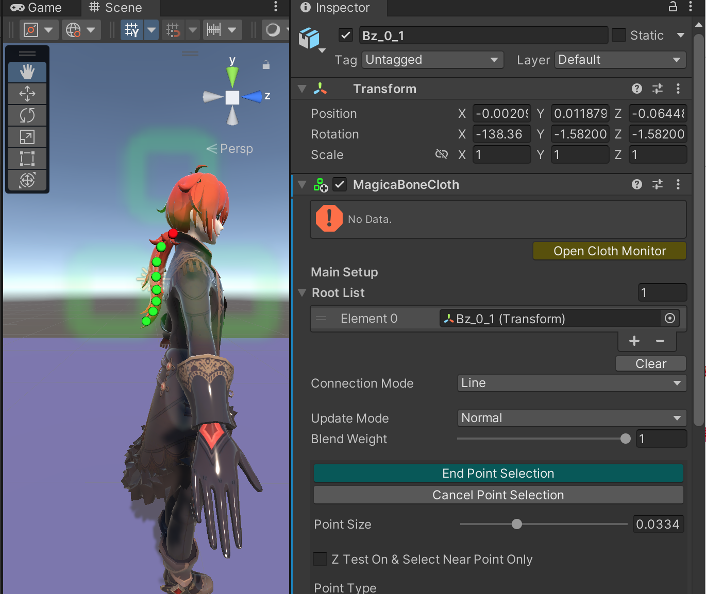

然后来到【Parameters】里面的【Preset】，选择【LongHair】

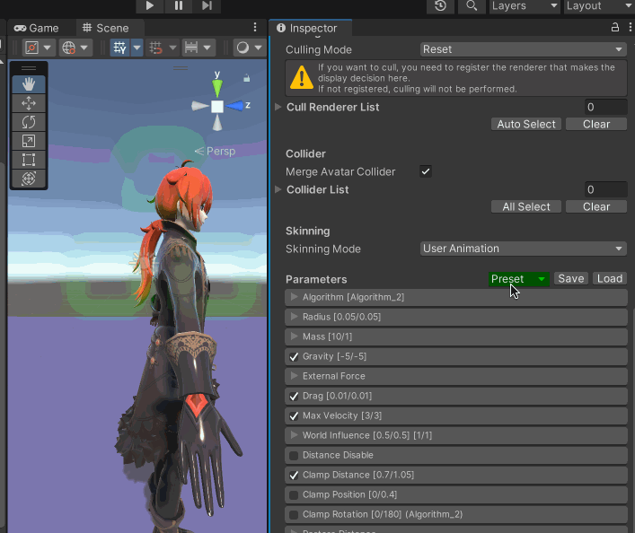

然后点击【Create】，运行效果如下

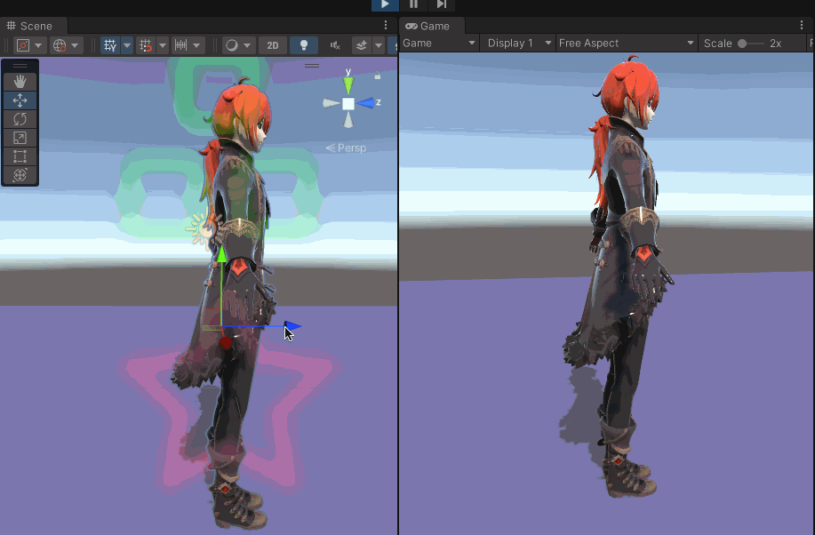

可以看到飘柔的头发效果，但是很明显头发穿模了，下面讲一下怎么解决

## 碰撞体

Magica Cloth 布料模拟系统里面是有一个碰撞器组件的，可以用来避免出现穿模问题，比如这里头发穿到模型的身体里了

对应找到穿模所在地方的骨骼，针对我们的模型就是Chest，为其增加MagicaCapsuleCollider 组件，然后调整位置、旋转、大小，变成如下的效果

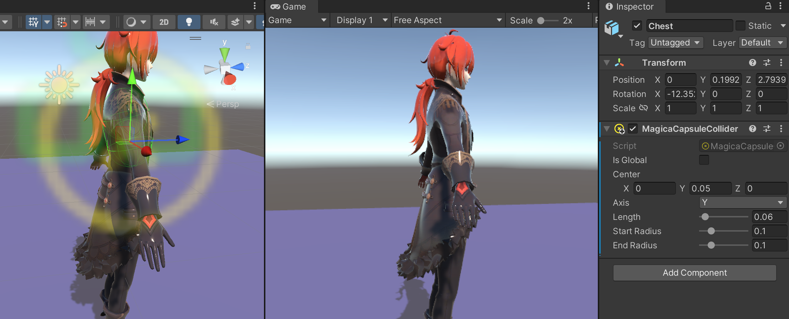

回到Bz\_0\_1 骨骼上找到添加的MagicaBoneCloth 组件，在其【Collider List】属性中添加刚才增加的碰撞器组件

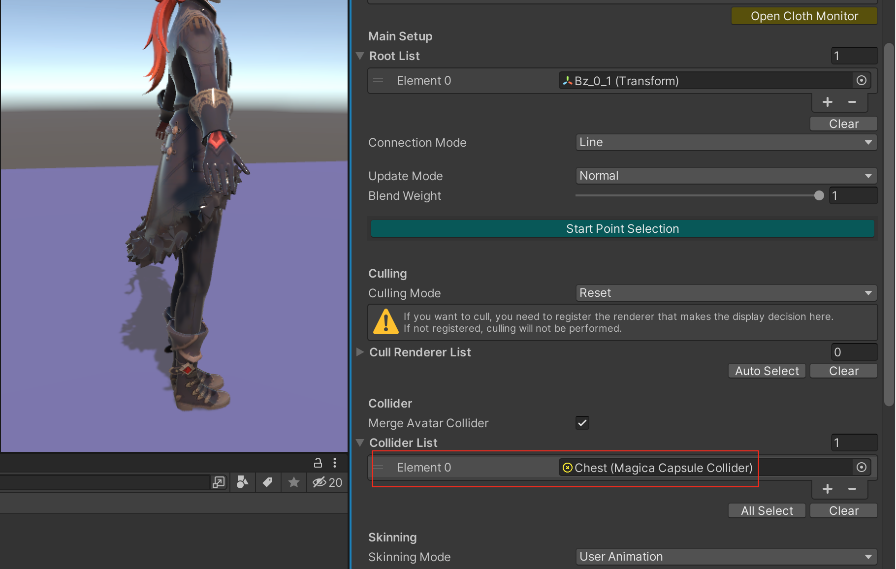

再次运行，效果如下所示，不再出现穿模的现象

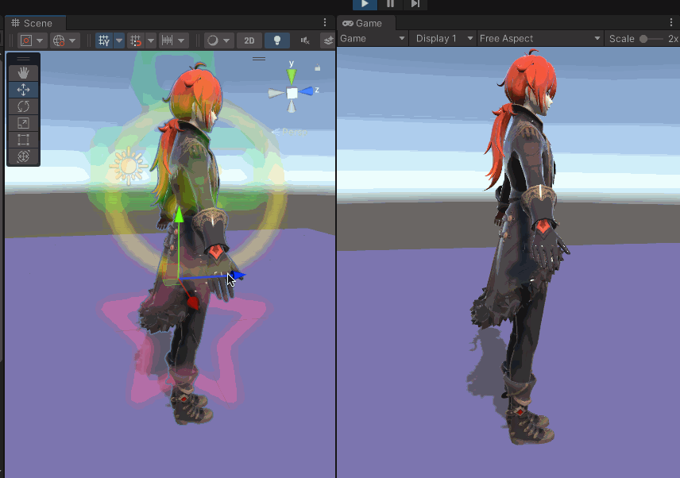

另外除了马尾辫，这个模型还有刘海部分也是有骨骼的，可以做头发模拟效果，一样的流程，这里不做展示

## 衣服部分布料模拟

以上实现了基于BoneCloth 的布料模拟，也展示了头发的实现，下面看一下衣服的实现

首先找到衣服的其中一个骨骼，这里是Q\_0\_1，为其增加MagicaBoneCloth 组件，在Root List 中增加所有的衣服根骨骼（具体可以通过Blender 查看），这里是Q\_0\_1、Q\_0\_2、Q\_0\_3……

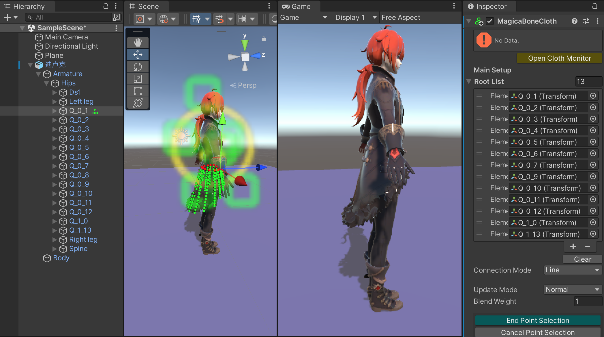

然后来到【Parameters】里面的【Preset】，选择【Skirt】

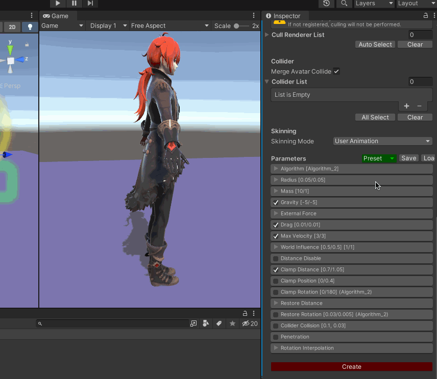

考虑到衣服可能和大腿穿模，所以找到Left leg、Right leg 两个骨骼，为其增加MagicaCapsuleCollider 组件

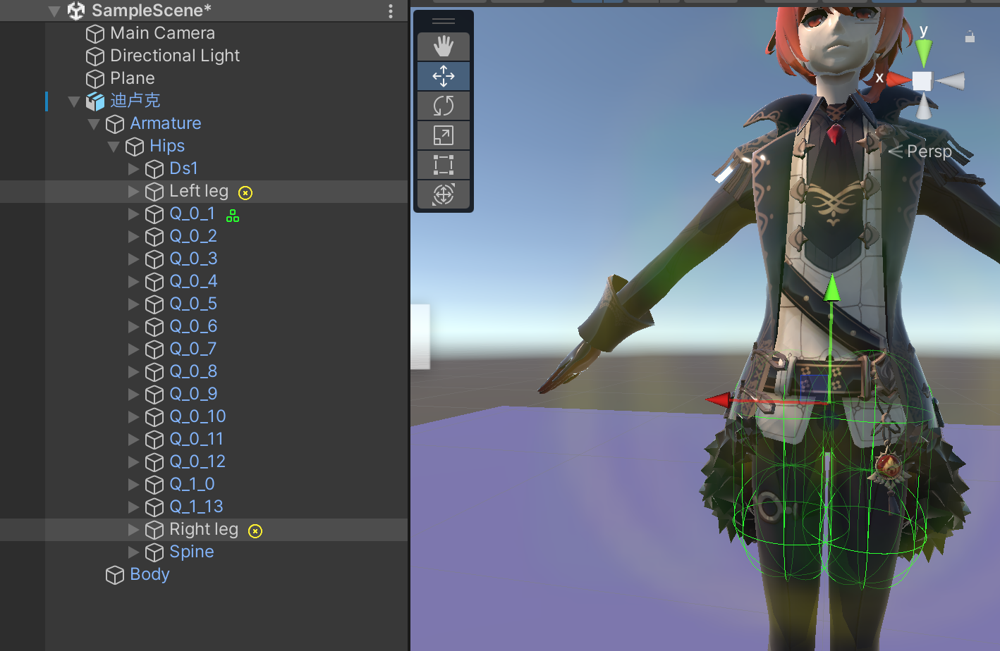

再回到Q\_0\_1 的MagicaBoneCloth 组件，Collider List 属性添加刚才为左右腿增加的MagicaCapsuleCollider 组件

运行效果如下

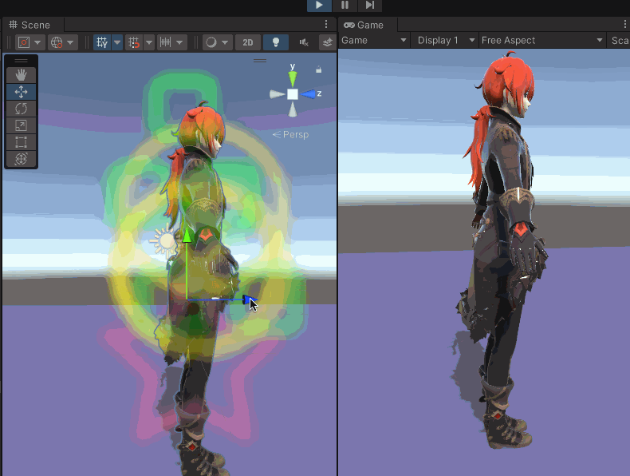

但是感觉衣服的效果并不是很好，这里我是在【Parameters】里面直接选择的【Skirt】预设值，如果感觉效果不好，可以试着选择其他Skirt 相关的预设值，或者尝试去修改其他的Parameters

>[https://magicasoft.jp/en/magica-cloth-paramaters-2/](https://magicasoft.jp/en/magica-cloth-paramaters-2/)

也可能是因为碰撞体的设置不合理导致的，比如上面的运行效果可以发现屁股处的衣服鼓起来了，就是因为碰撞体设置得太大导致的，所以碰撞体的位置、大小、旋转等的设置要慢慢地调整！

## 遗留问题

Magica Cloth 插件的性能问题怎么样？

在661 x 423 的屏幕设置下，运行的帧率在70 FPS 左右

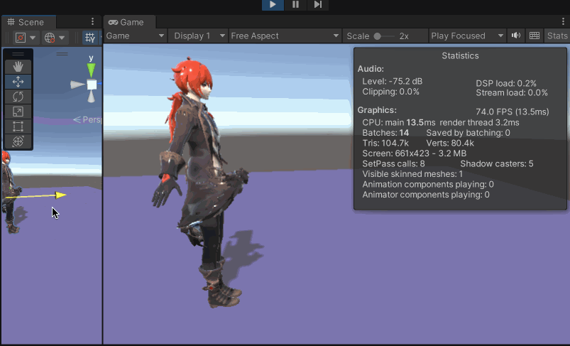

另外推荐[《Magica Cloth》](https://blog.csdn.net/uwa4d/article/details/127788816)、[《Unity 布料模拟插件Magica Cloth》](https://blog.csdn.net/sinat_34014668/article/details/128174513)
