上一篇的文章中基于Bone Cloth 实现布料模拟，这种方案是最省性能的，但是需要你有美术人员按照约定的标准输出带骨骼的模型，如果你没有很好的美术，那怎么办？可以使用MeshCloth

>However, since processing such as control of each vertex of the mesh and writing back the result to the skinning mesh occurs, the calculation load increases accordingly

具体的使用，参考[https://magicasoft.jp/en/magicaclothmeshclothstart-2/](https://magicasoft.jp/en/magicaclothmeshclothstart-2/)

需要指明的一点就是，如果想要使用MeshCloth，也是需要对模型规范有一定要求的，比如需要对衣服做模拟，那么在模型中衣服是要有单独的Skinned Mesh Renderer 组件的

比如下面的模型，整个模型是完整的一个，头发、衣服是没有分开的，那么使用MeshCloth 就会比较麻烦

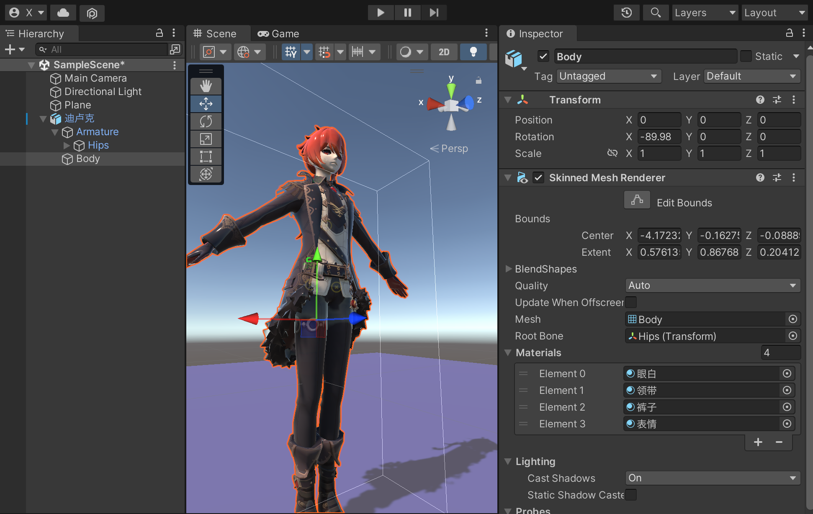

所以不管是BoneCloth，还是MeshCloth，都需要和美术人员约定好模型、骨骼的资产规范的

## MeshCloth 使用演示

基于MeshCloth 实现头发的布料模拟效果

首先找到fbx 模型，修改其Read/Write，设置为Enable，这个必须要勾选，MeshCloth 才能生效

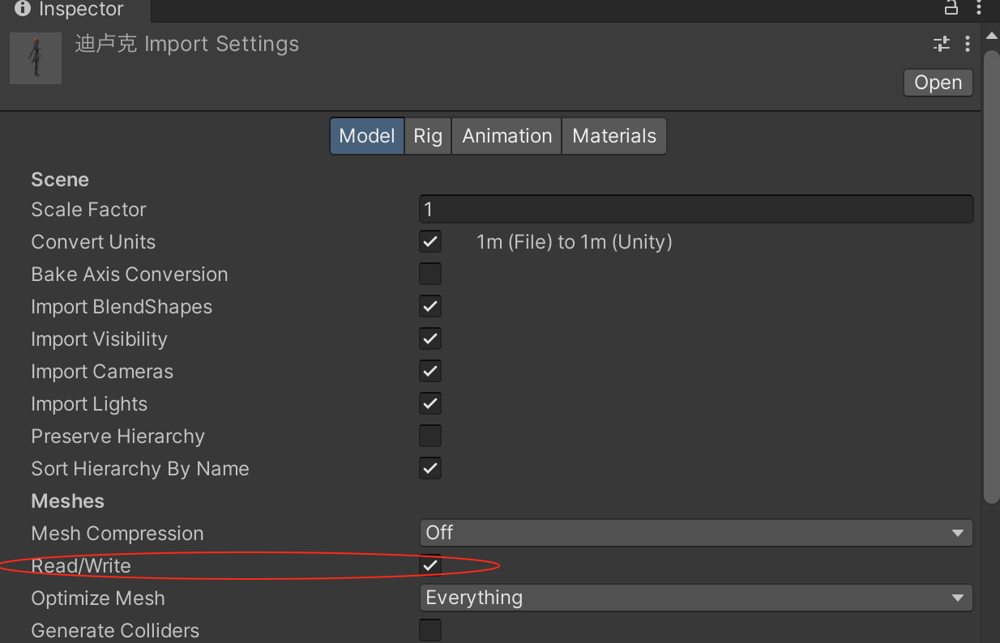

然后为模型中带有Skinned Mesh Render 部分的子物体增加【MagicaRenderDeformer】组件

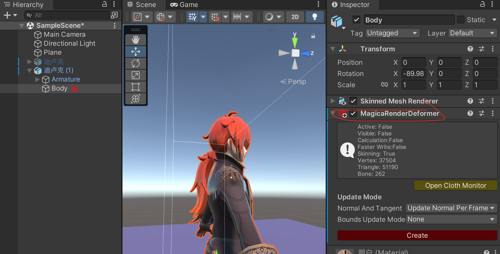

然后在场景中创建一个【MagicaVirtualDeformer】物体，将上面带有【MagicaRenderDeformer】组件的游戏物体拖入到Render Deformer List 中

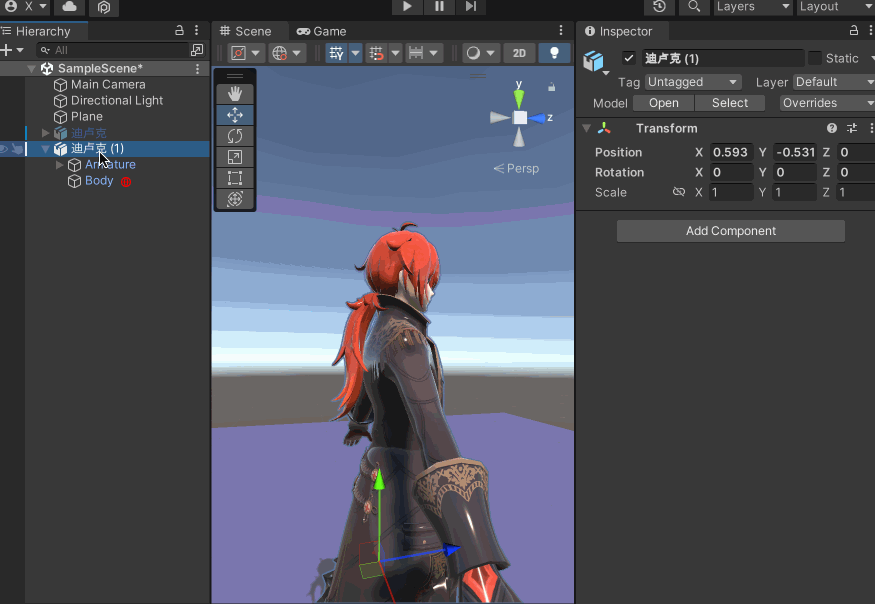

可以看到有【No Data.】的警告，点击【Create】等待一段时间后，不再有警告，可以看到有以下的输出

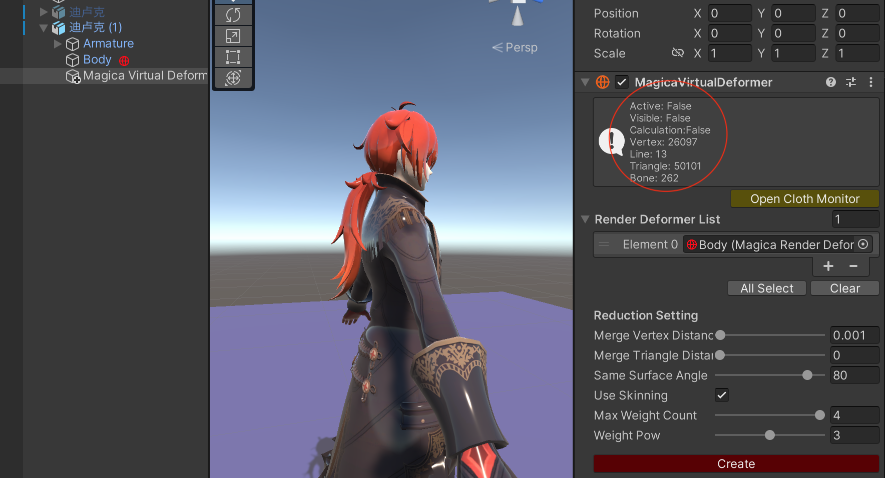

>有26097 个顶点，有50101 个三角面，有262 个骨骼

试着调整Merge Vertex Distance（默认是0.001）、Merge Triangle Distance（默认是0）等属性，比如都设置为0.01，重新【Create】，可以看到顶点数降到了7625，三角面降到了15841

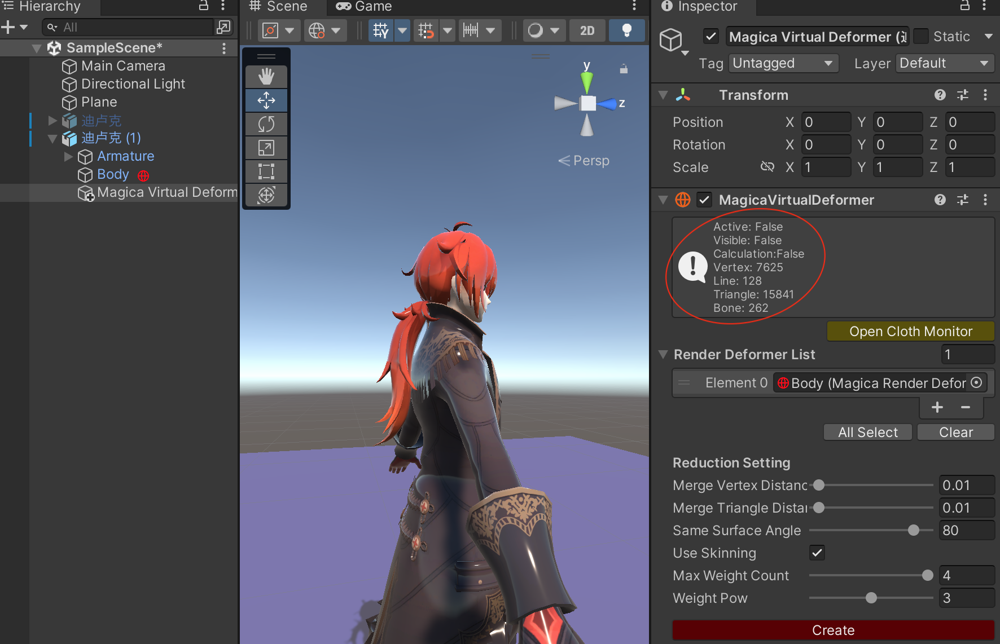

这些设置是优化性能的手段，具体的原理可以参考官网[https://magicasoft.jp/en/magicaclothmeshclothstart-2/](https://magicasoft.jp/en/magicaclothmeshclothstart-2/)

和上文使用的模型一致，找到骨骼中的Bz\_0\_1，为其添加【MagicaMeshCloth】组件，并且选择【Virtual Deformer】为刚才新建的游戏物体

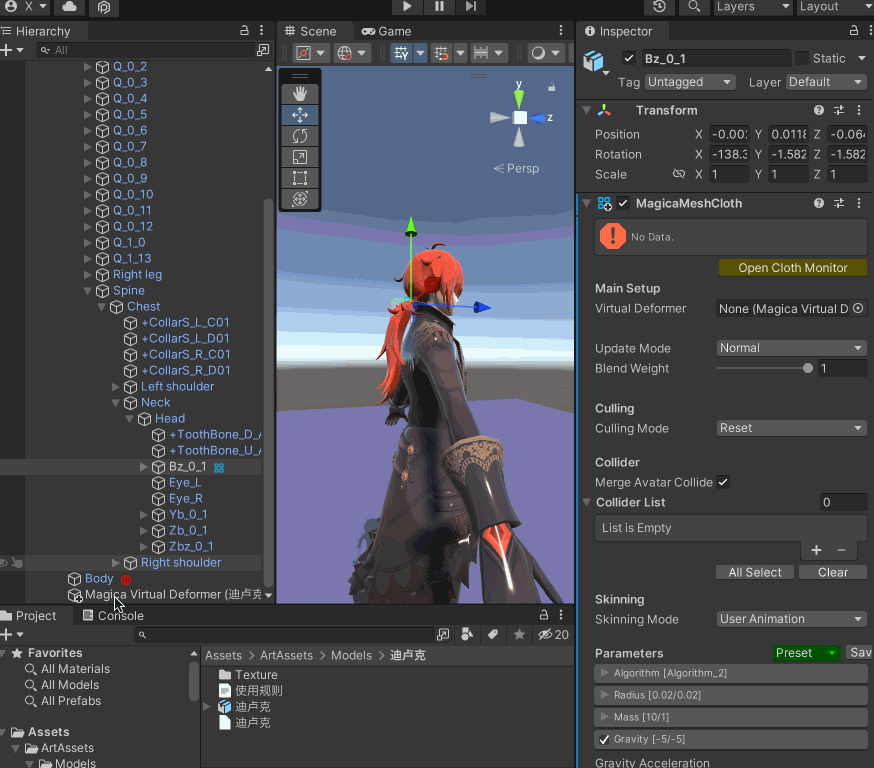

点击【Start Point Selection】可以看到模型上的所有点（这里是进一步调整Merge Vertex Distance、Merge Triangle Distance 后的顶点数，相比于上面的截图，顶点数进一步降到2267 个）

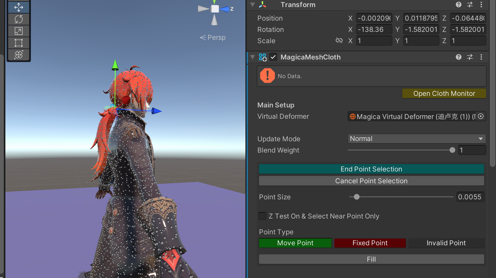

特别说明一下，这些点的颜色信息如下：白色（Invalid Point，不参与计算）、红色（Fixed Point，固定的顶点）、白色（Move Point，移动的顶点）

要实现马尾辫的飘动效果，那么就合理的设置马尾上的顶点类型，如下图所示（这里是进一步调整Merge Vertex Distance、Merge Triangle Distance 后的顶点数

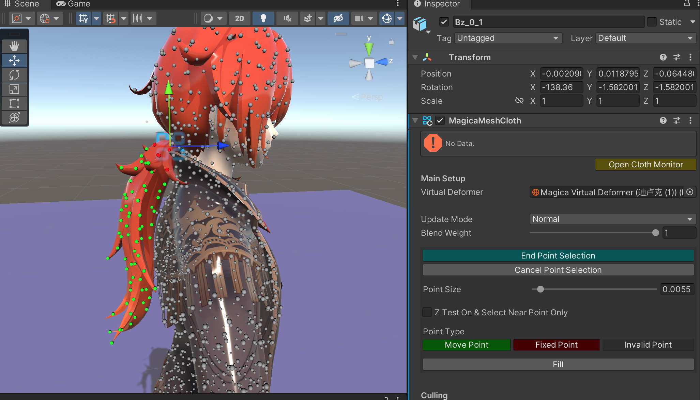

>这部分就是我说的比较麻烦的地方，顶点的数量比骨骼多很多，所以要一个一个的点，而且因为马尾辫的模型和身体没有分开，所以很可能点错，需要特别小心！

>当然如果觉得顶点太多，可以回到【MagicaVirtualDeformer】中调整Merge Vertex Distance、Merge Triangle Distance，重新Create，降低顶点数

>这里我依然只做了马尾部分，刘海部分的头发没有做，无非是一个顶点一个顶点去点，设置顶点类型

后续的步骤一样，在Parameters 里面先选择预设值【LongHair】，然后Create 后，运行效果如下

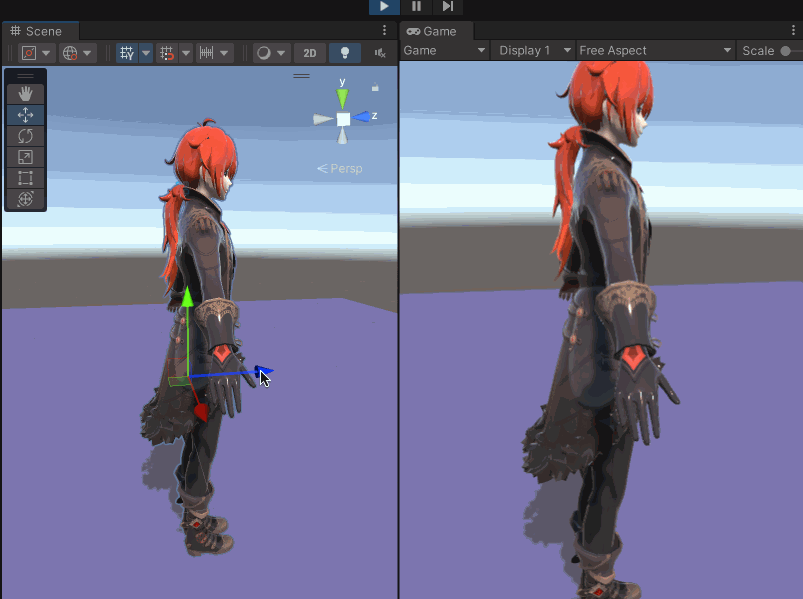

首先通过运行效果可以看出来是生效了的

因为没有设置碰撞体，所以存在穿模的情况，具体怎么设置，参考上文即可

另外很明显可以看出，头发存在和模型粘连的情况，应该就是因为在上面设置顶点类型的时候没有配置好导致的，所以使用MeshCloth，如果模型没有拆分好，的确是很麻烦的事情

和上文一样，在661 x 423 的屏幕设置下；不同的点是只做了头发，没有做衣服，而且没有添加碰撞器，运行的帧率在60 FPS 左右。相比于BoneCloth 方式还是有明显的性能差距的

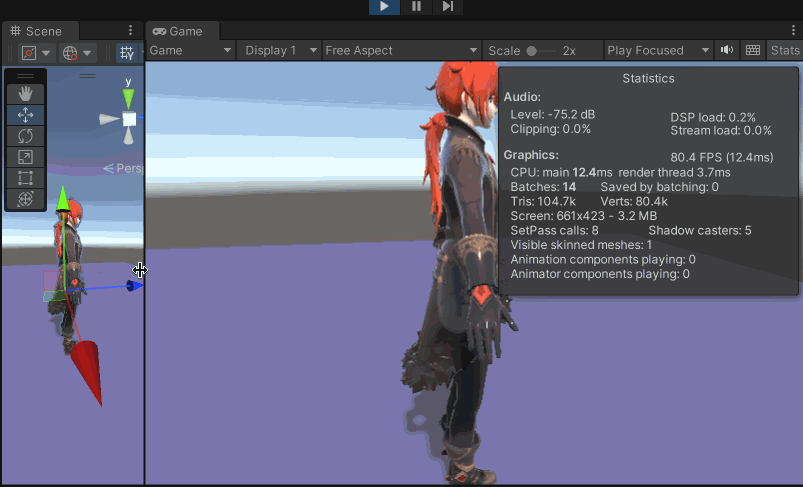
