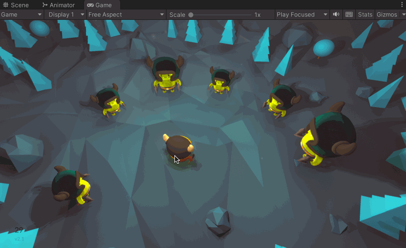
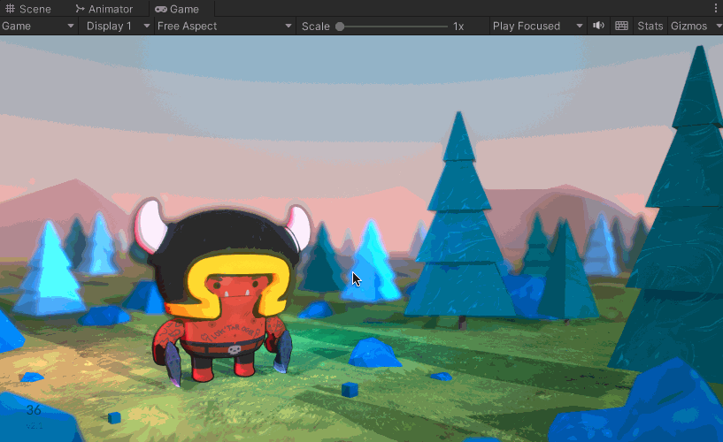
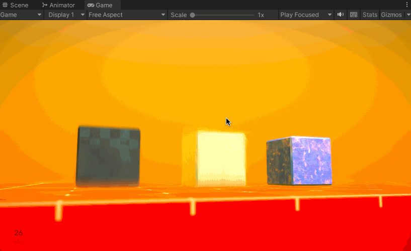
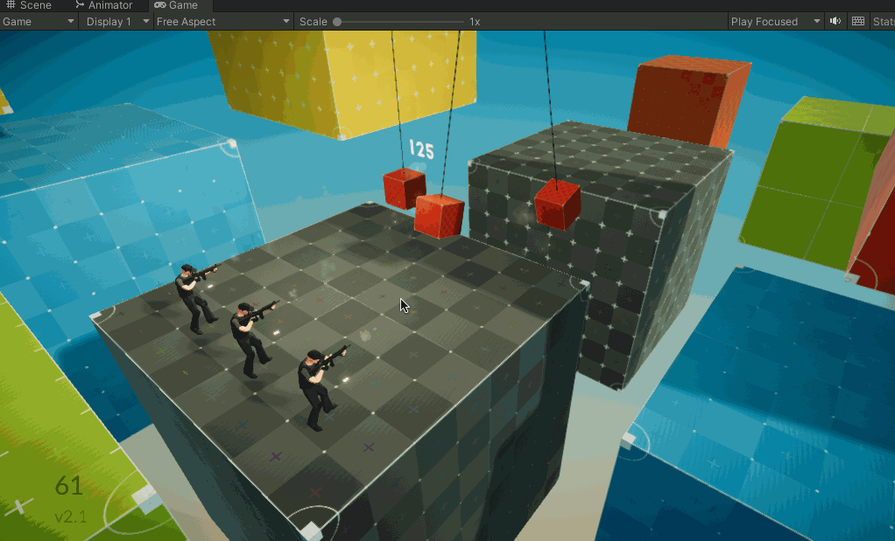
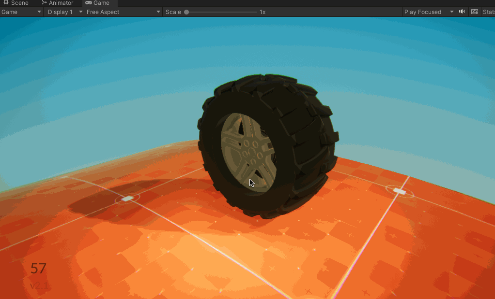
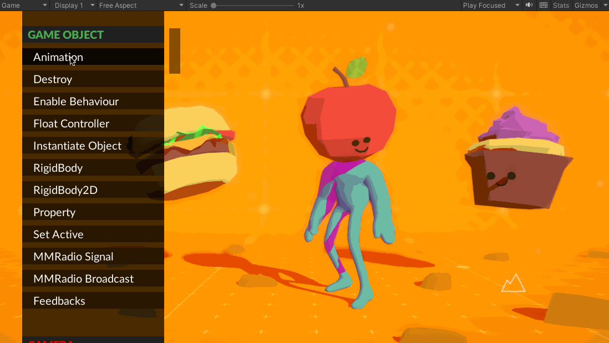

>[Unity Asset Store 地址](https://assetstore.unity.com/packages/tools/particles-effects/feel-183370)

>[Feel 官方网站 https://feel.moremountains.com/](https://feel.moremountains.com/)

>Feel is the best way to improve your game's feel and make it extra juicy

下面展示Feel 官方案例的一些Demo，注意：因为动图，所以没有办法展示音效

比如FeelDemos/Barbarians/FeelBarbarians 这个场景，看下面的动图，就能感觉到很有打击感（其中屏幕震动是很重要的因素，另外音效也很重要，截图没有办法展示音效）

再比如FeelDemos/Bounce/FeelBounce 这个场景的效果（同样，截图没有办法展示音效）

再比如FeelDemos/MMSequencer/FeelMMSequencer 的正方体运动效果也是很有质感的

FeelDemos/Tactical/FeelTactical 场景的设计效果如下

FeelDemos/Wheel/FeelWheel 场景中轮子飞驰效果

MMFeedbacks/Demos/MMFeedbacksDemo/MMFeedbacksDemo 场景效果展示如下

## Feel 插件介绍

>转载自[游戏开发工具箱(1) 打造游戏感的利器——Unity Feel 插件浅析](https://zhuanlan.zhihu.com/p/600560850)

你是不是曾在GameJam 最后的1个小时里，还在为游戏的手感不佳、打击感不强而抓耳挠腮？

你是不是也曾在开发游戏Demo时，苦于要解决玩家反馈的“操作好飘”、“反应太迟钝”等问题却没有头绪

Feel 是一款开箱即用的为游戏提供游戏感（反馈）的Unity 平台下的工具插件

模块化的设计，易于扩展；编辑器下的预览，十足便捷

在《游戏感——游戏操控感和体验设计指南》一书中，Steve Swink将游戏感拆解为了——实时操控（real-time control）、模拟空间（simulated space）和润色（polish）——三个基本要素

虽然在讨论游戏感时，感受是主观的，但Feel 将其拆解成了100+ 个基本的反馈操作（MMF_Feedback），主要覆盖了 音频、镜头、动画、GameObject、特效、后处理、UI、文字等方面

像拼积木一样组合好这些反馈操作，游戏感便跃然纸上了

Feel 另外依赖的四个package分别是：Cinemachine、Postprocessing、TextMeshPro 和2d Animation

## 推荐更多资料

* [B 站上关于Feel 插件使用的讲解](https://www.bilibili.com/video/BV1RU4y1S7bo)
* [游戏开发工具箱(1) 打造游戏感的利器——Unity Feel 插件浅析](https://zhuanlan.zhihu.com/p/600560850)
* [How to design with feedback and game feel in mind](https://www.bilibili.com/video/BV1e24y1r7Zp)
