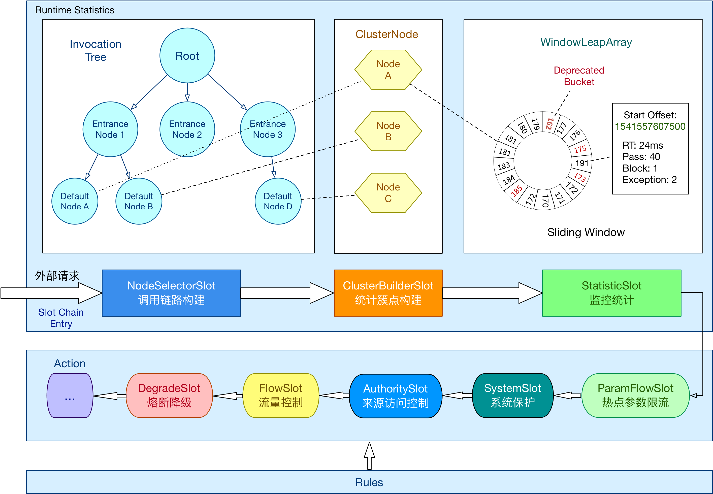
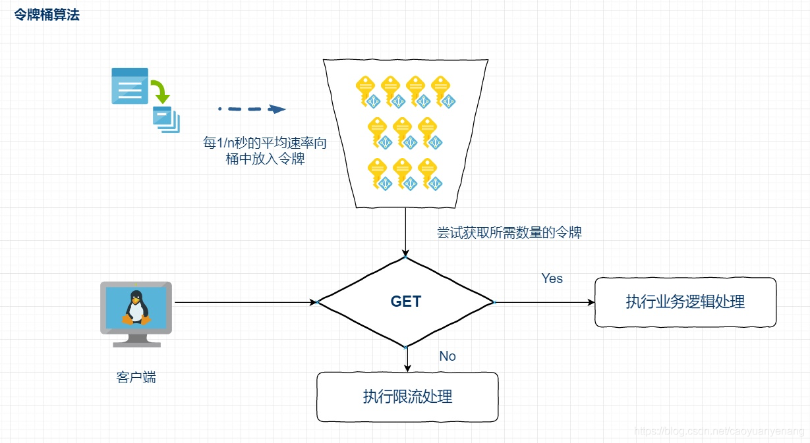

Sentinel（分布式系统的流量防卫兵）是阿里开源的一套用于**服务容错**的综合性解决方案。它以流量为切入点, 从流量控制、熔断降级、系统负载等多个维度来保护服务的稳定性

流量控制在网络传输中是一个常用的概念，它用于调整网络包的发送数据。然而，从系统稳定性角度考虑，在处理请求的速度上，也有非常多的讲究。任意时间到来的请求往往是随机不可控的，而系统的处理能力是有限的。我们需要根据系统的处理能力对流量进行控制。Sentinel 作为一个调配器，可以根据需要把随机的请求调整成合适的形状

除了流量控制以外，降低调用链路中的不稳定资源也是 Sentinel 的使命之一。由于调用关系的复杂性，如果调用链路中的某个资源出现了不稳定，最终会导致请求发生堆积。Sentinel 和 Hystrix 的原则是一致的: 当调用链路中某个资源出现不稳定，例如，表现为timeout，异常比例升高的时候，则对这个资源的调用进行限制，并让请求快速失败，避免影响到其它的资源，最终产生雪崩的效果

**资源**是Sentinel 的关键概念。它可以是Java 应用程序中的任何内容，可以是一个服务，也可以是一个方法，甚至可以是一段代码

**规则**就是用来定义如何进行保护资源的，作用在资源之上，定义以什么样的方式保护资源，主要包括流量控制规则、熔断降级规则以及系统保护规则

Sentinel 官网：[https://sentinelguard.io/zh-cn/](https://sentinelguard.io/zh-cn/)
Sentinel GitHub：[https://github.com/alibaba/Sentinel/](https://github.com/alibaba/Sentinel/)
Sentinel 中文文档：[https://github.com/alibaba/Sentinel/wiki/介绍](https://github.com/alibaba/Sentinel/wiki/介绍)

Sentinel 具有以下特征:

* 丰富的应用场景 ：Sentinel 承接了阿里巴巴近 10 年的双十一大促流量的核心场景，例如秒杀（即突发流量控制在系统容量可以承受的范围）、消息削峰填谷、集群流量控制、实时熔断下游不可用应用等
* 完备的实时监控 ：Sentinel 同时提供实时的监控功能。您可以在控制台中看到接入应用的单台机器秒级数据，甚至 500 台以下规模的集群的汇总运行情况
* 广泛的开源生态 ：Sentinel 提供开箱即用的与其它开源框架/库的整合模块，例如与 Spring Cloud、Dubbo、gRPC 的整合。您只需要引入相应的依赖并进行简单的配置即可快速地接入Sentinel
* 完善的SPI 扩展点：Sentinel 提供简单易用、完善的 SPI 扩展接口。您可以通过实现扩展接口来快速地定制逻辑。例如定制规则管理、适配动态数据源等



## 搭建环境，试用Sentinel

本次展示，使用单机非控制台模式，通过yml 定义和加载参数

首先引入Sentinel 依赖

```xml
<dependency>
   <groupId>org.springframework.boot</groupId>
   <artifactId>spring-boot-starter</artifactId>
   <version>1.5.6.RELEASE</version>
</dependency>
<dependency>
    <groupId>org.springframework.boot</groupId>
    <artifactId>spring-boot-starter-web</artifactId>
    <version>1.5.6.RELEASE</version>
</dependency>

<dependency>
    <groupId>com.alibaba.csp</groupId>
    <artifactId>sentinel-annotation-aspectj</artifactId>
    <version>1.8.6</version>
</dependency>

<dependency>
    <groupId>org.projectlombok</groupId>
    <artifactId>lombok</artifactId>
    <version>1.18.10</version>
    <scope>provided</scope>
</dependency>

<dependency>
    <groupId>com.alibaba</groupId>
    <artifactId>fastjson</artifactId>
    <version>1.2.66</version>
</dependency>
```

定义一个用于测试用的异常类，后续的文章会用到

```java
package com.test.exceptions;

public class ExceptionMain extends RuntimeException 
{
    private static final long serialVersionUID = -382927159028737548L;
}
```

定义流量控制规则、熔断规则

```java
package com.test.config;

import lombok.Getter;
import lombok.Setter;

// 流量控制配置类
@Getter
@Setter
public class FlowConfig 
{
    private String resource;            // 资源名称
    private String refResource;         // 关联资源名称
    private int grade;                  // 阈值类型  0：线程数  1：QPS
    private int strategy;               // 流控模式 0：直接 1：关联 2：链路
    private double count;               // 限流阈值
    private int controlBehavior;        // 流控效果  0：快速失败  1：warmup 2：排队等待
    private int warmUpPeriodSec;        // warmup时间
    private int maxQueueingTimeMs;      // 排队等待模式中的最大排队时间
}
```

```java
package com.test.config;

import lombok.Getter;
import lombok.Setter;

/**
 * 熔断配置类
 * 
 * 【平均响应时间 (DEGRADE_GRADE_RT)】
 * 当资源的平均响应时间超过阈值（DegradeRule 中的 count，以 ms 为单位）之后，资源进入准降级状态。
 * 如果接下来 1s 内持续进入 5 个请求（即 QPS >= 5），它们的 RT 都持续超过这个阈值，
 * 那么在接下的时间窗口（DegradeRule 中的 timeWindow，以 s 为单位）之内，
 * 对这个方法的调用都会自动地熔断（抛出 DegradeException）。
 * 
 * 【异常比例 (DEGRADE_GRADE_EXCEPTION_RATIO)】
 * 当资源的每秒异常总数占通过量的比值超过阈值（DegradeRule 中的 count）之后，资源进入降级状态，
 * 即在接下的时间窗口（DegradeRule 中的 timeWindow，以 s 为单位）之内，对这个方法的调用都会自动地返回。
 * 
 * 【异常数 (DEGRADE_GRADE_EXCEPTION_COUNT)】
 * 当资源近 1 分钟的异常数目超过阈值之后会进行熔断。
 * 
 */
@Getter
@Setter
public class DegradeConfig 
{
    private String resource;        // 资源名称
    private int grade;              // 熔断策略，支持0-慢调用比例/1-异常比例/2-异常笔数三种策略
    private int minRequestAmount;   // 熔断触发的最小请求数，请求数小于该值即使异常比率超出阈值也不会被熔断
    private double count;           // 慢调用模式下为慢调用临界RT（超出该值统计为慢调用，单位是微秒）；异常比例/异常数模式下为对应的阈值
    private int timeWindow;         // 熔断时长，单位是秒，熔断之后多久尝试恢复 
    private int statIntervalMs;     // 统计窗口长度
    private int slowRatioThreshold; // 慢调用比例阈值，仅慢调用比例模式有效
}
```

定义流量控制、熔断规则的加载服务

```java
package com.test.config;

import java.util.ArrayList;
import java.util.List;

import lombok.Getter;
import lombok.Setter;

import org.springframework.beans.factory.annotation.Value;
import org.springframework.context.annotation.Bean;
import org.springframework.context.annotation.Configuration;

import com.alibaba.csp.sentinel.annotation.aspectj.SentinelResourceAspect;
import com.alibaba.csp.sentinel.slots.block.degrade.DegradeRule;
import com.alibaba.csp.sentinel.slots.block.degrade.DegradeRuleManager;
import com.alibaba.csp.sentinel.slots.block.flow.FlowRule;
import com.alibaba.csp.sentinel.slots.block.flow.FlowRuleManager;
import com.alibaba.fastjson.JSON;

@Getter
@Setter
@Configuration
public class SentinelInitilizer 
{
    @Value("${sentinel.degrade.rules:null}")
    public void setDegradeRules(String list)
    {
        System.out.println("加载熔断规则: " + list);

        if (list != null && !list.isEmpty()) {
            List<DegradeConfig> tempList = JSON.parseArray(list, DegradeConfig.class);
            if (tempList == null || tempList.size() <= 0) {
                System.out.println("未解析出DegradeConfig配置："+ list);
            } else {
                List<DegradeRule> degradeRuleList = new ArrayList<>();
                for (DegradeConfig item : tempList) {
                    DegradeRule degradeRule = new DegradeRule();
                    degradeRule.setResource(item.getResource());
                    degradeRule.setGrade(item.getGrade());
                    degradeRule.setCount(item.getCount());
                    degradeRule.setMinRequestAmount(item.getMinRequestAmount());
                    degradeRule.setTimeWindow(item.getTimeWindow());
                    degradeRule.setStatIntervalMs(item.getStatIntervalMs());
                    degradeRule.setSlowRatioThreshold(item.getSlowRatioThreshold());
                    degradeRuleList.add(degradeRule);
                }
                DegradeRuleManager.loadRules(degradeRuleList);
            }
        }
    }

    @Value("${sentinel.flow.rules:null}")
    public void setFlowRules(String list)
    {
        System.out.println("加载流量控制规则: " + list);

        if (list != null && !list.isEmpty()) {
            List<FlowConfig> tempList = JSON.parseArray(list, FlowConfig.class);
            if (tempList == null || tempList.size() <= 0) {
                System.out.println("未解析出FlowConfig配置："+ list);
            } else {
                List<FlowRule> flowRuleList = new ArrayList<>();
                for (FlowConfig item : tempList) {
                    FlowRule flowRule = new FlowRule();

                    flowRule.setResource(item.getResource());
                    flowRule.setRefResource(item.getRefResource());
                    flowRule.setGrade(item.getGrade());
                    flowRule.setCount(item.getCount());
                    flowRule.setStrategy(item.getStrategy());
                    flowRule.setControlBehavior(item.getControlBehavior());
                    flowRule.setWarmUpPeriodSec(item.getWarmUpPeriodSec());
                    flowRule.setMaxQueueingTimeMs(item.getMaxQueueingTimeMs());
                    flowRuleList.add(flowRule);
                }
                FlowRuleManager.loadRules(flowRuleList);
            }
        }
    }

    @Bean
    public SentinelResourceAspect sentinelResourceAspect() {
        return new SentinelResourceAspect();
    }
}
```

接下来在Controller 中使用Sentinel

```java
package com.test.controller;

import org.springframework.stereotype.Controller;
import org.springframework.web.bind.annotation.RequestBody;
import org.springframework.web.bind.annotation.RequestMapping;
import org.springframework.web.bind.annotation.ResponseBody;

import com.alibaba.csp.sentinel.annotation.SentinelResource;
import com.alibaba.csp.sentinel.slots.block.BlockException;
import com.test.exceptions.ExceptionMain;

@Controller
@RequestMapping("/test")
public class TestController 
{
    // 流量控制
    // http://localhost:8880/test/flow
    @SentinelResource(value = "flowResource", blockHandler = "flowBlockHandler", fallback = "flowFallback")
    @RequestMapping("/flow")
    @ResponseBody
    public String flow(@RequestBody String request) {
        System.out.println(request);
        return "This is Flow Page";
    }
    
    // 返回值类型必须与原函数返回值类型一致；
    // 方法参数列表需要和原函数一致，或者可以额外多一个 BlockException 类型的参数用于接收对应的异常。
    public String flowBlockHandler(@RequestBody String request, BlockException ex) {
        return "flowBlockHandler";
    }
    
    // 返回值类型必须与原函数返回值类型一致；
    // 方法参数列表需要和原函数一致，或者可以额外多一个 Throwable 类型的参数用于接收对应的异常。
    public String flowFallback(@RequestBody String request, Throwable throwable) {
        return "flowFallback";
    }
    
    
    // 熔断
    // http://localhost:8880/test/degrade
    @SuppressWarnings("static-access")
    @SentinelResource(value = "degradeResource", blockHandler = "degradeBlockHandler", fallback = "degradeFallback")
    @RequestMapping("/degrade")
    @ResponseBody
    public String degrade(@RequestBody String request) throws InterruptedException {
        Thread.currentThread().sleep(50);   // 模拟慢响应
        System.out.println(request);
        return "This is Degrade Page";
    }
    
    // 返回值类型必须与原函数返回值类型一致；
    // 方法参数列表需要和原函数一致，或者可以额外多一个 BlockException 类型的参数用于接收对应的异常。
    public String degradeBlockHandler(@RequestBody String request, BlockException ex) {
        return "degradeBlockHandler";
    }
    
    // 返回值类型必须与原函数返回值类型一致；
    // 方法参数列表需要和原函数一致，或者可以额外多一个 Throwable 类型的参数用于接收对应的异常。
    public String degradeFallback(@RequestBody String request, Throwable throwable) {
        return "degradeFallback";
    }
}
```

Sentinel 支持通过@SentinelResource 注解定义资源并配置blockHandler 和fallback 函数来进行限流之后的处理。注意blockHandler 函数会在原方法被限流/降级/系统保护的时候调用，而fallback 函数会针对所有类型的异常

以上是所有的代码，具体的配置和演示在后续的博客中详细介绍和演示

## 对比Guava 的RateLimiter

Guava 中的RateLimiter 限流器实现，是基于令牌桶算法实现的



以恒定速率往令牌桶中添加令牌，在请求到达的时候，先去令牌桶中获取一个令牌，如果令牌桶为空，获取不到令牌，则说明触发了限流规则，阻塞等

令牌桶这里达到限流的目的是通过令牌桶容量和生产令牌的速率来控制的，令牌桶的生产速率就是正常的限流值，比如1s内访问5次，那么令牌产生的速率就是1s生产5个；而令牌桶是用来处理一定的突发流量的，所以桶的容量需要保证极端情况下，不压垮系统就好了

RateLimiter 使用起来也很简单，比如

```java
private static RateLimiter rateLimiter = RateLimiter.create(5);

public static void main(String[] args) throws InterruptedException {
    while (true) {
        get(1);
    }
}

private static void get(int permits) {
    rateLimiter.acquire(permits);
    System.out.println(System.currentTimeMillis());
}
```

RateLimiter 是基于令牌桶算法实现的一个限流组件，其代码看起来很简单，一共就两个类：抽象父类RateLimiter 和实际的SmoothRateLimiter。其中SmoothWarmingUP 和SmmothBursty 是SmoothRateLimiter 的两个内部类

## 参考资料

* [sentinel （史上最全）](https://blog.csdn.net/crazymakercircle/article/details/125059491)
* [技术选型：Sentinel vs Hystrix](https://yq.aliyun.com/articles/633786/)
* [Sentinel 限流使用案例](https://blog.csdn.net/weixin_43831049/article/details/113501189)
* [SpringCloudAlibaba-Sentinel 2.2.1最新版](https://blog.csdn.net/wangguohui0726/article/details/115861948)
* [guava之限流RateLimiter](https://blog.csdn.net/sinat_14913533/article/details/124623046)
* [Guava中RateLimiter（流控）简介](https://www.jianshu.com/p/404aa2747809)

 