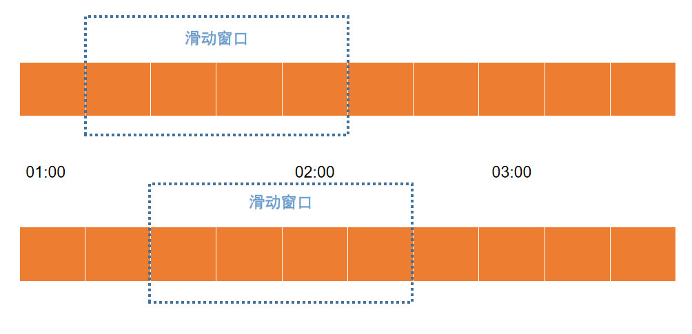

TCP 网络协议底层也是基于滑动窗口算法实现流量控制的

上面的例子中，展示的是Sentinel API 的使用，但是如果我想只使用Sentinel 的滑动窗口实现呢？比如我想要实现一套自己的熔断方案，所有的接口观测一个指标，即整个系统所有接口的响应时间和成功率，然后不同的接口提供不同的降级方案

滑动时间窗口，将时间窗口划分为更小的时间片段，每过一个时间片段，时间窗口就会往右滑动一格，每个时间片段都有独立的计数器。我们在计算整个时间窗口内的请求总数时会累加所有的时间片段内的计数器。时间窗口划分的越细，那么滑动窗口的滚动就越平滑，限流的统计就会越精确

TCP 底层是基于滑动窗口来进行流量控制的；Spark 的流计算实现也是基于时间窗口的



## Sentinel 滑动窗口实现

滑动窗口调用链路如下所示，转载自[《sentinel-滑动时间窗口算法》](https://www.jianshu.com/p/9cb6aa788520)


AbstractLinkedProcessorSlot 抽象类实现了ProcessorSlot 接口，该抽象类对应的实现如下

* com.alibaba.csp.sentinel.slots.block.authority.AuthoritySlot
* com.alibaba.csp.sentinel.slots.block.degrade.DegradeSlot
* com.alibaba.csp.sentinel.slots.block.flow.FlowSlot
* com.alibaba.csp.sentinel.slots.clusterbuilder.ClusterBuilderSlot
* com.alibaba.csp.sentinel.slots.logger.LogSlot
* com.alibaba.csp.sentinel.slots.nodeselector.NodeSelectorSlot
* com.alibaba.csp.sentinel.slots.statistic.StatisticSlot

这些就是常用的熔断、流量控制等功能的相关实现了

Sentinel 将降级功能的实现抽象为处理器插槽（ProcessorSlot），由一个个ProcessorSlot 提供丰富的降级功能的实现，并且使用SPI 机制提供扩展功能，使用者可通过自定义SlotChainBuilder 自己构建ProcessorSlotChain，这相当于给开发者提供插件的功能。因此可以通过自定义ProcessorSlot 为Sentinel 添加开关降级功能

Sentinel 的核心骨架是一个叫做ProcessorSlotChain 的类。这个类基于责任链模式来设计，将不同的功能（限流、降级、系统保护）封装为一个个的Slot，请求进入后逐个执行即可

更多玩法可以参考：[《16. 自定义 ProcessorSlot 实现开关降级》](https://blog.csdn.net/qian_348840260/article/details/108679625)、[《Sentinel源码分析》](https://blog.csdn.net/qq_41720396/article/details/124066850)


## 滑动窗口源码解释

ArrayMetric 用来统计滑动窗口中的各种数据，比如已经通过的请求数，被限流的请求数、向当前窗口中增加通过的请求数等等

```java
/**
 * The basic metric class in Sentinel using a {@link BucketLeapArray} internal.
 *
 * @author jialiang.linjl
 * @author Eric Zhao
 */
public class ArrayMetric implements Metric {

    private final LeapArray<MetricBucket> data;

    public ArrayMetric(int sampleCount, int intervalInMs) {
        this.data = new OccupiableBucketLeapArray(sampleCount, intervalInMs);
    }

    public ArrayMetric(int sampleCount, int intervalInMs, boolean enableOccupy) {
        if (enableOccupy) {
            this.data = new OccupiableBucketLeapArray(sampleCount, intervalInMs);
        } else {
            this.data = new BucketLeapArray(sampleCount, intervalInMs);
        }
    }

    /**
     * For unit test.
     */
    public ArrayMetric(LeapArray<MetricBucket> array) {
        this.data = array;
    }

    @Override
    public long success() {
        data.currentWindow();
        long success = 0;

        List<MetricBucket> list = data.values();
        for (MetricBucket window : list) {
            success += window.success();
        }
        return success;
    }
    
    ...

}
```

LeapArray 是滑动窗口的真正实现，包括计算请求的当前窗口重要方法

```java
/**
 * <p>
 * Basic data structure for statistic metrics in Sentinel.
 * </p>
 * <p>
 * Leap array use sliding window algorithm to count data. Each bucket cover {@code windowLengthInMs} time span,
 * and the total time span is {@link #intervalInMs}, so the total bucket amount is:
 * {@code sampleCount = intervalInMs / windowLengthInMs}.
 * </p>
 *
 * @param <T> type of statistic data
 * @author jialiang.linjl
 * @author Eric Zhao
 * @author Carpenter Lee
 */
public abstract class LeapArray<T> {

    protected int windowLengthInMs;
    protected int sampleCount;
    protected int intervalInMs;
    private double intervalInSecond;

    protected final AtomicReferenceArray<WindowWrap<T>> array;

    /**
     * The conditional (predicate) update lock is used only when current bucket is deprecated.
     */
    private final ReentrantLock updateLock = new ReentrantLock();

    /**
     * The total bucket count is: {@code sampleCount = intervalInMs / windowLengthInMs}.
     *
     * @param sampleCount  bucket count of the sliding window
     * @param intervalInMs the total time interval of this {@link LeapArray} in milliseconds
     */
    public LeapArray(int sampleCount, int intervalInMs) {
        AssertUtil.isTrue(sampleCount > 0, "bucket count is invalid: " + sampleCount);
        AssertUtil.isTrue(intervalInMs > 0, "total time interval of the sliding window should be positive");
        AssertUtil.isTrue(intervalInMs % sampleCount == 0, "time span needs to be evenly divided");

        this.windowLengthInMs = intervalInMs / sampleCount;
        this.intervalInMs = intervalInMs;
        this.intervalInSecond = intervalInMs / 1000.0;
        this.sampleCount = sampleCount;

        this.array = new AtomicReferenceArray<>(sampleCount);
    }
    
    ...
    
}
```

WindowWrap 是一个对象，真正的数据被保存到泛型T 的value 中，在这里使用的是MetricBucket 对象

```java
/**
 * Represents metrics data in a period of time span.
 *
 * @author jialiang.linjl
 * @author Eric Zhao
 */
public class MetricBucket {

    private final LongAdder[] counters;

    private volatile long minRt;

    public MetricBucket() {
        MetricEvent[] events = MetricEvent.values();
        this.counters = new LongAdder[events.length];
        for (MetricEvent event : events) {
            counters[event.ordinal()] = new LongAdder();
        }
        initMinRt();
    }

    public MetricBucket reset(MetricBucket bucket) {
        for (MetricEvent event : MetricEvent.values()) {
            counters[event.ordinal()].reset();
            counters[event.ordinal()].add(bucket.get(event));
        }
        initMinRt();
        return this;
    }

    ...
    
}
```

```
/**
 * Wrapper entity class for a period of time window.
 *
 * @param <T> data type
 * @author jialiang.linjl
 * @author Eric Zhao
 */
public class WindowWrap<T> {

    /**
     * Time length of a single window bucket in milliseconds.
     */
    private final long windowLengthInMs;

    /**
     * Start timestamp of the window in milliseconds.
     */
    private long windowStart;

    /**
     * Statistic data.
     */
    private T value;

    /**
     * @param windowLengthInMs a single window bucket's time length in milliseconds.
     * @param windowStart      the start timestamp of the window
     * @param value            statistic data
     */
    public WindowWrap(long windowLengthInMs, long windowStart, T value) {
        this.windowLengthInMs = windowLengthInMs;
        this.windowStart = windowStart;
        this.value = value;
    }

    ...
    
}
```

## 更多参考资料

* [sentinel-滑动时间窗口算法](https://www.jianshu.com/p/9cb6aa788520)
* [TCP 滑动窗口详解（非常实用）](https://blog.csdn.net/weixin_47156401/article/details/125890118)
* [Spark-窗口函数实现原理及各种写法](https://www.jianshu.com/p/409312265fa4)
* [限流](https://blog.csdn.net/wudiyong22/article/details/109398986)
* [16. 自定义 ProcessorSlot 实现开关降级](https://blog.csdn.net/qian_348840260/article/details/108679625)
* [Sentinel源码分析](https://blog.csdn.net/qq_41720396/article/details/124066850)
