>[【Unity插件】最多的插件合集](https://blog.csdn.net/qq576813016/article/details/131059950)

## Mesh Baker（网格烘培插件）

项目开发的时候经常会大量使用大规模的Mesh，导致Draw Call 过高。而Mesh Baker 扮演了网格烘焙器的角色，其工作原理是将网格和材质合并，从而降低渲染的Draw Call

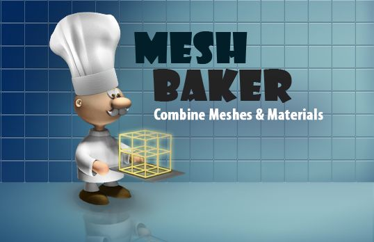

## SimpleLOD（LOD插件）

比较适合大规模场景的制作开发。在处理多人在线的项目（如MMO 游戏）时，按照我们以往的优化方法是尽可能降低Draw Call 和减少渲染消耗，在远处使用低级LOD，在Run-time 时根据相机距离切换合适的LOD，使得在手机性能有限的情况下尽量渲染更多的角色，达到更好的效果

而SimpleLOD 恰好可以满足这一点，除了同样拥有Mesh Baker 所具有的Mesh 合并、Atlas 烘焙等功能，它还能提供Mesh 的简化（Mesh Baker 无法提供），并对动态蒙皮网格进行了很好的支持。该插件可在Run-time 和Editor 中都可以使用，同时开放了源码，大家可以根据项目的实际情况而作修改

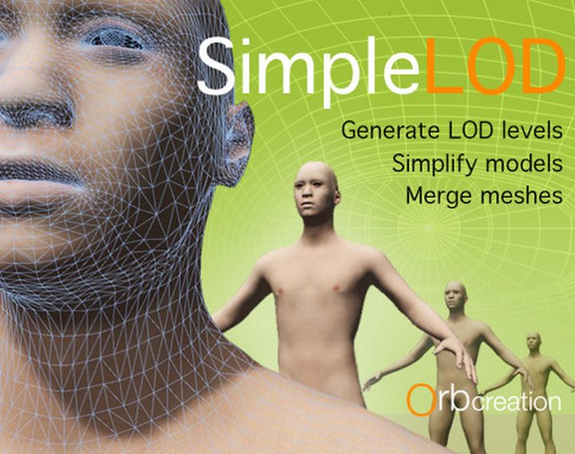

## Obfuscator（防止逆向工程破解）

Obfuscator可以保护游戏代码和游戏资源，防止被逆向工程破解

## Inventory Pro（背包插件）

Inventory Pro 是制作背包仓储系统的最佳插件，可以用来存储物品、装备、武器和杂物等。是制作RPG 游戏的必备插件

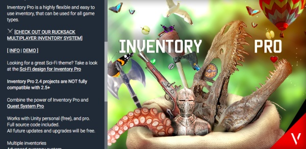

## Lip Sync Pro（唇语同步&面部动画）

Lip Sync Pro 是一款制作唇语同步&面部动画的插件，如果你的游戏包含大量对白，这款插件就很有必要了

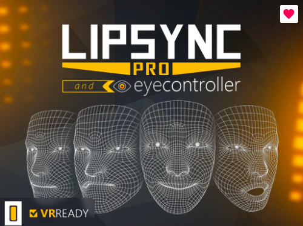

## A\* Pathfinding Project Pro（A\*寻路插件）

A\* Pathfinding Project Pro是一款AI寻路插件，开发者可以自定义AI 的寻路行为

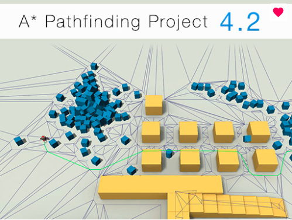

## Koreographer Professional Edition（音乐节拍跳动插件）

Koreographer Professional Edition 是一款针对音频进行操作的插件

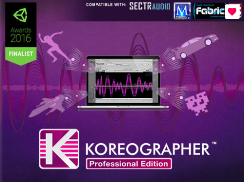

## Master Audio: AAA Sound（声音类插件）

Master Audio: AAA Sound是Unity游戏开发的终极音频解决方案，音效编辑器，音频3A插件

## Final IK（反向动力控制插件）

Final IK 是一个反向动力控制插件。相比较Unity 的自带IK 系统，Final IK 设置更加方便，用途更广。有很多情景化的应用，如针对和物体交互的动作系统。如果能使用好Final IK 插件，就可以使用少量的固定动画，在此基础上融合IK 动作，做出千变万化的交互动作

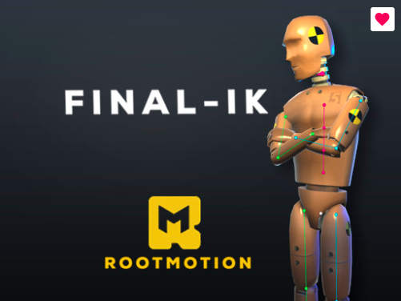

## PuppetMaster（系统骨骼动画插件）

PuppetMaster 是高级活跃的布娃娃完成了由Final-IK 的制造商制作的布娃娃创作和编辑工具，可以制作动画布娃娃，在场景视图中可以直观地编辑对照和联合限制

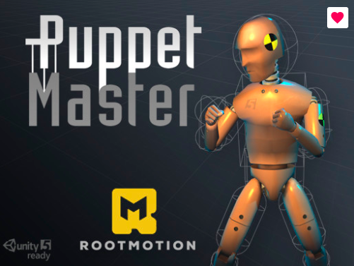

## Colorful FX（全屏图像效果处理插件）

Colorful FX 包含了大量的可定制的FX 效果和全屏的Camera 渲染效果。对色彩纠正和图像后期处理有很大作用

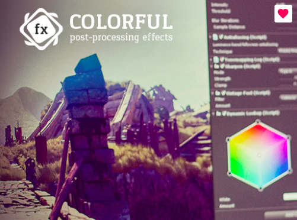

## Mega-Fiers（Mesh形变插件）

Mega-Fiers 是一个可以让Mesh 发生的形变的插件

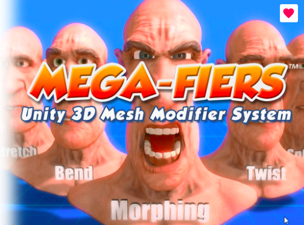

## Surforge（Unity中改变模型材质）

Surforge 能够帮你在Unity 内部快速制作3D 模型的Texture

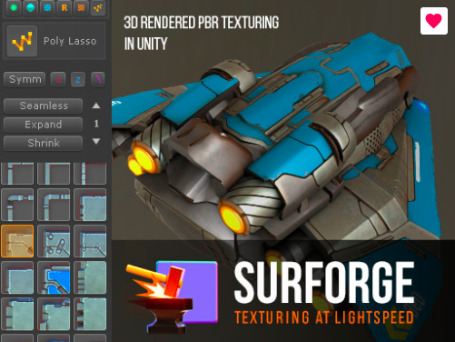

## Octave3D-Level Design（快速制作关卡）

Octave3D-Level Design 帮助Unity 开发者制作关卡

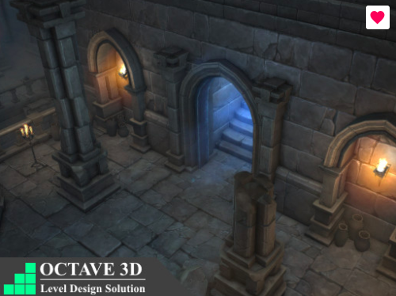

## UBER - Standard Shader Ultra（制作3A级别Shader）

UBER - Standard Shader Ultra 可以帮助开发者制作3A 级别的Shader

## UMotion Pro（动画制作插件）

UMotion Pro 是Unity 中一款非常优秀的动画制作插件

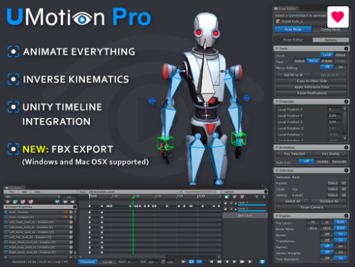

## Behavior Designer（制作AI行为树）

Behavior Designer 可以帮助Unity 开发者制作AI 的行为树

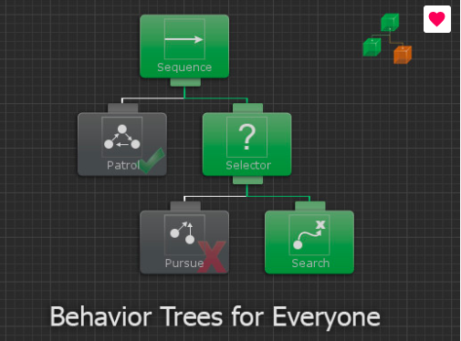

## DOTween （动画移动插件）

DOTween Pro 是一款制作动画和渐变状态的插件

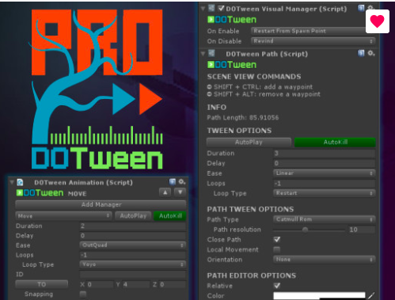

## TerrainComposer 2（节点制作地形插件）

TerrainComposer 2 是一款利用节点制作地形的插件。开发者用它可以很容易的制作惊艳的地形

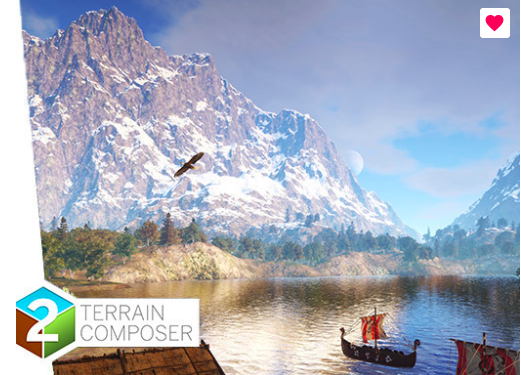

## MapMagic World Generator（节点制作地形的插件）

MapMagic World Generator 也是一款基于节点制作地形的插件

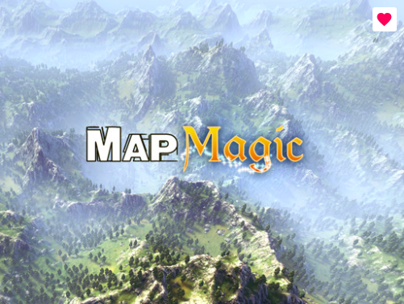

## Gaia（地形制作插件）

Gaia 是一款一站式地形制作插件

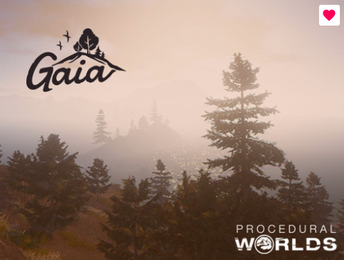

## MTE（地形编辑器）

MTE (Mesh Terrain Editor) 地形编辑器，基于模型的地形创建、转换、编辑工具

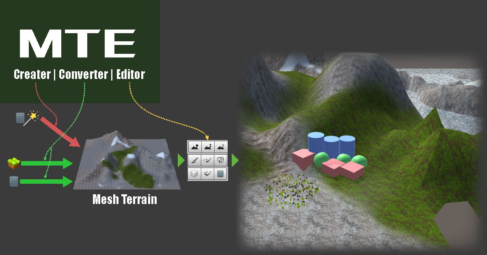

## Cinemachine（影视镜头移动插件）

影视镜头插件，2017的首推插件，这个做镜头非常的简单，而且效果也很棒。可以很简单的创建自由视角的摄像机

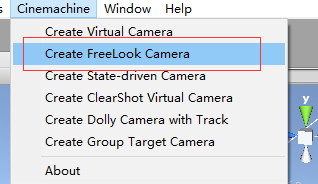

## Open Rencent Scene（快速切换场景）

快速场景切换，只用键盘就搞定多场景切换，再也不用凌乱的翻找文件夹找场景了。Ctrl+Shift+O hotkey on PC or Cmd+Shift+O on Mac 加数字键就可一，异常方便啊

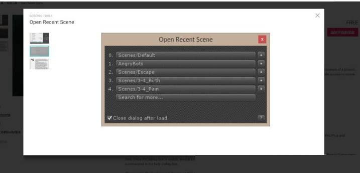

## Dungeon Architect（一键生成大量地牢关卡）

Dungeon Architect 可以帮助开发者一键生成大量地牢关卡。可以通过设置相应的参数来自动或者手动的快速创建关卡，也可以在运行时生成。同时支持2D 和3D 地牢地形的生成

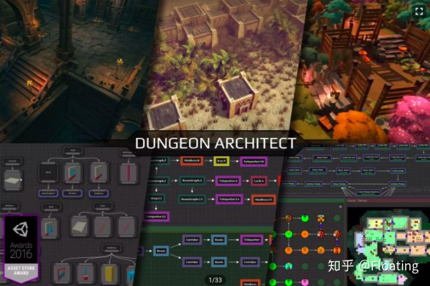

## DunGen（自动生成地牢场景的Unity插件）

该插件同样也是一款自动生成地牢场景的Unity 插件

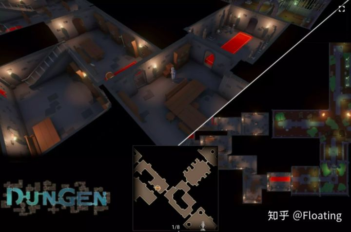

## Isometric Builder（快速创建isometric风格的地形环境）

该插件功能齐全，开发者可以使用该插件内置的Magic Brush 快速创建isometric 风格的地形环境、创建寻路系统、创建图集等。而且该插件包含详细的使用教程，易于学习

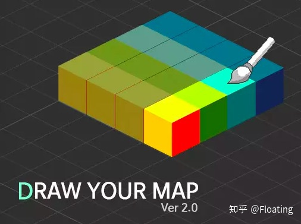

## Isometric Toolkit（制作isometric风格游戏的插件）

一款轻量级的制作isometric 风格游戏的插件

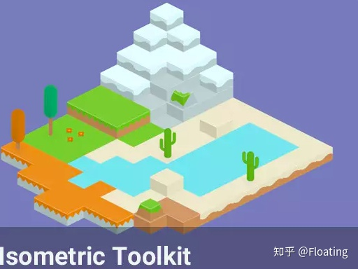

## Dynamic Bone（动态骨骼插件）

动态骨骼插件可以应用到角色的骨头或关节。简单的一些设置，就可以让角色的头发，衣服，胸部或任何部分将移动现实

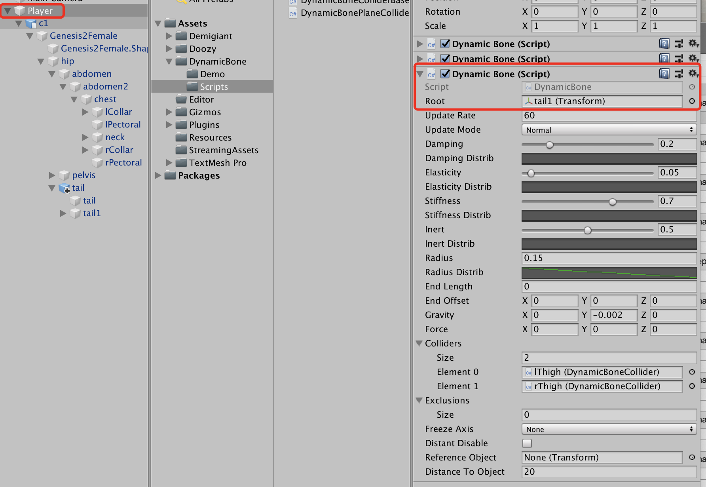

## PlayerMaker（可视化编程插件）

PlayerMaker是一以状态机state为原理的可视化编程插件，该插件虽然可以减少甚至不用写脚本，但其局限性在于部分功能无法实现，但对于不会码代码的萌新，这款插件还是挺有挺实用的

PlayMaker是由第三方软件开发商Hotong Games开发完成。它的Logo是一个中文的“玩”字（PS：看来中国文化声名远播）。它既是一个可视化脚本工具，又是一个分层逻辑框架。设计师、程序员使用PlayMaker能够很快的完成游戏原型动作，既适合独立开发者，又特别适合团队合作

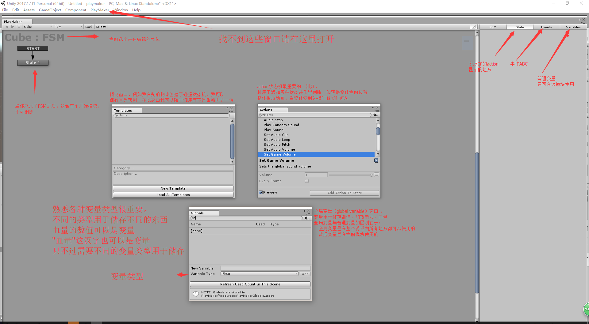

## FairyGUI（独立Unity的UI系统，UI编辑器）

FairyGUI 再推一套UI解决方案，跟上面的框架不一样，这套算是集大成体。首先是分离了UI与逻辑的开发（有一套专门的Adobe like 编辑器，Mac/Win都有），丰富的控件集成（基本涵盖国内手游大部分的ui需求），国人开发。个人独立游戏开发可以试试上面MarkLight的或者是更简单的自定义框架，团队项目的开启可以尝试下FairyGUI

FairyGUI 是不同于 NGUI 和 UGUI 的一个独立的 Unity UI 系统，他最大的特点是提供一个对美术、策划都友好的 UI 编辑器，不需要编码就能实现绝大部分 UI 制作的需求

FairyGUI 编辑器非常简单易用，都是纯 2D 的操作，使用习惯近似 Aodbe 软件，不需要理解相机、网格等复杂的 3D 概念

FairyGUI 编辑器还同时提供了支持 Starling/Egret/Laya 的 SDK，这意味使用 FairyGUI 可以使你的 UI 资产以及 UI 技能在 3D 主流引擎、页游主流引擎，H5 主流引擎上零成本迁移

使用 FairyGUI，解决了 Unity 制作 UI 的很多痛点，例如多国语言支持，可视化编辑 UI 动画，图文混排（包括文字和动画混排），虚拟列表（数量巨大的列表数目也不卡顿）、循环列表，像素级点击检测、3D UI，VR UI（轻松制作出曲面 UI）, 内置手势库，更带有自动生成代码的功能

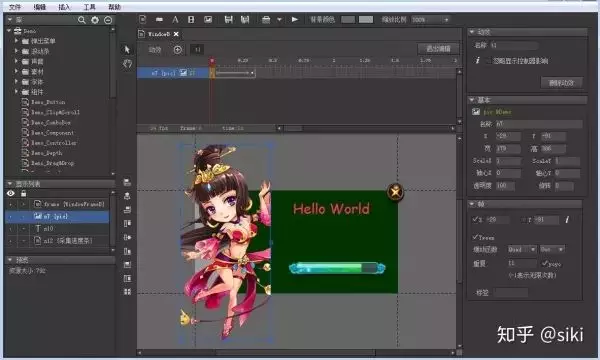

## iTween（对象动画类插件）

iTween是一个动画库，作者创建它的目的就是最小的投入实现最大的产出。让你做开发更轻松,用它可以轻松实现各种动画、晃动、旋转、移动、褪色、上色、控制音频等等

iTween的核心是数值的插值。只需要定义开始和结束，中间过程iTween就会帮你弄好

iTween插件包含两部分：iTween和iTweenPath

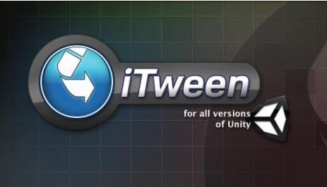

## Zenject（轻量级依赖注入框架 for Unity）

Zenject 是轻量级依赖注入框架，类似的还有StrangIOC、uInject等，这个更新的勤快，社区好，基本任何项目都能引入

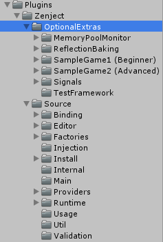

## Xffect （粒子特效编辑插件）

Xffect Editor Pro 是一款专为Unity 开发的特效插件，C# 编写，提供所有源码

与Unity 内置的粒子系统相比，Xffect 更适合游戏特效，使用上也更为方便，因为它所提供的粒子系统实际上并不是传统意义上的“粒子”系统

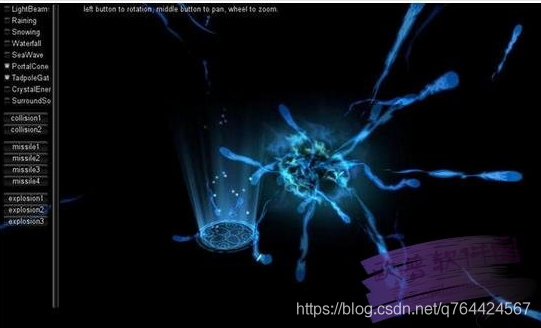

## Glow11（边缘发光插件）

Glow11 插件是Unity Asset Store 中非常强大的自发光插件

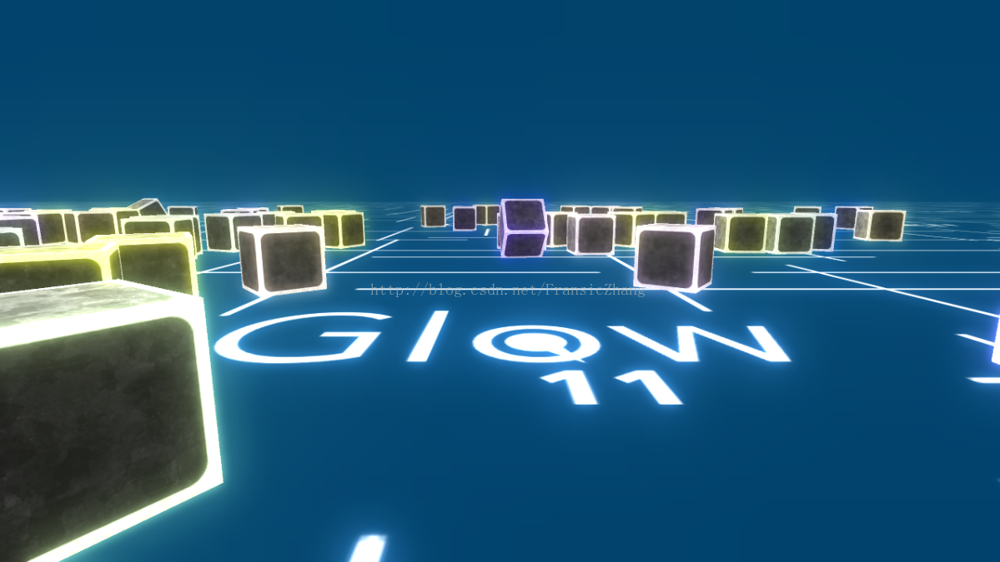

## Obi Fluid（水流效果插件）

Obi Fluid 插件是一款为Unity3D 用户提供的水流效果插件，很多游戏中都会有河流湖泊之类的存在，大家自己去建模非常麻烦，可以直接使用这款Obi Fluid 插件制作出水流效果，非常方便

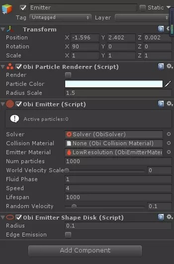

## Dialogue System for Unity（对话插件）

Dialogue System 是一个分支式的统一会话系统。它不需要任何脚本，但它是设计为易于由程序员扩展

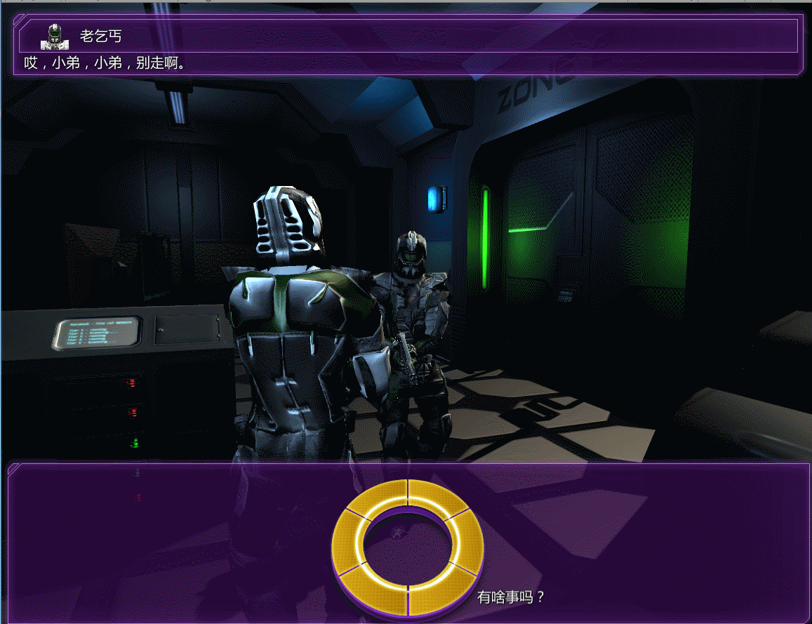

## Obi Rope（绳子插件）

Obi Rope 可以模拟绳子在游戏中的环境进行实时交互，拉伸，紧绷等属性

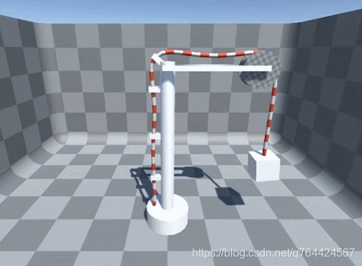

## Exploder（爆炸效果插件）

Exploder 可以实现物体爆炸的效果

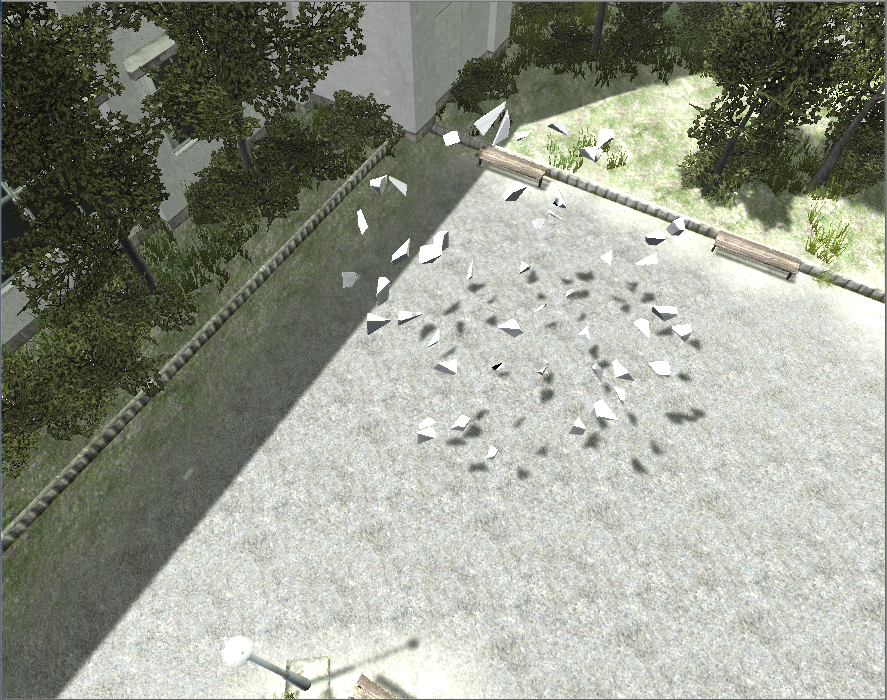

## Volumetric（体积照明插件）

Volumetric Light Beam 允许您通过生成真正容积的程序光束来大大改善场景的照明。这是模拟聚光灯和手电筒的密度，深度和音量的完美，简单而便宜的方法

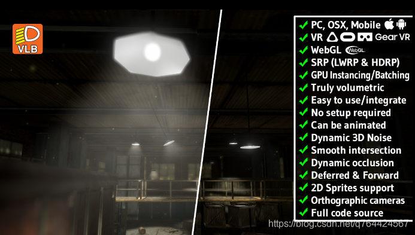

## Camera Path Animator（相机漫游插件）

Unity 的资源商店提供了一款相机路径的专用插件 - Camera Path Animator，通过这款插件的操作，我们就可以很快的在场景内创建出相机的漫游效果

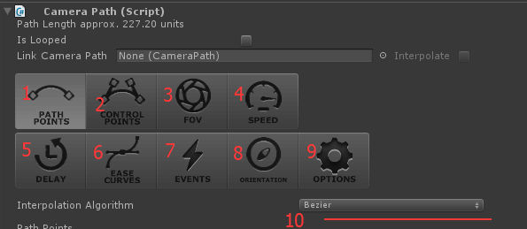

## Easy Save3（存储插件）

一款方便且强大的数据存储插件，我们可以用来存储多种类型的数据

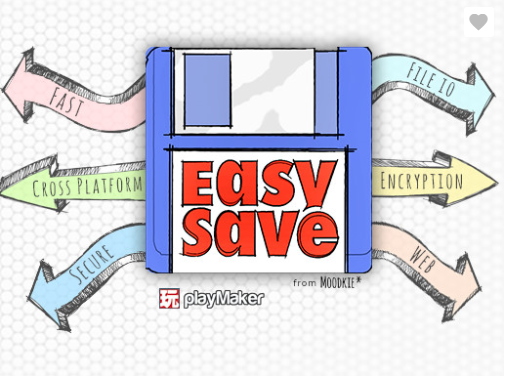

## World Creator（制作3D真实地形插件）

World Creator 是一款制作3D 真实地形的的专业插件

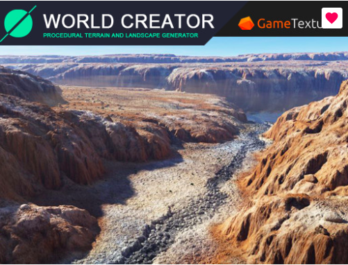

