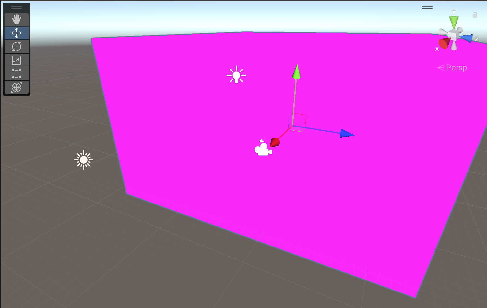
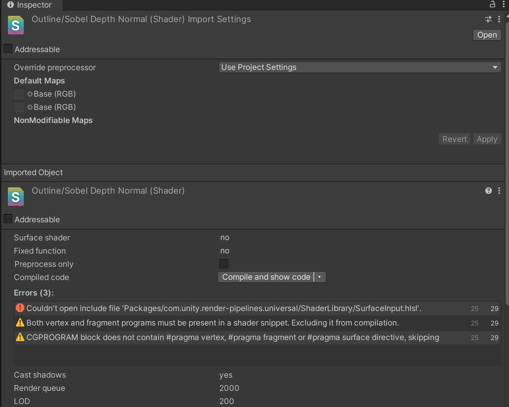
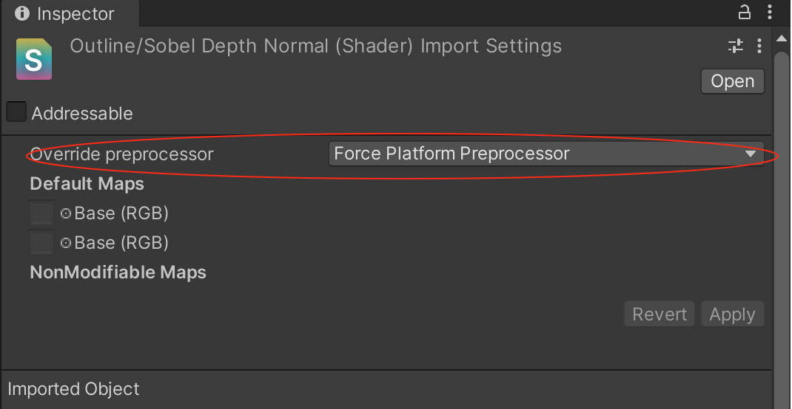

一个Unity 工程，基于Render Feature 实现了风格化渲染效果，将工程下载到MacOS 上并且打开之后，发现材质显示的都是洋红色



找到Render Feature 对应的材质，然后再找到对应的Shader，果然有报错，如下所示



对应的报错信息如下

```
Couldn't open include file 'Packages/com.unity.render-pipelines.universal/ShaderLibrary/SurfaceInput.hlsl'.
Compiling Subshader: 0, Pass: Sobel Filter, Vertex program with <no keywords>
Platform defines: SHADER_API_DESKTOP UNITY_ENABLE_DETAIL_NORMALMAP UNITY_ENABLE_REFLECTION_BUFFERS UNITY_LIGHTMAP_FULL_HDR UNITY_LIGHT_PROBE_PROXY_VOLUME UNITY_PBS_USE_BRDF1 UNITY_SPECCUBE_BLENDING UNITY_SPECCUBE_BOX_PROJECTION UNITY_USE_DITHER_MASK_FOR_ALPHABLENDED_SHADOWS
Disabled keywords: RAW_OUTLINE SHADER_API_GLES30 UNITY_ASTC_NORMALMAP_ENCODING UNITY_COLORSPACE_GAMMA UNITY_ENABLE_NATIVE_SHADOW_LOOKUPS UNITY_FRAMEBUFFER_FETCH_AVAILABLE UNITY_HALF_PRECISION_FRAGMENT_SHADER_REGISTERS UNITY_HARDWARE_TIER1 UNITY_HARDWARE_TIER2 UNITY_HARDWARE_TIER3 UNITY_LIGHTMAP_DLDR_ENCODING UNITY_LIGHTMAP_RGBM_ENCODING UNITY_METAL_SHADOWS_USE_POINT_FILTERING UNITY_NO_DXT5nm UNITY_NO_FULL_STANDARD_SHADER UNITY_NO_SCREENSPACE_SHADOWS UNITY_PBS_USE_BRDF2 UNITY_PBS_USE_BRDF3 UNITY_PRETRANSFORM_TO_DISPLAY_ORIENTATION UNITY_UNIFIED_SHADER_PRECISION_MODEL UNITY_VIRTUAL_TEXTURING
```

其中一个解决方案，如下图，把图上的红圈部分改成“Force Platform Preprocessor”或者"Force Caching Preprocessor"，最后点击Apply 问题应该会解决了



另外的解决方案，就是在Unity 项目的资源管理器中，也就是你项目的本地文件中。删除Library 文件，然后再重新打开Unity，这时Unity 会自动重新导入该文件夹，然后问题就会解决了
