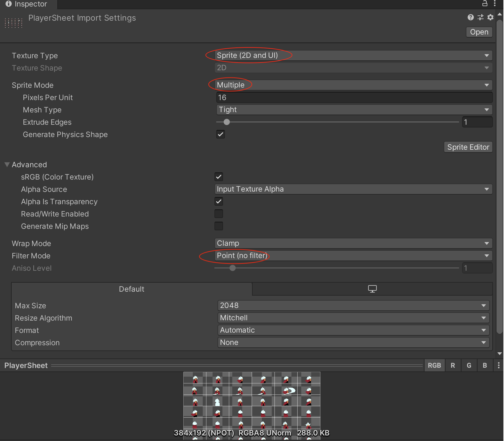
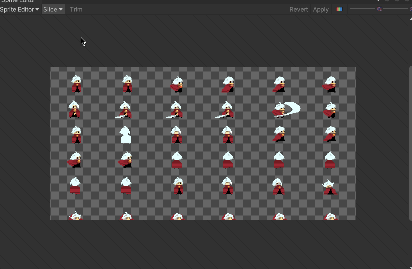
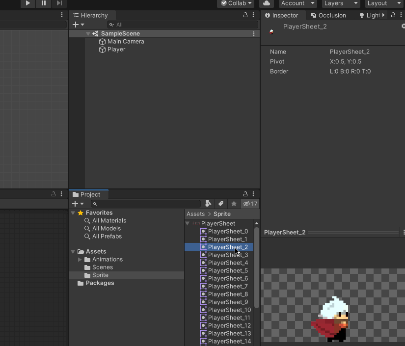
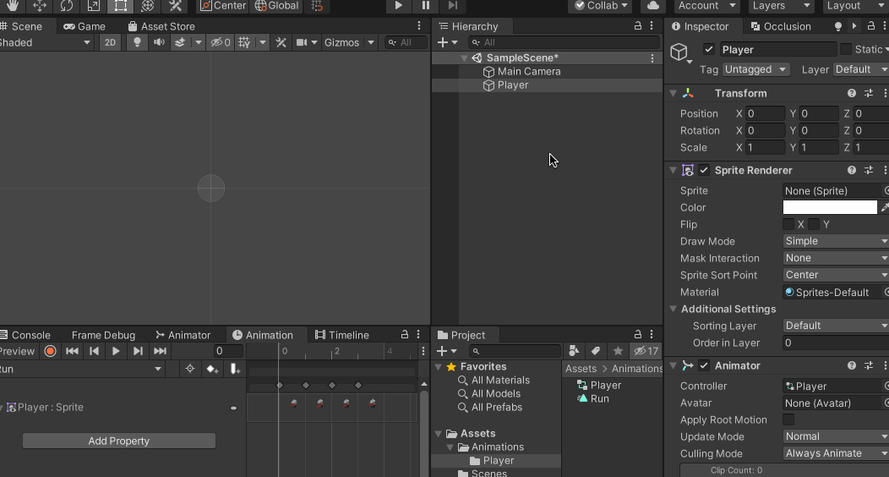

>参考[【Unity 2D游戏开发教程】](https://www.bilibili.com/video/BV1sE411L7kV)整理的学习笔记，对应github 的仓库地址为[https://github.com/zs8861/2D-Platform](https://github.com/zs8861/2D-Platform)

## 像素资源使用

像素美术素材可以使用Aseprite 软件进行制作，比如制造完成后导入Unity 之后，需要进行如下设置（Pixels Per Unit 结合实际情况）

然后点击【Sprite Editor】进行切图，比如在Aseprite 里面制作的每张图都是32 x 64 像素的，那么如下设置（Mode 选择Grid By Cell Size，切完后Apply）

然后就可以切成一个个小的图片了，动画的原理不就是一个个静态的图片播放起来实现动态效果的吗

## 制作2D 动画

比如要制作一个Run 动画，比如上面切割好之后的子图片，PlayerSheet_2 到PlayerSheet_5 是奔跑动画，那么选中所有的子图片拖拽到Player（一个Empty Object）上就可以生成一个动画文件（.anim）

这样就会自动为Player 添加一个动画控制器，同时可以在Animation 窗口看一下制作出来的动画的运行效果

按照这种方式可以制作其他的动画效果

>当然，在Unity 中所谓的制作动画只是把素材拿过来用，具体前期怎么制作素材才是关键！

最开始Player 是Empty Object，只有Transform 组件，上面的操作为其增加了如下组件：

1. Sprite Renderer
2. Animator

## 遗留问题

1. Aseprite 怎么制作动画是后续在Unity 中制作游戏的关键
2. 设置Pixels Per Unit 的参考依据是什么？开发怎么与美术配合？
3. 图片放在Unity Project 中，Inspector 面板有很多属性，分别怎么设置？依据？
4. Aseprite 怎么结合数位板制作像素画？
5. 规范的像素画、像素动画制作流程是什么样的？有什么技巧？
6. 2D 横版游戏在游戏策划、设计上有什么技巧？注意事项？
7. 灵魂问题：怎么制作好玩的横版2D 游戏？