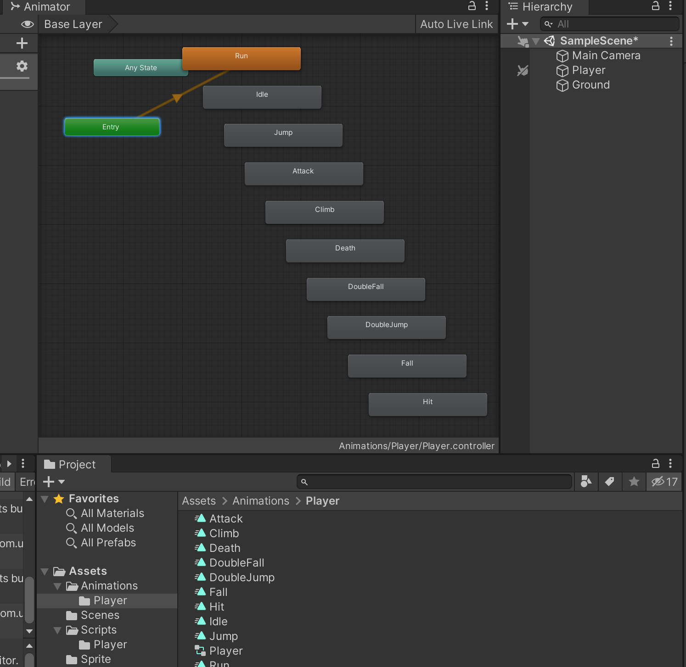

>参考[【Unity 2D游戏开发教程】](https://www.bilibili.com/video/BV1sE411L7kV)整理的学习笔记，对应github 的仓库地址为[https://github.com/zs8861/2D-Platform](https://github.com/zs8861/2D-Platform)

按照上文“制作”了Run 动画，可以使用裁剪好的Sprite 制作其他的动画，本文继续参考教程将这些动画用起来

现在做出来的动画控制器如下，后续基于这些动画可以进一步做动画状态机（用这种方式制作的精灵动画，都会默认放到动画控制器中，当然其中的每一个子动作是可以根据增加、删除的）



## 地面相关设置

先直接复用教程里面的Ground 素材（实际开发游戏需要自己制作），作为游戏场景的地面，后续2D 角色在这个Ground 上行动


为Ground 添加Box Collider 2D，注意不要选择【Is Trigger】，不触发，而是作为一个碰撞器，角色在上面不会“穿墙”


## 角色相关设置

为Player 添加Rigidbody 2D，也就是2D 刚体，用于控制角色的移动，注意Collision Detection 选择Continuous；Sleeping Mode 选择为Never Sleep

为Player 添加Capsule Collider 2D，胶囊体碰撞器，注意包裹住角色，注意不要选择【Is Trigger】

为Player 添加Box Collider 2D，注意包裹住角色的脚，并适当往下拉大一些，注意这里要选择【Is Trigger】，用于判断角色与地面是否接触


>这里是否做的有点复杂了，每一个组件的作用当然需要重点了解清楚！

## 让角色动起来

在Player 物体上增加一个脚本，用来控制角色的移动

```c#
using System.Collections;
using System.Collections.Generic;
using UnityEngine;

public class PlayerController : MonoBehaviour
{
    public float runSpeed = 5;
    private Rigidbody2D rigidbody2D;

    // Start is called before the first frame update
    void Start()
    {
        rigidbody2D = GetComponent<Rigidbody2D>();
    }

    // Update is called once per frame
    void Update()
    {
        Run();
    }


    void Run()
    {
        float moveDir = Input.GetAxis("Horizontal");   // 水平轴，-1～1之间的值
        Vector2 playerVel = new Vector2(moveDir * runSpeed, rigidbody2D.velocity.y);
        rigidbody2D.velocity = playerVel;
    }
}
```

运行起来的效果是这样的（鬼畜），角色在滚动


是因为Player 的Rigidbody 2D 需要勾选Freeze Rotation Z轴！

## 遗留问题

1. 怎么用“瓦片”制作游戏场景？制作丰富的游戏场景？
2. 2D 像素游戏的整体场景美术风格的一致性怎么实现？有哪些注意事项？
3. Rigidbody 2D，Collision Detection 设置Continuous？Sleeping Mode 设置Never Sleep？
4. 碰撞器与触发器的区别是什么？各自适用于什么场景？
