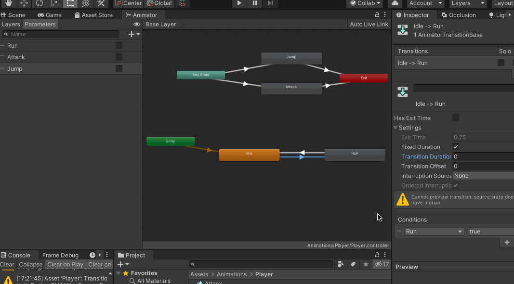
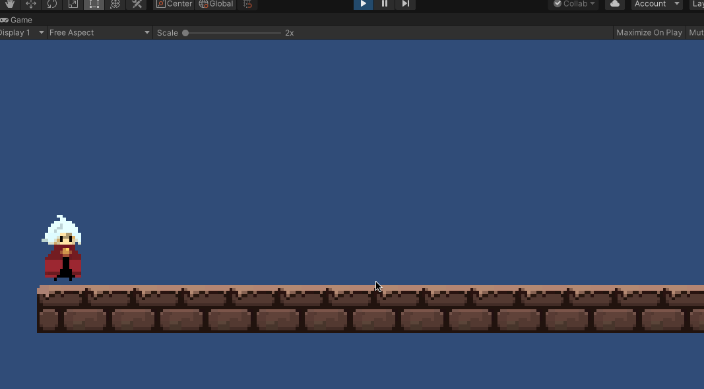

前面两部分让角色动起来了，但是希望实现不同的动作切换，这一部分就需要使用到Animator 组件了

我希望实现的动画控制效果如下：

1. 正常情况下Idle 状态
2. 按【A】、【D】 键，角色Run 起来
3. 按【Space】 空格键，角色Jump
4. 按【Shift】 键，角色Attack 攻击

## 动画状态机设置

去修改动画控制器（保留Idle、Run、Jump、Attack 动画），增加动画状态机如下：

1. 动画状态机进来之后，默认是Idle 状态
2. Idle 切换到Run，通过一个Bool 类型的Run 参数控制，为true 时切换
	2.1. 不需要过渡时间，Transaction Duration 设置为0
	2.2. 取消勾选Has Exit Time 选项
3. Run 切换回Idle，当Bool 类型的Run 参数为false
4. Any State 都可以切换到Attack 状态，通过增加Bool 类型Attack 参数
	4.1. Attack 参数为false，离开
5. Any State 都可以切换到Jump 状态，通过增加Bool 类型Jump 参数
	5.1. Jump 参数为false，离开



这里只是演示了怎么设置动画状态机

## 编写程序控制动画

在上文的基础上增加动作切换的控制逻辑

```c#
using System.Collections;
using System.Collections.Generic;
using UnityEngine;

public class PlayerController : MonoBehaviour
{
    public float runSpeed = 5;
    private Rigidbody2D rigidbody2D;
    private Animator animator;

    // Start is called before the first frame update
    void Start()
    {
        rigidbody2D = GetComponent<Rigidbody2D>();
        animator = GetComponent<Animator>();
    }

    // Update is called once per frame
    void Update()
    {
        float moveDir = Input.GetAxis("Horizontal");   // 水平轴，-1～1之间的值

        // 通过刚体控制GameObject 位移
        Vector2 playerVel = new Vector2(moveDir * runSpeed, rigidbody2D.velocity.y);
        rigidbody2D.velocity = playerVel;

        // 当按下【A】、【D】时移动
        if (moveDir > 0.01 || moveDir < -0.01)
        {
            // 通过动画控制器切换动作
            animator.SetBool("Run", true);
        }

        // Run运动停止
        if (moveDir > -0.01 && moveDir < 0.01)
        {
            animator.SetBool("Run", false);
        }

        // 按下【Space】，进行跳跃
        if (Input.GetKeyDown(KeyCode.Space))
        {
            animator.SetBool("Jump", true);

            // 通过协程控制，一定时间后跳跃结束
            StartCoroutine(StopJumpCoroutine());
        }

        // 按下【Shift】，进行攻击
        if (Input.GetKeyDown(KeyCode.LeftShift))
        {
            animator.SetBool("Attack", true);

            // 通过协程控制，一定时间后攻击结束
            StartCoroutine(StopAttackCoroutine());
        }
    }


    IEnumerator StopJumpCoroutine()
    {
        yield return new WaitForSeconds(1);
        animator.SetBool("Jump", false);
    }

    IEnumerator StopAttackCoroutine()
    {
        yield return new WaitForSeconds(1);
        animator.SetBool("Attack", false);
    }
}
```

## 运行效果演示



>本文实现了很基础的动作功能，可以尝试去丰富场景、添加敌人等来进一步丰富玩法

以上的演示效果明显存在一些问题：

1. 但是明显可以看到跳跃和奔跑的动作切换很生硬
	1.1. 所以是否可以使用协程来配合实现动作的切换？
	1.2. 如果可以使用，那么应该怎么使用？
	1.3. 如果不可以使用，那么应该如何实现动作的丝滑切换？
2. 跳跃在代码里面强制设置了等待1s，其实应该根据动画实际时长来设置
3. 按【A】之后，角色后退移动，但没有转头效果
4. 播放Jump 动作的时候，按【A】、【D】，还是会移动
	4.1. 因为代码里面刚体移动的逻辑是单独的

## 遗留问题

1. Animator 里面的Layer 一般怎么使用？
2. 制作过渡更加丝滑的动作效果，有什么技巧？针对2D 游戏！
3. 本文实现的代码很基础，扩展性很差
4. 本文实现的动作效果，不同动作之间的过渡、切换效果并不好，一般有什么好的设置方法？
