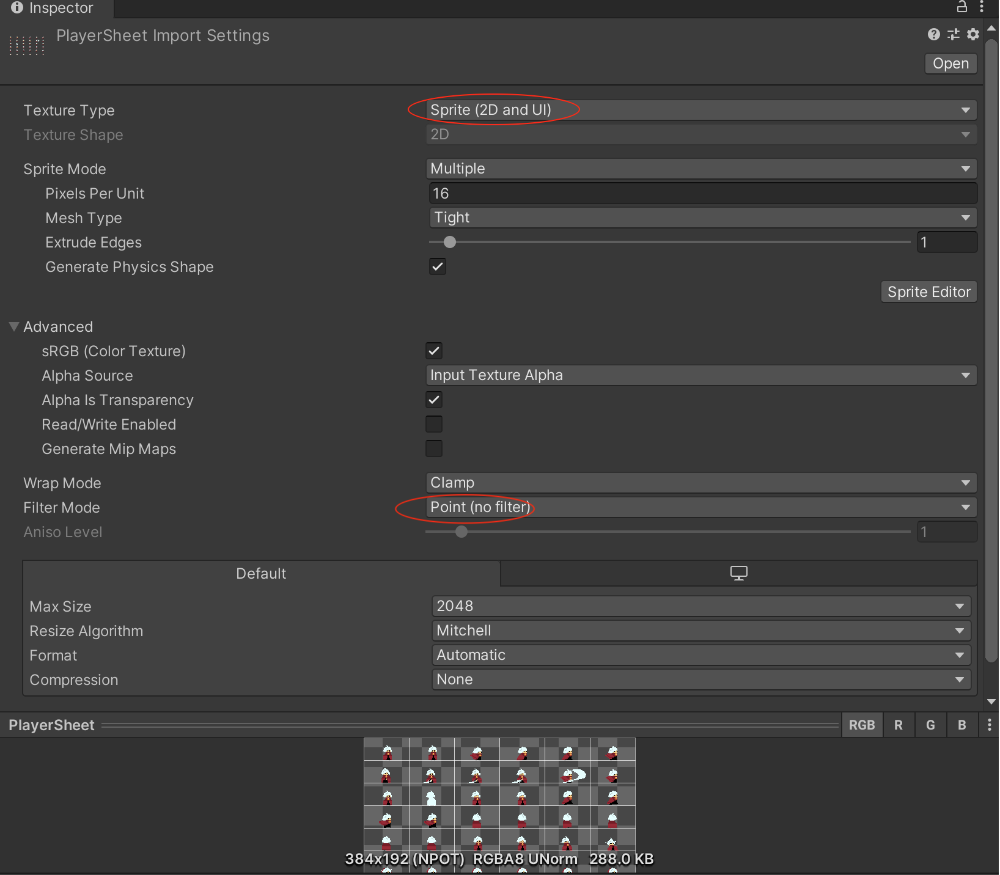
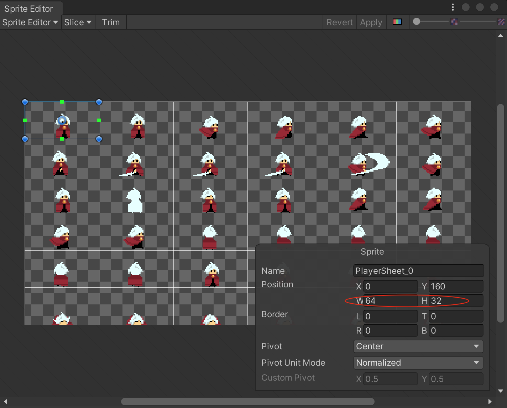

参考[【Unity 2D游戏开发教程】](https://www.bilibili.com/video/BV1sE411L7kV)整理的学习笔记，对应github 的仓库地址为[https://github.com/zs8861/2D-Platform](https://github.com/zs8861/2D-Platform)

像素美术素材可以使用Aseprite 软件进行制作，比如制造完成后导入Unity 之后，需要进行如下设置（Pixels Per Unit 结合实际情况）

然后点击【Sprite Editor】进行切图，比如在Aseprite 里面制作的每张图都是32 x 64 像素的，那么如下设置

然后就可以切成一个个小的图片了，动画的原理不就是一个个静态的图片播放起来实现动态效果的吗

## 遗留问题

1. Aseprite 怎么制作动画？