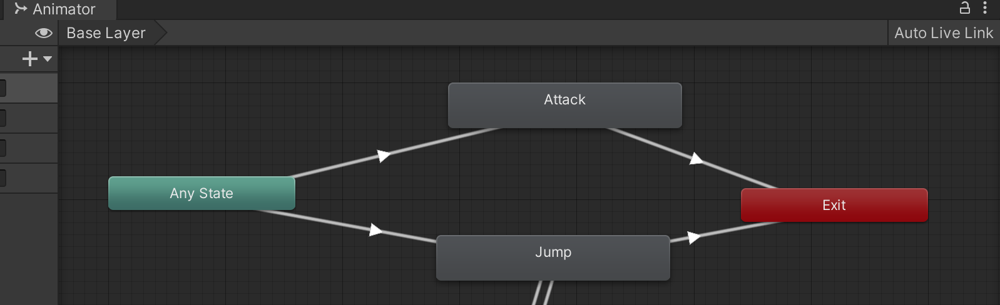
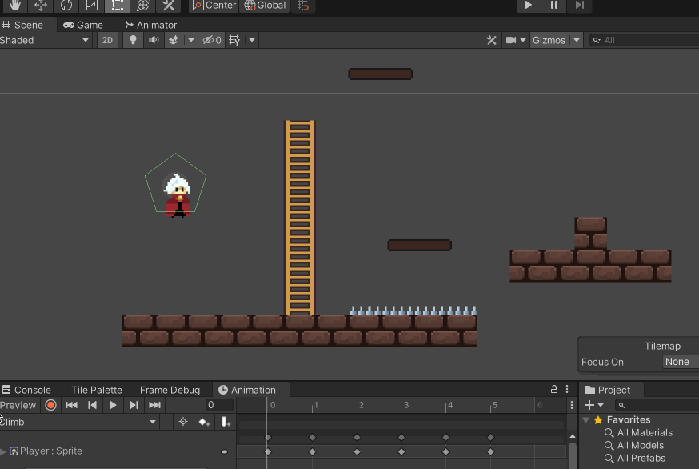
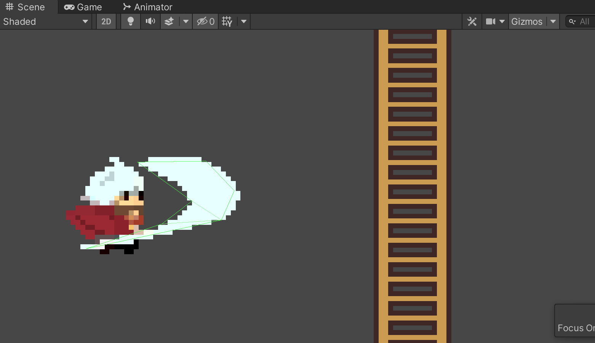
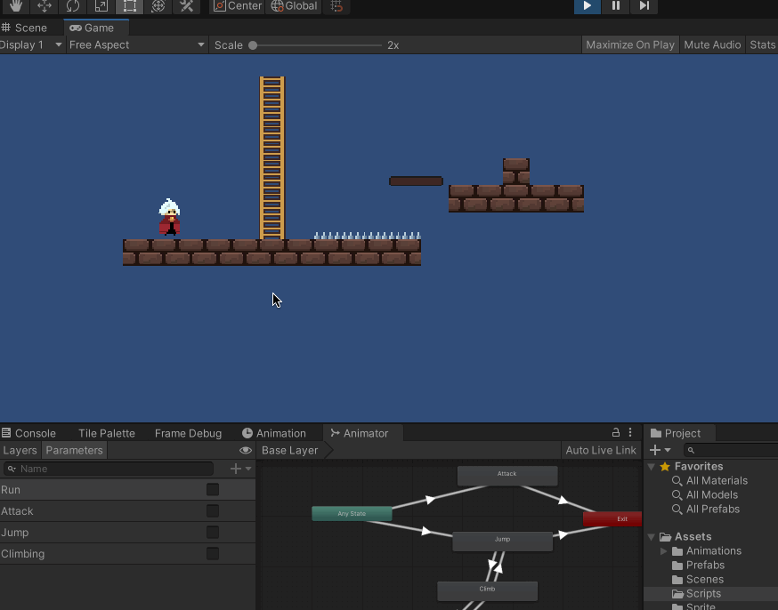
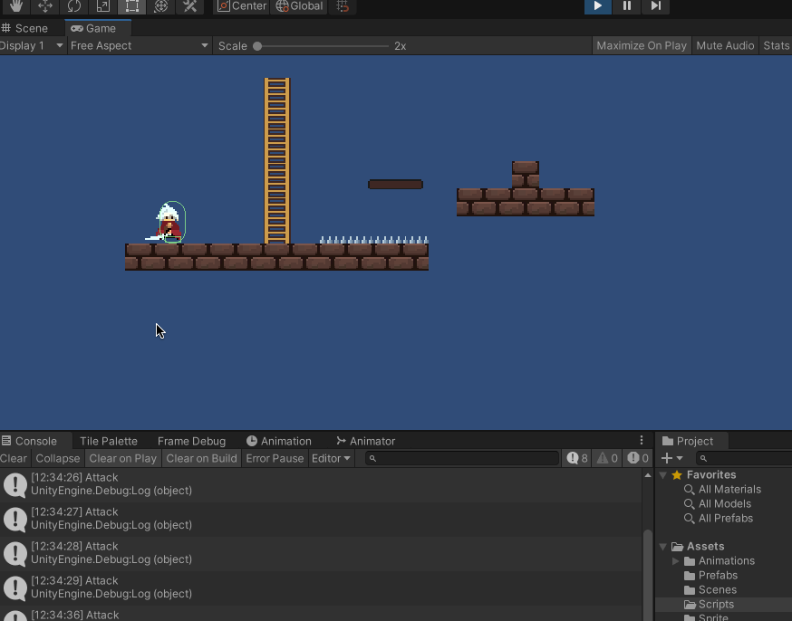
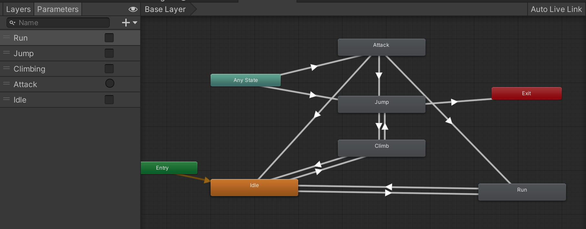

>参考[【Unity 2D游戏开发教程】](https://www.bilibili.com/video/BV1sE411L7kV)整理的学习笔记，对应github 的仓库地址为[https://github.com/zs8861/2D-Platform](https://github.com/zs8861/2D-Platform)

## 动画状态机

希望达成的效果是任何动画状态都可以在玩家按下【Shift】之后切换到攻击动画，所以可以从【Any State】切换到【Attack】

然后Attack 结束后，需要回到上一个状态，所以Attack 需要和Idle、Run、Jump 等分别有一个连线（考虑一下切换的条件分别是什么？）

动画状态机设计如下（但是因为Attack 结束后可以回到上次的状态，所以Attack 需要和所有的动画都有一个连线，很乱）：



>攻击动作的播放已经在上文实现了！

## 攻击动画和功能

先说明一下需要实现的效果，角色Attack 时，当武器挥砍出去的时候，启动Polygon Collider 2D 碰撞器，进行碰撞检测，触发相关的攻击逻辑

Polygon Collider 2D 碰撞器需要包裹住攻击时的刀这个武器，用于后续和敌人判断是否碰撞使用

在Player 游戏物体下面新建一个PlayerAttack 子物体，为这个子物体增加Polygon Collider 2D 组件，这个Polygon Collider 2D 碰撞器放在这里进行管理，注意勾选IsTrigger 属性

切换到角色的动画到Attack，然后逐帧找到光刀完全挥出来的效果，也就是第4 帧



然后去调整Polygon Collider 2D 的范围，包裹住光刀



## 攻击功能逻辑实现

在PlayerAttack 子物体上增加一个PlayerAttack.cs 脚本。注意把PlayerController.cs 里面关于攻击的动画逻辑迁移到这里

```c#
using System.Collections;
using System.Collections.Generic;
using UnityEngine;

public class PlayerAttack : MonoBehaviour
{
    public float damage = 2f;   // 伤害值

    private Animator animator;
    private PolygonCollider2D polygonCollider;

    // Start is called before the first frame update
    void Start()
    {
        animator = GameObject.FindGameObjectWithTag("Player").GetComponent<Animator>();

        // 获取碰撞体，开始是关闭的，等攻击的时候再打开
        polygonCollider = GetComponent<PolygonCollider2D>();
        polygonCollider.enabled = false;
    }

    // Update is called once per frame
    void Update()
    {
        // 按下【Shift】，进行攻击
        if (Input.GetKeyDown(KeyCode.LeftShift))
        {
            animator.SetBool("Attack", true);
            Debug.Log("Attack");  // 用于debug 分析

            // 通过协程控制，攻击动画播放一定时间后触发碰撞框
            StartCoroutine(StartAttackCoroutine());

            // 通过协程控制，一定时间后攻击结束
            StartCoroutine(StopAttackCoroutine());
        }
    }

    IEnumerator StartAttackCoroutine()
    {
        // 经过测试大概动画0.3s后，光刀挥出来
        yield return new WaitForSeconds(0.3f);  // 这里设置一个默认值，正常情况下应该是作为参数可配置的

        // 开启攻击碰撞框
        polygonCollider.enabled = true;
    }

    IEnumerator StopAttackCoroutine()
    {
        // 经过测试播放一次攻击动画大概0.5s
        yield return new WaitForSeconds(0.5f);   // 这里设置一个默认值，正常情况下应该是作为参数可配置的
        animator.SetBool("Attack", false);

        // 关闭攻击碰撞框
        polygonCollider.enabled = false;
    }
}
```

打开Gizmos，然后测试一下运行效果如下：



可以发现有一个问题：点击一次LeftShift，Attack 动画播放了三次，这个要怎么调整？

## 调试动画效果

除了上面出现的问题，还可能出现这种情况：按下LeftShift 后，进入到了攻击逻辑，但是没有按照预期播放Attack 动画

如下所示，中间有几次，以及最后一次只打开了PolygonCollider2D，但是没有播放Attack 动画



优化的方法：

1. 将触发Attack 的逻辑修改为使用Trigger，而不是动画状态机的Bool 类型
2. Attack 结束后不是到Exit，而是在动画状态机中具体连线到各个状态
3. Attack->Idle，当Idle = true 时
4. Attack->Run，当Run = true 时
5. Attack->Jump，当Jump = true 时



对应代码修改为：

```c#
using System.Collections;
using System.Collections.Generic;
using UnityEngine;

public class PlayerAttack : MonoBehaviour
{
    public float damage = 2f;   // 伤害值

    private Animator animator;
    private PolygonCollider2D polygonCollider;

    // Start is called before the first frame update
    void Start()
    {
        animator = GameObject.FindGameObjectWithTag("Player").GetComponent<Animator>();

        // 获取碰撞体，开始是关闭的，等攻击的时候再打开
        polygonCollider = GetComponent<PolygonCollider2D>();
        polygonCollider.enabled = false;
    }

    // Update is called once per frame
    void Update()
    {
        // 按下【Shift】，进行攻击
        if (Input.GetKeyDown(KeyCode.LeftShift))
        {
            animator.SetTrigger("Attack");
            Debug.Log("Attack");

            // 通过协程控制，攻击动画播放一定时间后触发碰撞框
            StartCoroutine(StartAttackCoroutine());

            // 通过协程控制，一定时间后攻击结束
            StartCoroutine(StopAttackCoroutine());
        }
    }

    IEnumerator StartAttackCoroutine()
    {
        // 经过测试大概动画0.3s后，光刀挥出来
        yield return new WaitForSeconds(0.3f);  // 这里设置一个默认值，正常情况下应该是作为参数可配置的

        // 开启攻击碰撞框
        polygonCollider.enabled = true;
    }

    IEnumerator StopAttackCoroutine()
    {
        // 经过测试播放一次攻击动画大概0.5s
        yield return new WaitForSeconds(0.5f);   // 这里设置一个默认值，正常情况下应该是作为参数可配置的

        // 因为Attack是一个Trigger，所以这里不用在关闭了
        //animator.SetBool("Attack", false);

        // 关闭攻击碰撞框
        polygonCollider.enabled = false;
    }
}
```

另外，因为相对于原来增加了Idle 这个Bool 变量，PlayerController.cs 的代码逻辑对应也要变化，主要是Update()

需要注意的是，比如从Run 切换到Idle 状态，不光要将Idle 设置为True，还要把Run 设置为False，因为在动画状态机里面，如果在玩家不移动的时候，只将Idle 设置为True，不将Run 设置为False，那么Run 是True 就会一直在Idle 和Run 之间一直快速切换

所以归根到底现在的代码太粗糙，对于状态的切换、状态的管理，后续一定要做好设计和封装！！

```c#
// Update is called once per frame
void Update()
{
    float moveDir = Input.GetAxis("Horizontal");   // 水平轴，-1～1之间的值

    // 通过刚体控制GameObject 位移
    Vector2 playerVel = new Vector2(moveDir * runSpeed, rigidbody2D.velocity.y);
    rigidbody2D.velocity = playerVel;

    // 当按下【A】、【D】时移动
    if (moveDir > 0.01 || moveDir < -0.01)
    {
        // 通过动画控制器切换动作
        animator.SetBool("Run", true);
        Debug.Log("Run");
    }

    Debug.Log("moveDir: " + moveDir);

    // Run运动停止
    if (moveDir > -0.01 && moveDir < 0.01)
    {
        // 因为上面将Run 设置为True 了，所以这里必须先将其设置为False，否则还是一直播放Run 动画！
        animator.SetBool("Run", false);

        Debug.Log("Idle");
        if (true != animator.GetBool("Idle"))
        {
            animator.SetBool("Idle", true);
        }
    }

    // 按下【Space】，进行跳跃
    if (Input.GetKeyDown(KeyCode.Space))
    {
        animator.SetBool("Jump", true);

        // 位置上移，给玩家y方向赋值（jumpSpeed暂定为7，具体值需要调整）
        rigidbody2D.velocity = new Vector2(rigidbody2D.velocity.x, jumpSpeed);

        //Debug.Log(rigidbody2D.velocity);

        // 通过协程控制，一定时间后跳跃结束
        StartCoroutine(StopJumpCoroutine());
    }
}
```

>所以调试动画的效果还是很繁琐的，需要对于细节、时间点、代码逻辑做好全面的分析和把控

## 遗留问题

1. 攻击时候的特效、音效、屏幕震动等还是缺失的，打击感不够
2. 有哪些增强打击感的技巧？
3. 现在的动画状态机连线看起来很乱、很复杂，应该如何优化？
4. Animator 中，Bool 变量和Trigger 变量各自的适用场景？
5. 现在的代码都是面向过程式的编程，至少对于动作部分怎么继续封装优化？
6. 武器的碰撞器在玩家按下【Shift】攻击时就变成enable，如果攻击有前摇呢，是否可以结果动画事件来控制enable 的时机？
7. 使用动画事件，游戏的可维护性是否不够好？是不是不够内聚
8. 如何设计游戏中的数值，保证整体的数值是平衡、有趣的？
9. 游戏中的Tag、Layer 越来越多，要系统化的管理起来
10. 随着游戏的复杂度增加，游戏各种物体的参数越来越多，这些如何有效管理起来？
