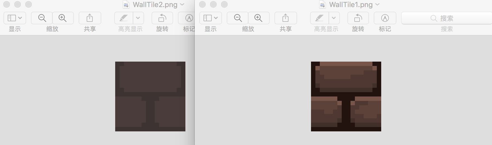
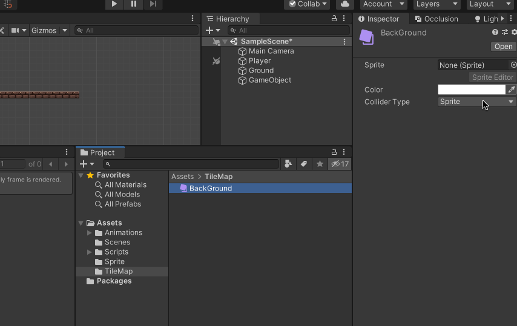
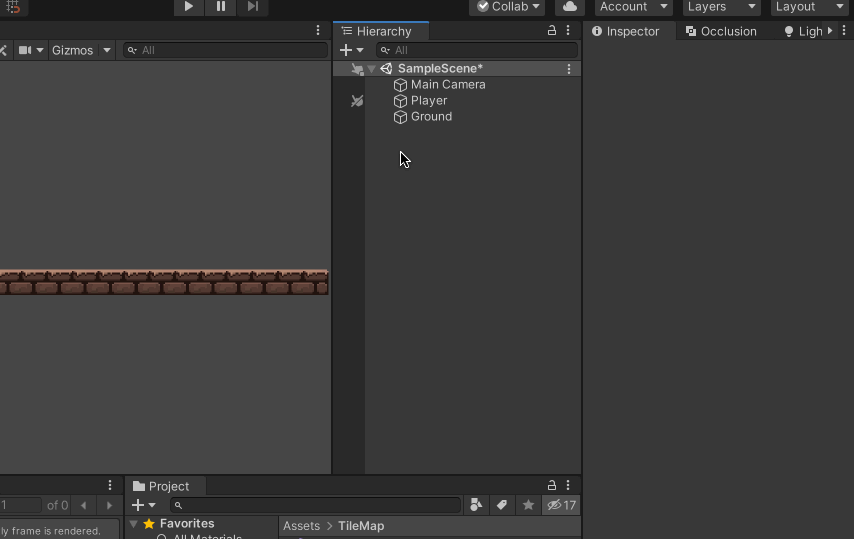
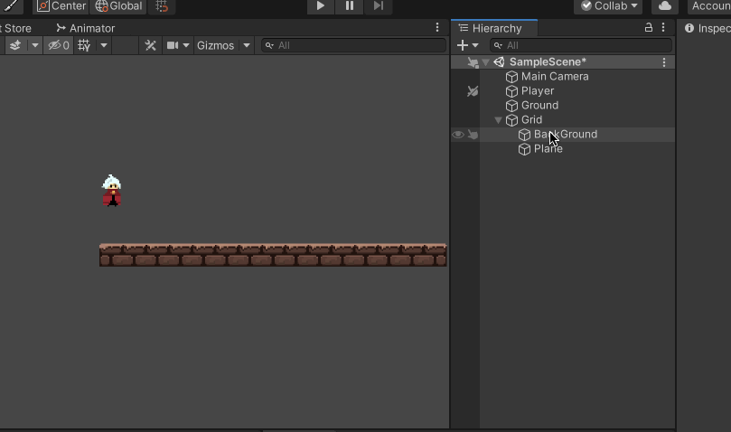
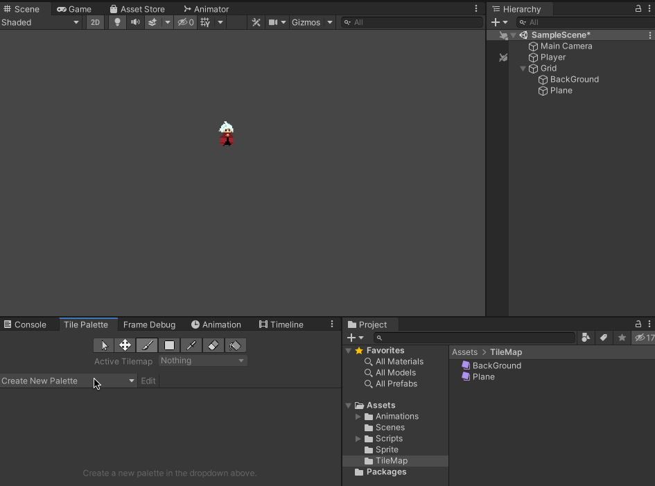
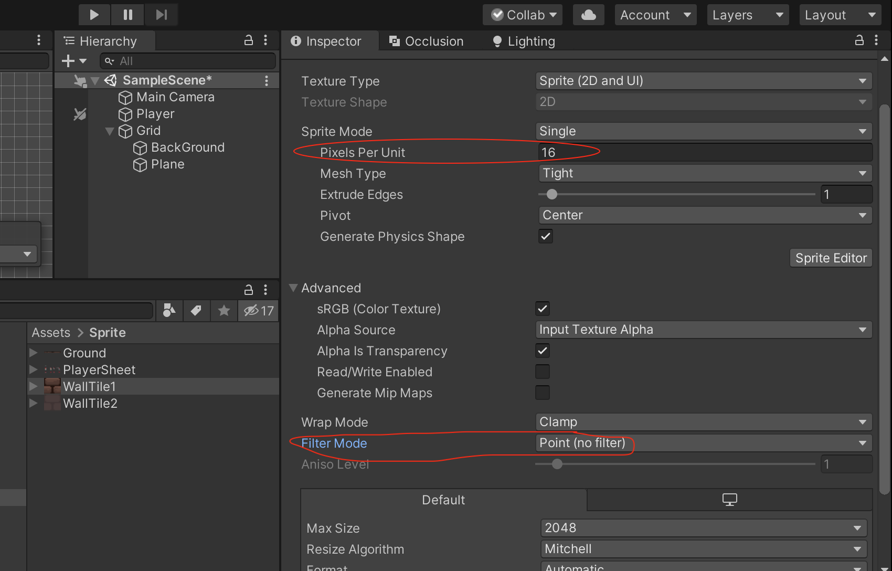
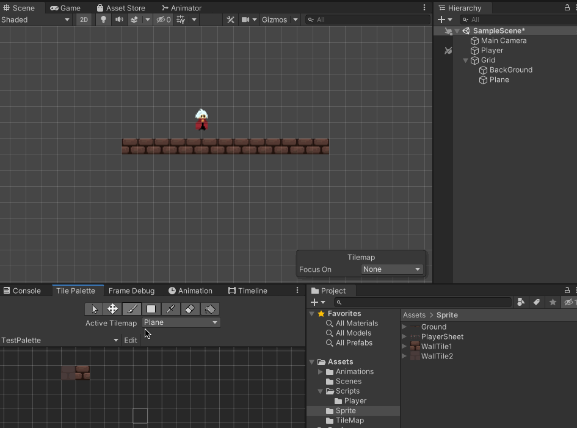
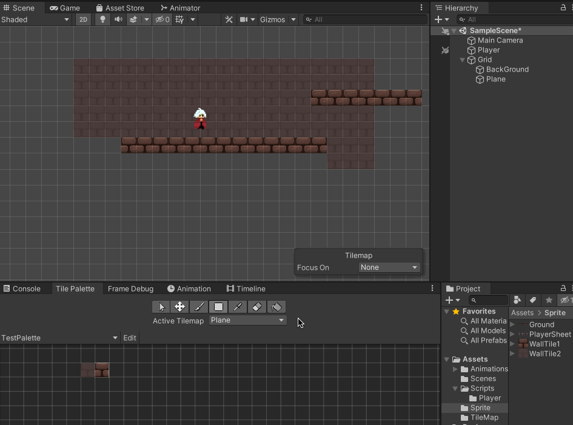
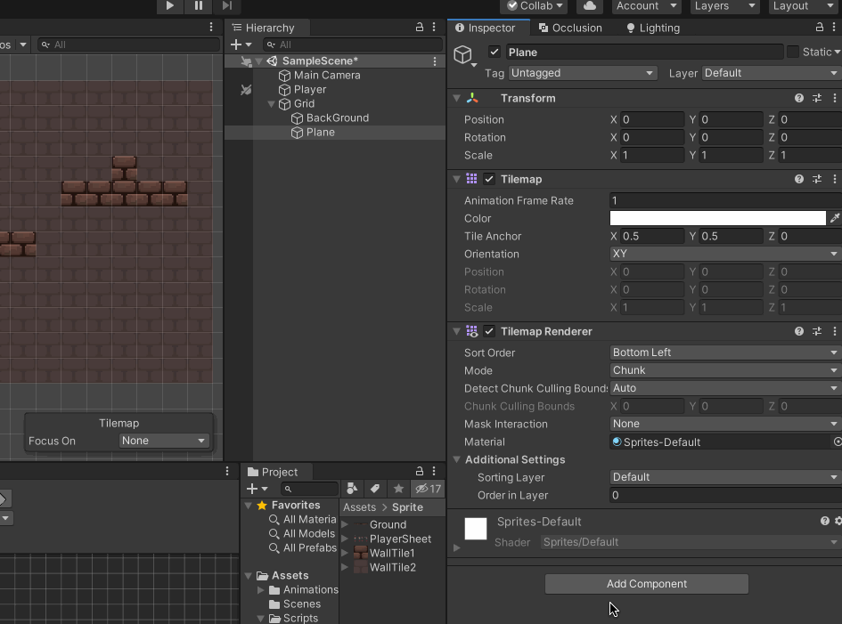
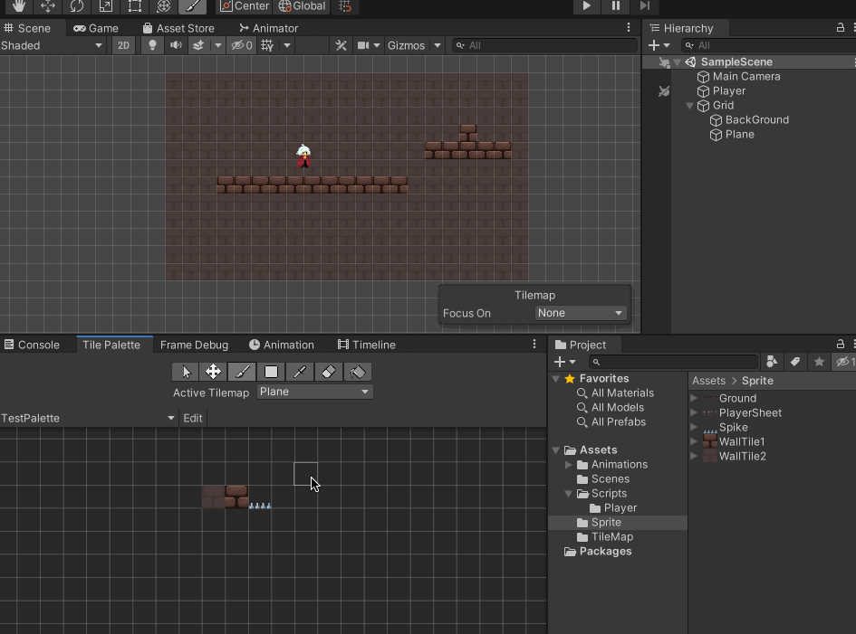

>参考[【Unity 2D游戏开发教程】](https://www.bilibili.com/video/BV1sE411L7kV)整理的学习笔记，对应github 的仓库地址为[https://github.com/zs8861/2D-Platform](https://github.com/zs8861/2D-Platform)

TileMap 在2D 横版游戏中，主要用于绘制游戏的背景，比如山石、墙等，也可以用来绘制2D 平台；在TopDown 类游戏中也是使用TileMap 来绘制地图场景，比如准备墙、花、草等的TileMap

## TileMap 使用

比如本文只使用简单的两个瓦片，分别作为前景、后景，以设计简单的场景

在Project 中，右键 -> Create -> Tile，然后为选择对应的精灵图片，这样就制作了一个TileMap（同样的步骤，分别做一个BackGround、Plane）

再回到场景中，右键 -> 2d Object -> Tilemap，就可以在场景中创建一个TileMap，并且使用上面创建的资源了

把之间在场景中创建的Ground删除，后续使用TileMap 来绘制场景、地形

Window -> 2D -> Tile Palette，打开Tilemap 瓦片调色板，先创建一个新的Palette，然后使用上面创建的Tile 进行绘制

但是可以看到绘制的瓦片很小，这个是因为对Sprite 的设置不对导致的，先对Sprite 进行修改，主要修改Pixels Per Unit、Filter Mode 属性

再去绘制场景、地形，现在就显示正常了！

上面的绘制，有一个问题，在Tile Palette 绘制两种瓦片的时候，没有正确选择对应在场景中的TileMap（这一步比较重要，后续设置TileMap Collider 2D 等会用得到）

## TileMap 碰撞体

比如计划用一个砖块作为瓦片去绘制平台，那么每个砖块瓦片增加一个碰撞体的话，性能是很差的，Unity 提供了TileMap Collider 2D 的方案，这样就不是每个瓦片都附带一个碰撞体，而是整个TileMap 有一个碰撞体

结合[Unity 横版2D 游戏开发学习笔记 - 2：让2D 角色动起来](https://xumenger.github.io/2-unity-2d-game-20241026/)，再去考虑针对Plane 的Layer 等进行合理的设置

## 删除不需要的瓦片

比如在TilePalette 做了一个基础的瓦片，但是发现并不需要了，想从TilePalette 中删除，可以点Edit -> 选中橡皮擦 -> 划掉不用的瓦片

## 遗留问题

1. 这一节很重要，后续设计地图、场景、关卡，考虑需要哪些场景素材都息息相关！
2. 一个场景丰富的游戏怎么设计TileMap？背景、前景、障碍、点缀、道具（梯子等）……
3. TileMap Renderer 组件？
4. TileMap Collider 2D 组件？
5. Tile Palette 怎么使用？比如选择一片区域、设置图层等操作……
