>参考[【Unity 2D游戏开发教程】](https://www.bilibili.com/video/BV1sE411L7kV)整理的学习笔记，对应github 的仓库地址为[https://github.com/zs8861/2D-Platform](https://github.com/zs8861/2D-Platform)

首先修改地刺2D 素材的参数

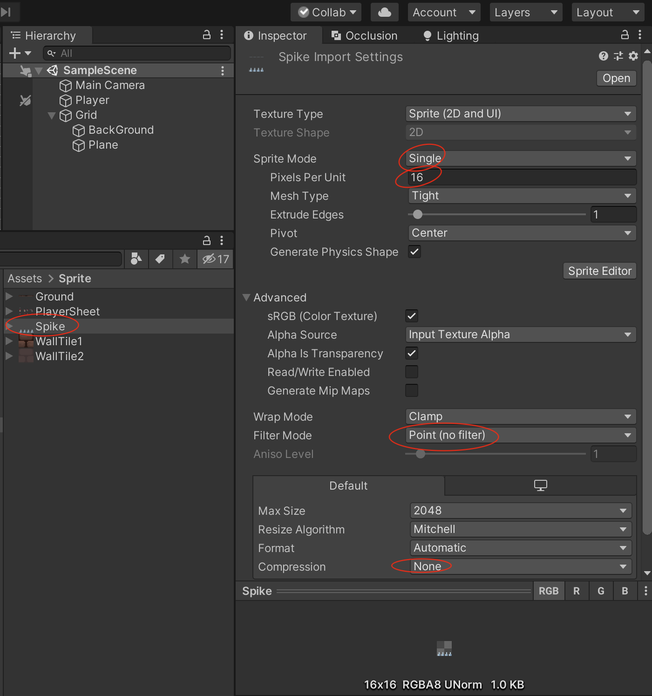

将地刺素材拖到Tile Palette 里面

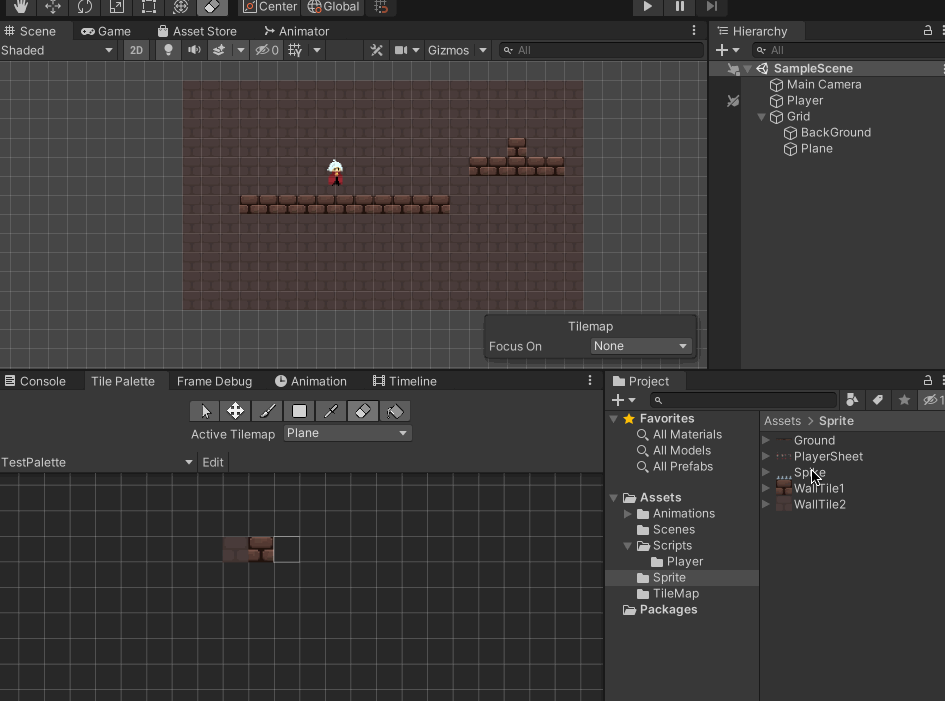

然后就可以使用瓦片在场景中绘制地刺机关了，在场景中增加一个Spike 的TileMap 专门用来画地刺

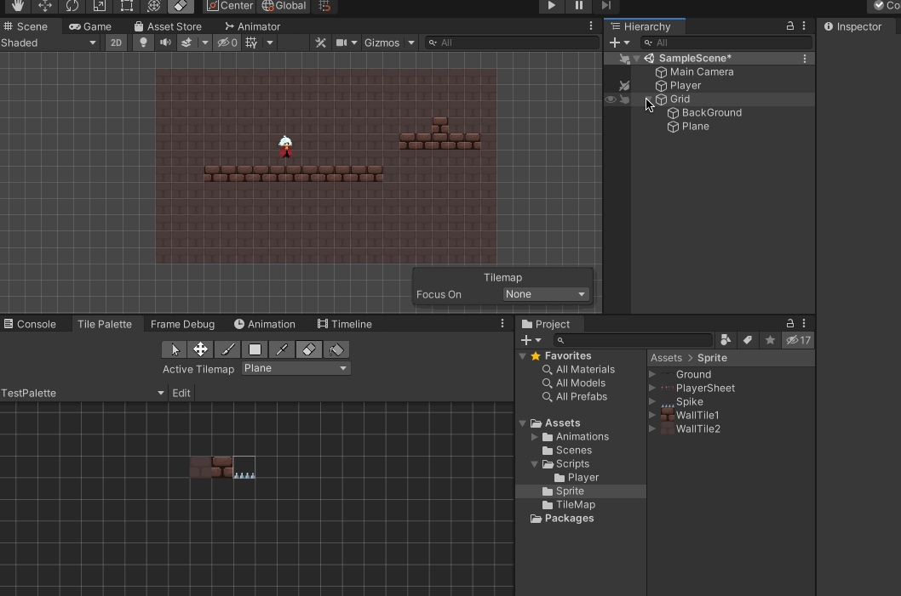

## 为地刺添加碰撞体

为场景中的Spike 游戏物体增加Tilemap Collider 2D，但是可以看到是每个瓦片都有一个碰撞体Component，这样的性能消耗比较大

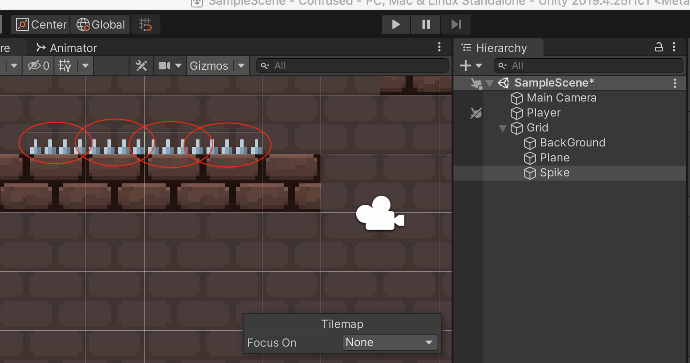

可以使用Composite Collider 2D 组件，需要注意

1. 同时会自动添加一个Rigidbody 2D 的组件，将Body Type 勾选为Static 静态
2. 勾选Tilemap Collider 2D 的Used By Composite 属性，这样就可以合并碰撞体了

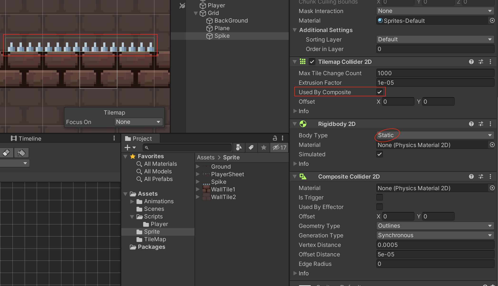

>在使用Tilemap 编辑地图的时候，对于碰撞器都需要注意这一点！

## 碰撞范围修改

如上图，可以看到碰撞体的上面范围是超过了地刺的上边界的，这个可以通过精灵编辑器修改

使用精灵编辑器打开地刺素材，选择Custom Physics Shape ，然后可以画出来一个预期的范围

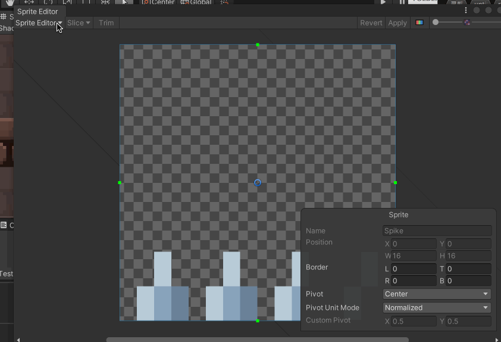

对于TileMap 不用做其他修改，直接在Spike 这个Active Tilemap 绘制地刺，可以和之前的进行对比，碰撞的范围现在符合预期了

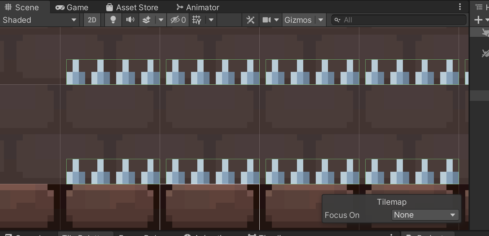

但是可以看到虽然使用了Composite Collider 2D ，但是碰撞体是割裂开的

因为在Sprite Editor 的Custom Physics Shape 模式中，我们在横向没有画满，如下图

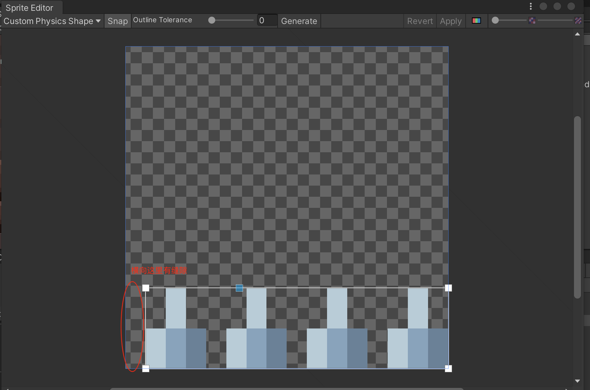

改成这样的话就可以了

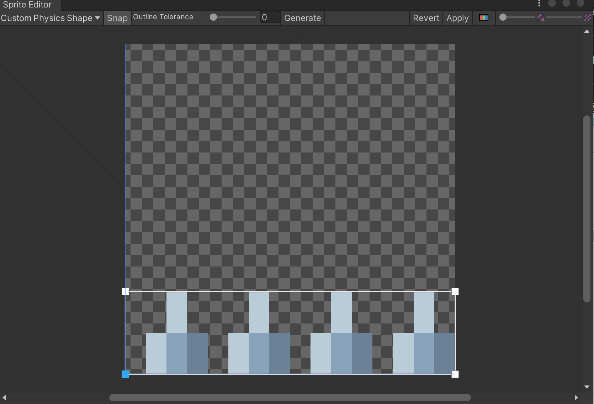

现在再去使用地刺瓦片绘制，效果就符合预期了

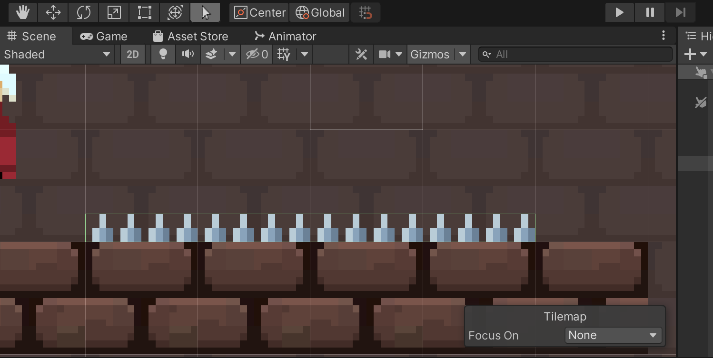

## 编写程序

在PlayerController.cs 中增加HP 属性和Damage() 方法，并且为Player 增加"Player" 的Tag

```c#
public void Damage(int damage)
{
    HP -= damage;
    if (HP <= 0)
    {
        this.gameObject.SetActive(false);
    }
}
```

增加SpikeController.cs 实现碰撞检测（注意需要先勾选Spike 的Composite Collider2D 的IsTrigger 属性）

```c#
using System.Collections;
using System.Collections.Generic;
using UnityEngine;

public class SpikeController : MonoBehaviour
{
    public int damage = 1;
    public PlayerController player;

    // Start is called before the first frame update
    void Start()
    {
        player = GameObject.FindGameObjectWithTag("Player").GetComponent<PlayerController>();
    }

    private void OnTriggerEnter2D(Collider2D other)
    {
        // 因为Player 有两个碰撞体，所以需要再判断一下碰撞体
        // 否则碰撞一次丢两个HP
        // 这种写法确实有点挫
        if (other.CompareTag("Player") && other.GetType().ToString() == "UnityEngine.CapsuleCollider2D")
        {
            // 玩家受伤
            player.Damage(damage);

            // 配合屏幕震动、屏幕闪烁、玩家掉血特效等
            // 是否使用事件机制更利于扩展
        }
    }
}
```

运行效果如下：

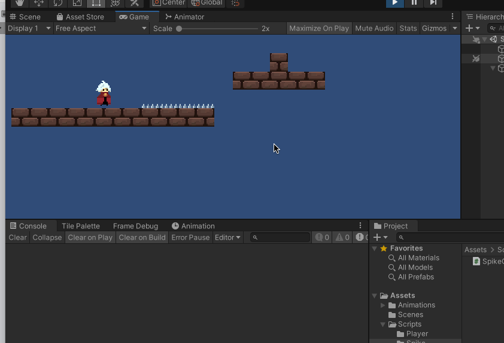

这里面有几个注意点：

1. 关于玩家受伤后可能触发各种逻辑：屏幕、血条、特效等，这些适合使用事件机制
2. 玩家持续站在地刺上面的话，现在没有实现持续受伤的效果（比如隔1s 就扣血）
3. 玩家身上有两个碰撞器，和地面、地刺的碰撞器的关系是什么样的，怎么管理？
4. 现在的代码、动作都是非常粗糙的，具体好的游戏效果差很多！

## 遗留问题

1. 地刺是一个很常规的陷阱设计，更多的玩法、陷阱该如何设计，要求能贴合场景、剧情
2. Unity 中针对png 类型素材设置的Pixels Per Unit、Wrap Mode、Filter Mode、Compression 等参数的具体作用？
3. Tile Palette 有一个Active Tilemap 层，这个在场景中绘制瓦片的时候需要关注
4. Composite Collider 2D 组件怎么使用的，需要了解
5. Custom Physics Shape 可以修改精灵图片的物理属性
6. 游戏逐步完善，玩家、相机、敌人、陷阱等的代码结构怎么组织起来？合理规划模块？
7. 后续需要基于事件机制完善游戏的代码可扩展性！
