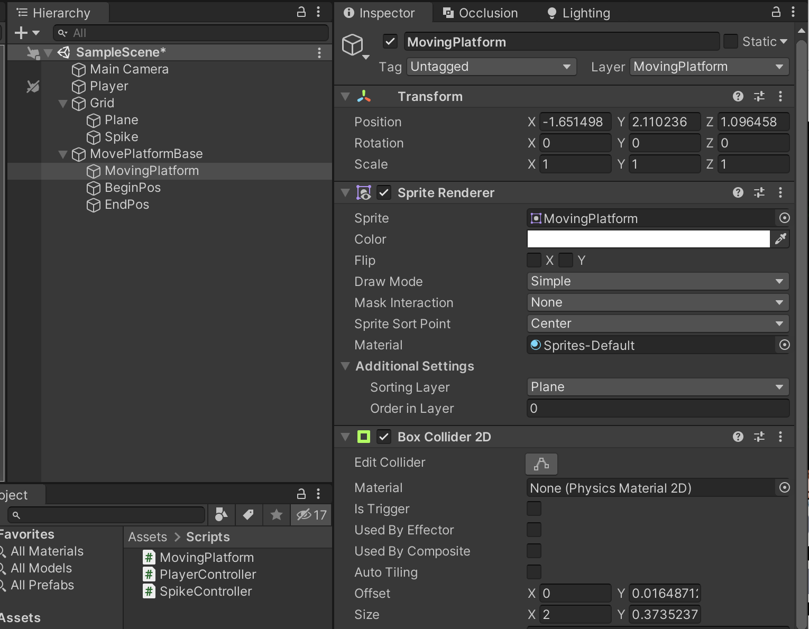
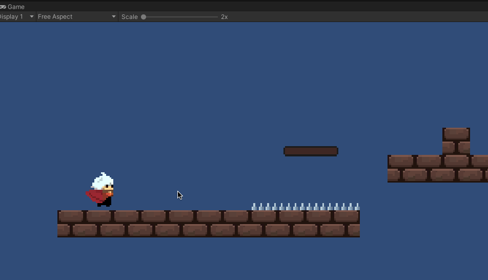
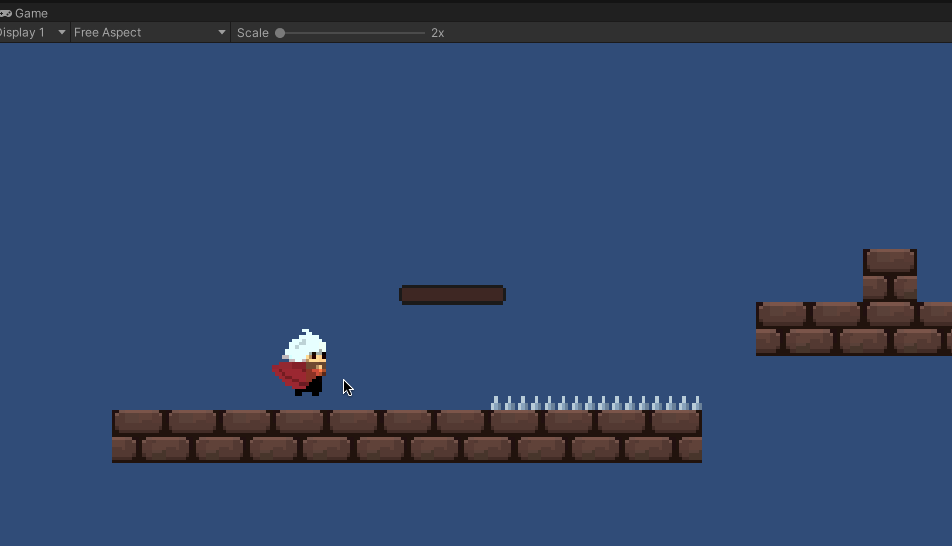
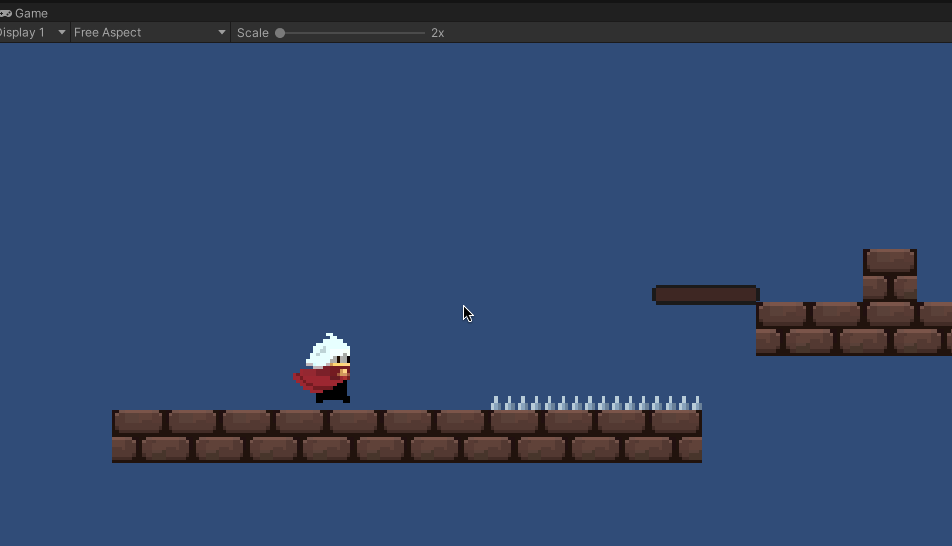

>参考[【Unity 2D游戏开发教程】](https://www.bilibili.com/video/BV1sE411L7kV)整理的学习笔记，对应github 的仓库地址为[https://github.com/zs8861/2D-Platform](https://github.com/zs8861/2D-Platform)

找到一个移动平台的精灵图片素材，设置精灵图片的相关参数

将平台拖动到场景中，对应生成一个GameObject，在Sprite Renderer 组件中有一个Sorting Layer 属性，设置为Ground，和地面一致

并且增加一个Layer：MovingPlatform，用于区分这是一个移动平台的层，后续判断玩家是否可以站在上面的时候使用

为移动平台增加一个Box Collider 2D 组件，用来控制玩家可以站在上面，注意不要勾选Is Trigger



## 完善玩家的跳跃功能

在PlayerController.cs 中的Update() 方法增加代码逻辑

```c#
void Update()
{
	...

    // 按下【Space】，进行跳跃
    if (Input.GetKeyDown(KeyCode.Space))
    {
        // 玩家的动作动画切换
        animator.SetBool("Jump", true);

        // 位置上移，给玩家y方向赋值（jumpSpeed暂定为7，具体值需要调整）
        rigidbody2D.velocity = new Vector2(rigidbody2D.velocity.x, jumpSpeed);

        // 通过协程控制，一定时间后跳跃结束
        StartCoroutine(StopJumpCoroutine());
    }

    ...
}

IEnumerator StopJumpCoroutine()
{
    yield return new WaitForSeconds(0.8f);
    animator.SetBool("Jump", false);
}
```

运行效果如下：



存在以下问题（以后再慢慢优化）：

1. 向后运行的时候玩家没有转身面向后面
2. 一直按空格键跳跃，玩家一直往上飞，这个需要控制一下
3. 玩家的脚距离平面存在一定的差距，这个贴合度做的不好
4. 跳到墙上的时候会卡在墙上（当然有一些机制可能就需要这个特性）

## 移动平台的移动功能

为移动平台增加控制代码

```c#
using System.Collections;
using System.Collections.Generic;
using UnityEngine;

public class MovingPlatform : MonoBehaviour
{
    public float speed = 3;

    private int posIndex;
    public Transform[] movePos; // 平台移动的两端

    // Start is called before the first frame update
    void Start()
    {
        posIndex = 1;
    }

    // Update is called once per frame
    void Update()
    {
        transform.position = Vector2.MoveTowards(transform.position, movePos[posIndex].position, speed * Time.deltaTime);
        if (Vector2.Distance(transform.position, movePos[posIndex].position) < 0.1f)
        {
            if (posIndex == 1)
            {
                posIndex = 0;
            } 
            else
            {
                posIndex = 1;
            }
        }
    }
}
```

并且设置beginPos、endPos


现在的运行效果是这样的



## 玩家随平台移动

可以看到上面的效果，玩家跳到平台上之后，玩家不会随着平台移动（当然这种也可以是一种玩法设计）

如果想要实现玩家随着平台移动，可以使用Trigger 实现

```c#
using System.Collections;
using System.Collections.Generic;
using UnityEngine;

public class MovingPlatform : MonoBehaviour
{
    public float speed = 3;

    private int posIndex;
    public Transform[] movePos; // 平台移动的两端


    public Transform playerParentTransform; // 玩家父类

    // Start is called before the first frame update
    void Start()
    {
        posIndex = 1;
        playerParentTransform = GameObject.FindGameObjectWithTag("Player").transform.parent;
    }

    // Update is called once per frame
    void Update()
    {
        transform.position = Vector2.MoveTowards(transform.position, movePos[posIndex].position, speed * Time.deltaTime);
        if (Vector2.Distance(transform.position, movePos[posIndex].position) < 0.1f)
        {
            if (posIndex == 1)
            {
                posIndex = 0;
            } else
            {
                posIndex = 1;
            }
        }
    }

    private void OnTriggerEnter2D(Collider2D other)
    {
        Debug.Log(other.GetType().ToString());
        if (other.CompareTag("Player") && other.GetType().ToString() == "UnityEngine.BoxCollider2D")
        {
            // 玩家和平台碰撞的时候，使用平台作为玩家的父物体
            other.gameObject.transform.parent = gameObject.transform;
        }
    }
    private void OnTriggerExit2D(Collider2D other)
    {
        // 玩家和平台离开后，恢复原来的父物体
        other.gameObject.transform.parent = playerParentTransform;
    }
}
```



1. 但是贴合度也不高，并且仍然存在自动掉落的情况
2. 除了上面的方案，还有没有其他可以实现玩家随平台移动的方案？

## 扩展机制

移动平台是横版2D 游戏中非常常见的玩法机制，基于本文和上文的操作步骤、需要的技术，可以继续完善更多种玩法：

1. 单向跳跃平台（可以从下跳跃穿过去，不会掉下来）
2. 围绕某个点一直翻转的平台，当坡度超过30度，玩家就会下滑，玩家要把握时机
3. 一个正常的平面突然出现的地刺，或者地刺是某个Boss 的大招
4. 带有火焰的移动平台，需要先使用水技能灭火，再进行跳跃前进

另外这些机关，都可以抽象为预制件，需要的时候直接拖到场景中使用即可！

## 遗留问题

1. 增加的Layer 越来越多，如何有效的管理起来？
2. 移动平台可以做成一个预制件，后续在地图设计的时候，用得到的地方直接拖放到场景中
3. 移动平台在场景中的摆放高度是有讲究的，比如有一个场景，我不希望玩家一段跳直接跳上去，而是要学会二段跳技能后再跳上去，那么移动平台的高度要略高于一段跳高度、低于二段跳高度。这些都需要结合关卡的玩法来深化设计的！
4. 以本篇为例，跳跃、平台移动的功能好实现，但动作流畅度这些需要微调的空间还有很多
5. 在一个正规的游戏项目中，机关的类型是如何管理的，怎么选择在什么点使用什么机关？
