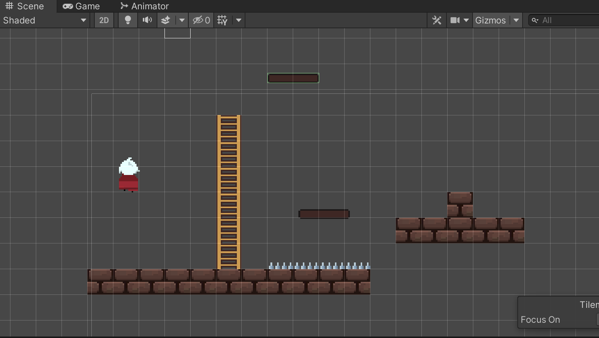

>参考[【Unity 2D游戏开发教程】](https://www.bilibili.com/video/BV1sE411L7kV)整理的学习笔记，对应github 的仓库地址为[https://github.com/zs8861/2D-Platform](https://github.com/zs8861/2D-Platform)

比如【动物井】里面爬梯子是一个非常关键的机制

## 梯子瓦片的经典步骤

1. 导入梯子图片素材（这个的来源就是美术了，或者自己购买）
2. 在Inspector 设置素材的属性
	1. Pixels Per Unit
	2. Filter Mode 设置为Point
	3. Compression 设置为None
3. 打开Sprite Editor 进行相关的编辑操作
	1. 选择Custom Physics Shape
	2. 按照设计设置后续需要用到的碰撞范围
4. 将编辑后的梯子图片素材导入到Tile Palette
	1. 后续在地图中绘制地图就可以直接用了
5. 在场景中创建一个TileMap 游戏对象
	1. 后续梯子都绘制在这里
6. 为梯子TileMap 游戏对象增加一个Layer：Ladder
7. 编辑梯子TileMap 游戏对象的Tilemap Render
	1. 编辑Sorting Layer，可以调整层的显示顺序
	2. 为梯子TileMap 在这里设置Layer 为Ladder
	3. 注意：梯子要在背景前、玩家后面
8. 选中梯子TileMap，就可以在场景中绘制了
9. 为梯子TileMap 增加Tilemap Collider 2D 碰撞体
10. 为梯子Tilemap 增加Composite Collider 2D 碰撞体
11. 勾选Tilemap Collider 2D 的Used By Composite 合并碰撞体
12. Rigidbody 2D 的Body Type 选择为静态（Static）

## 动画状态机设计

先参考[Unity 横版2D 游戏开发学习笔记 - 1：Unity 2D 动画基础，并总结2D 精灵动画流程](https://xumenger.github.io/1-unity-2d-game-20241026/) 制作爬梯子的动画

设计动画的切换：

1. 到梯子附近，按下【Up】按键，触发爬梯子
2. 通过玩家和梯子的碰撞器来判断玩家是否在梯子旁边
3. Idle 动作可以切换到Climb 动作
4. Jump 动作可以切换到Climb 动作
5. 爬到平台上之后，玩家切换到Idle 动作
6. 快爬到梯子最上沿后，也可以直接跳上去

当前状态 | 下一状态 | 切换操作  | 切换条件        | Has Exit Time | Fixed Duration | Transition Duration
--------|---------|----------|----------------|---------------|----------------|-------------------
Idle    | Climb   | 【Up/W】 | Climbing=true   | 不勾选        | 不勾选          | 0
Jump    | Climb   | 【Up/W】 | Climbing=true   | 不勾选        | 不勾选          |0
Climb   | Idle    | 无       | Climbing=false  | 不勾选        | 不勾选          |0
Climb   | Jump    | 【Space】| Jump=true       | 不勾选        | 不勾选          |0

设计的动画状态机如下：

## 遗留问题

1. 随着动作的越来越多，动画状态机的连线会越来越复杂，这个有什么好的解决方案吗？
2. 动画状态机里面，两个状态过渡的Transition Duration 属性作用和效果？
3. 动画状态机里面，两个状态过渡的Has Exit Time 属性作用和效果？
4. 动画状态机里面，两个状态过渡的Fixed Duration 属性作用和效果？
5. 是否使用子状态机会更简化？子状态机怎么用？
