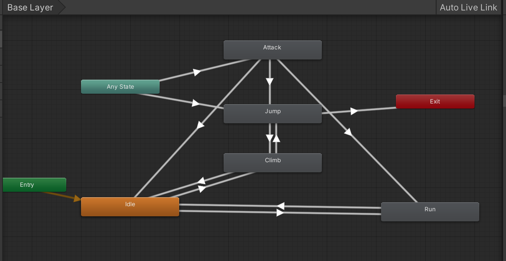

>参考[【Unity 2D游戏开发教程】](https://www.bilibili.com/video/BV1sE411L7kV)整理的学习笔记，对应github 的仓库地址为[https://github.com/zs8861/2D-Platform](https://github.com/zs8861/2D-Platform)

比如【动物井】里面爬梯子是一个非常关键的机制

## 梯子瓦片的经典步骤

1. 导入梯子图片素材（这个的来源就是美术了，或者自己购买）
2. 在Inspector 设置素材的属性
	1. Pixels Per Unit
	2. Filter Mode 设置为Point
	3. Compression 设置为None
3. 打开Sprite Editor 进行相关的编辑操作
	1. 选择Custom Physics Shape
	2. 按照设计设置后续需要用到的碰撞范围
4. 将编辑后的梯子图片素材导入到Tile Palette
	1. 后续在地图中绘制地图就可以直接用了
5. 在场景中创建一个TileMap 游戏对象
	1. 后续梯子都绘制在这里
6. 为梯子TileMap 游戏对象增加一个Layer：Ladder
7. 编辑梯子TileMap 游戏对象的Tilemap Render
	1. 编辑Sorting Layer，可以调整层的显示顺序
	2. 为梯子TileMap 在这里设置Layer 为Ladder
	3. 注意：梯子要在背景前、玩家后面
	4. Sorting Layer 里面，排名越后，显示越前
8. 选中梯子TileMap，就可以在场景中绘制了
9. 为梯子TileMap 增加Tilemap Collider 2D 碰撞体
10. 为梯子Tilemap 增加Composite Collider 2D 碰撞体
11. 勾选Composite Collider 2D 的IsTrigger
12. 勾选Tilemap Collider 2D 的Used By Composite 合并碰撞体
13. Rigidbody 2D 的Body Type 选择为静态（Static）

经过上面流程之后，绘制的测试地图如下所示：


## 动画状态机设计

先参考[Unity 横版2D 游戏开发学习笔记 - 1：Unity 2D 动画基础，并总结2D 精灵动画流程](https://xumenger.github.io/1-unity-2d-game-20241026/) 制作爬梯子的动画

设计动画的切换：

1. 到梯子附近，按下【Up】按键，触发爬梯子
2. 通过玩家和梯子的碰撞器来判断玩家是否在梯子旁边
3. Idle 动作可以切换到Climb 动作
4. Jump 动作可以切换到Climb 动作
5. 爬到平台上之后，玩家切换到Idle 动作
6. 快爬到梯子最上沿后，也可以直接跳上去

当前状态 | 下一状态 | 切换操作  | 切换条件        | Has Exit Time | Fixed Duration | Transition Duration
--------|---------|----------|----------------|---------------|----------------|-------------------
Idle    | Climb   | 【Up/W】 | Climbing=true   | 不勾选        | 不勾选          | 0
Jump    | Climb   | 【Up/W】 | Climbing=true   | 不勾选        | 不勾选          | 0
Climb   | Idle    | 无       | Climbing=false  | 不勾选        | 不勾选          | 0
Climb   | Jump    | 【Space】| Jump=true       | 不勾选        | 不勾选          | 0

>这个动画状态机相对也还是比较简单的，大型的游戏，动画状态机会是非常复杂的

设计的动画状态机如下：



## 编写代码实现攀爬逻辑

```c#
using System.Collections;
using System.Collections.Generic;
using UnityEngine;

public class PlayerController : MonoBehaviour
{
    public float runSpeed = 5;
    public float jumpSpeed = 7;
    public float HP = 5;
    private Rigidbody2D rigidbody2D;
    private Animator animator;

    private BoxCollider2D myFeet;      // 玩家的脚部设置了box碰撞体用于判断和地面接触、和梯子接触等

    public float climbingSpeed = 5;   // 爬梯子的速度
    private bool isLadder;        // 判断是否为梯子
    private bool isClimbing;      // 是否正在爬梯子

    private float palyerGravity;  // 初始重力，从梯子上下来后恢复使用

    private bool isJumping;   // 是否一段跳
    //private bool isFalling;   // 是否一段跳掉落

    // Start is called before the first frame update
    void Start()
    {
        rigidbody2D = GetComponent<Rigidbody2D>();
        animator = GetComponent<Animator>();

        myFeet = GetComponent<BoxCollider2D>();

        palyerGravity = rigidbody2D.gravityScale;
    }

    // Update is called once per frame
    void Update()
    {
        float moveDir = Input.GetAxis("Horizontal");   // 水平轴，-1～1之间的值

        // 通过刚体控制GameObject 位移
        Vector2 playerVel = new Vector2(moveDir * runSpeed, rigidbody2D.velocity.y);
        rigidbody2D.velocity = playerVel;

        // 当按下【A】、【D】时移动
        if (moveDir > 0.01 || moveDir < -0.01)
        {
            // 通过动画控制器切换动作
            animator.SetBool("Run", true);
        }

        // Run运动停止
        if (moveDir > -0.01 && moveDir < 0.01)
        {
            animator.SetBool("Run", false);
        }

        // 按下【Space】，进行跳跃
        if (Input.GetKeyDown(KeyCode.Space))
        {
            animator.SetBool("Jump", true);

            // 位置上移，给玩家y方向赋值（jumpSpeed暂定为7，具体值需要调整）
            rigidbody2D.velocity = new Vector2(rigidbody2D.velocity.x, jumpSpeed);

            Debug.Log(rigidbody2D.velocity);

            // 通过协程控制，一定时间后跳跃结束
            StartCoroutine(StopJumpCoroutine());
        }

        // 判断是否遇到了梯子
        isLadder = myFeet.IsTouchingLayers(LayerMask.GetMask("Ladder"));
        Debug.Log("isLadder: " + isLadder);

        // 判断玩家的一些状态
        isClimbing = animator.GetBool("Climbing");  // 是否正在爬梯子
        isJumping = animator.GetBool("Jump");

        // 按下上下键触发爬梯子逻辑
        if (isLadder)   // 是否在梯子旁边
        {
            float moveY = Input.GetAxis("Vertical");   // 垂直轴，-1～1之间的值
            Debug.Log("moveY: " + moveY);
            // 大于0.5向上爬；小于0.5向下爬
            if (moveY > 0.5f || moveY < -0.5f)
            {
                animator.SetBool("Climbing", true);
                rigidbody2D.gravityScale = 0.0f;   // 爬梯子的时候不能有重力，将重力改为0，不受重力影响
                rigidbody2D.velocity = new Vector2(rigidbody2D.velocity.x, moveY * climbingSpeed);
            }
            else
            {
                // 如果正在跳跃从梯子
                if (isJumping)
                {
                    animator.SetBool("Climbing", false);
                }
                else
                {
                    // 停在梯子上面
                    animator.SetBool("Climbing", true); // TODO 缺少在梯子上不动的动作
                    rigidbody2D.velocity = new Vector2(rigidbody2D.velocity.x, 0.0f);
                }
            }
        }
        else
        {
            animator.SetBool("Climbing", false);
            // 如果不在梯子上面，恢复重力
            rigidbody2D.gravityScale = palyerGravity;
        }
    }


    public void Damage(int damage)
    {
        HP -= damage;
        if (HP <= 0)
        {
            this.gameObject.SetActive(false);
        }
    }


    IEnumerator StopJumpCoroutine()
    {
        yield return new WaitForSeconds(0.8f);
        animator.SetBool("Jump", false);
    }
}
```

>现在的代码非常乱，完全没有封装；对于玩家的动画状态也是完全没有管理！！

运行效果如下所示


可以看到效果有很多问题：

1. 没有精确控制在梯子中间爬，可以在梯子的两边也触发攀爬，需要优化位置判断
2. 跳跃、运动等与攀爬的动作切换非常生硬！

## 遗留问题

1. 随着动作的越来越多，动画状态机的连线会越来越复杂，这个有什么好的解决方案吗？
2. 动画状态机里面，两个状态过渡的Transition Duration 属性作用和效果？
3. 动画状态机里面，两个状态过渡的Has Exit Time 属性作用和效果？
4. 动画状态机里面，两个状态过渡的Fixed Duration 属性作用和效果？
5. 是否使用子状态机会更简化？子状态机怎么用？
6. 动画状态机里面的Layer 怎么用，用在什么场景里面？
7. Tile Patette 里面的瓦片随着游戏开发的进行，也会越来越多，怎么管？
8. PlayerController.cs 里面是完全没有封装的，顺序式编程，后续是需要做好封装设计的！
