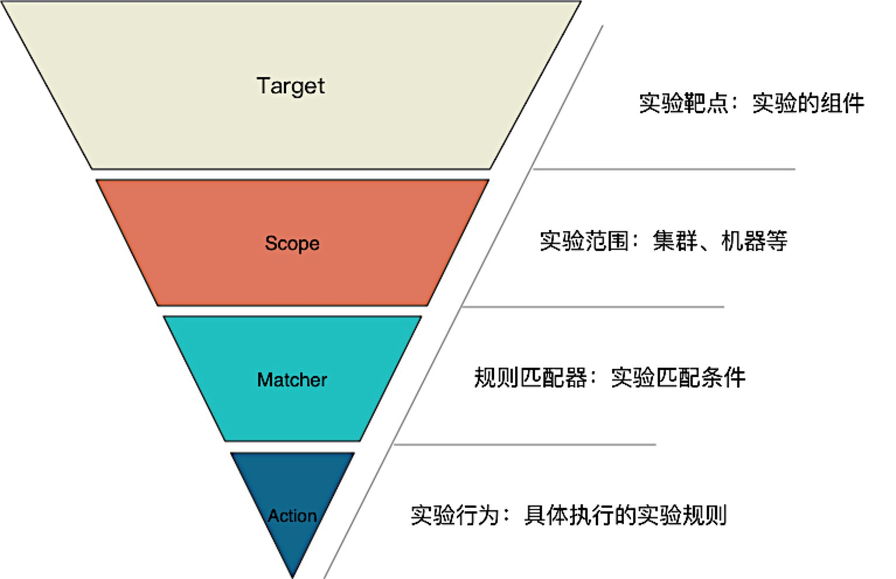
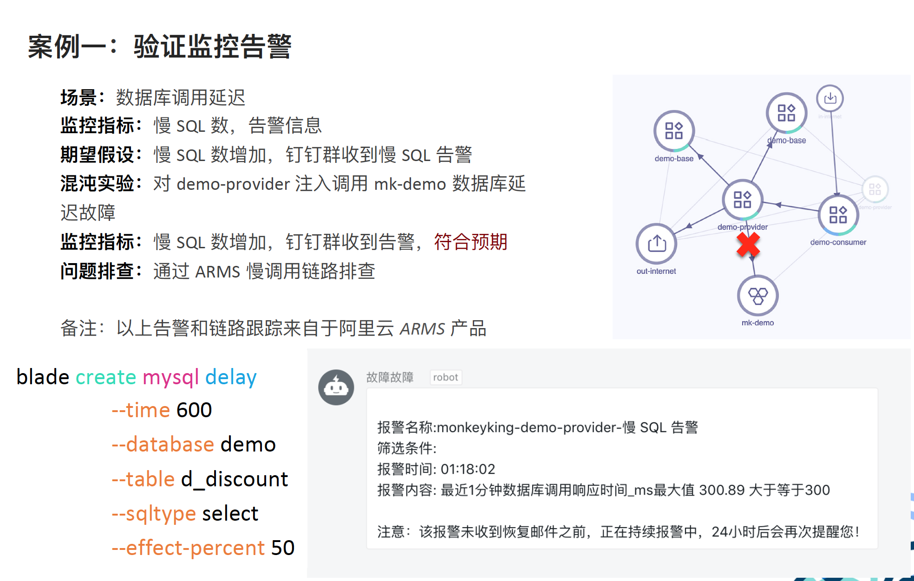
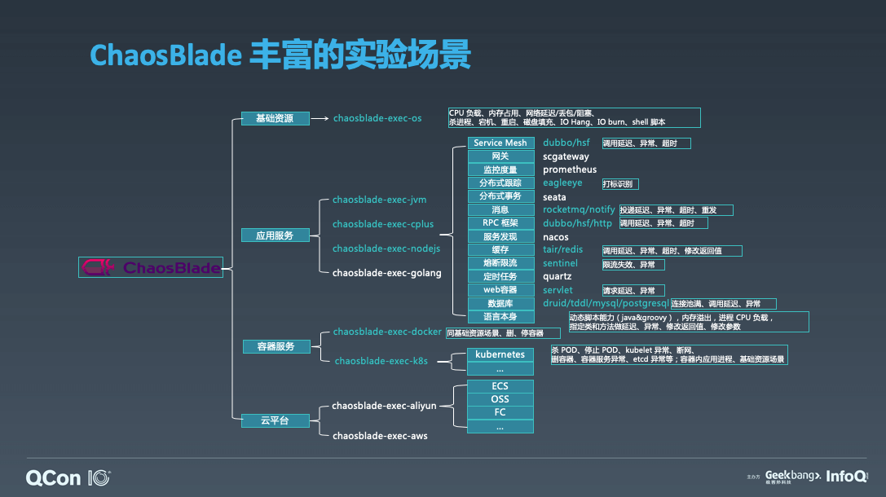
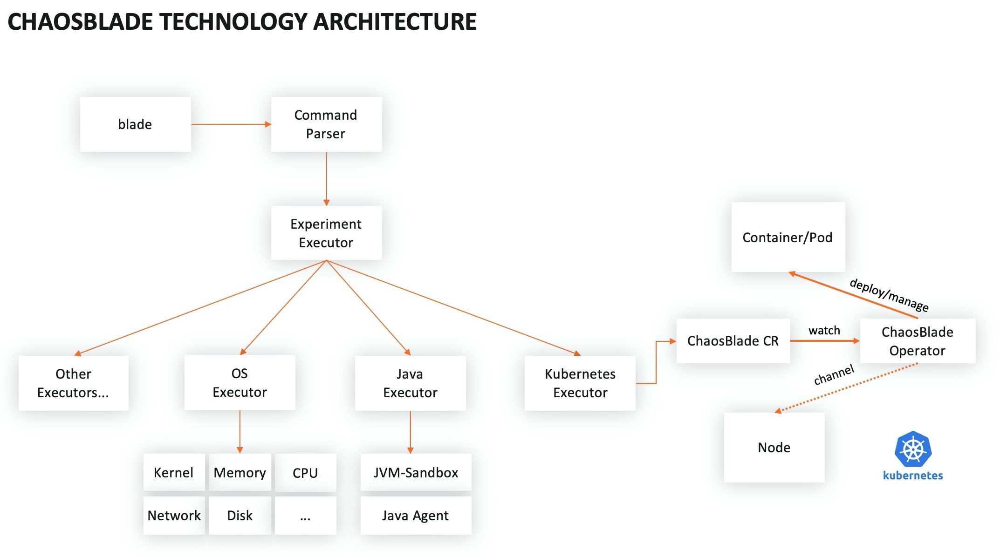
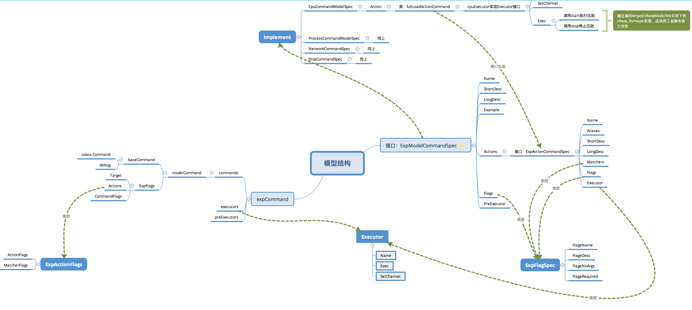
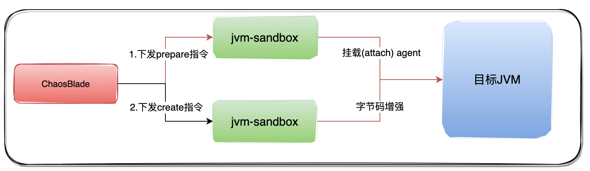

>[https://chaosblade.io/](https://chaosblade.io/)

>[ChaosBlade：云原生架构下的混沌工程探索和实践](https://chaosblade.io/blog/2019/10/17/chaosblade-cloud-native)

## 混沌实验模型

倒三角模型分为四层：**Target**：演练的目标是什么；**Scope**：定义了实验范围；**Matcher**：实验场景触发匹配的规则有哪些；**Action**：执行的实验行为，也就是要做什么演练

比如要对一台机器上的Dubbo 应用调用serviceA 服务做调用延迟实验，那么来对齐该实验模型：首先Target 是Dubbo，要对Dubbo 服务做演练；Scope 是本机，就是这一台机器上的Dubbo 应用；然后匹配规则是服务名serviceA；那么它的Action 是什么？是延迟！



在执行混沌实验之前，要有明确的监控指标，因为执行混沌实验的步骤包含要执行的实验计划是什么，执行的预期是什么，然后执行实验，执行实验如果不符合预期，下一步的推进计划是什么，后面再做持续的验证，所以说要定义一个监控指标，比如监控慢SQL 数以及监控报警。那么期望假设就是慢SQL 数增加，短信收到相关的报警信息



除了故障应急还有一个故障管理，故障管理的话主要是做故障沉淀，后面的话故障统计以及故障复盘，以及故障场景沉淀，持续做演练，防止故障再次发生

## ChaosBlade 怎么用

ChaosBlade 支持丰富的实验场景

1. 基础资源：CPU 满载、内存占用、网络延迟、进程Hang
2. 应用服务：支持JVM、C++、NodeJS，每一种应用服务下面又细分一些组件
3. 容器服务：Docker、Ks，比如杀Pos、Kubelet 异常、删容器等
4. 云平台：待实现



ChaosBlade 直接下载解压放到目标服务器上就可以使用

它支持的调用方式包括CLI 方式，直接执行blade 命令，比如要一个9520 端口调用做网络丢包，对齐前面的实验模型，可以看到，它的演练目标是network，它的action 是丢包，它的matcher 就是调用远程的一个服务端口9520。执行成功后会返回实验结果，每一个实验场景我们都会作为一个对象，它会返回一个实验对象的UID，此UID 用于后续的实验管理，比如销毁、查询实验都是通过此UID 来做的。要销毁实验，也就是恢复实验，直接执行blade destroy 命令就可以了

Server 模式：即利用./blade server start 将ChaosBlade 工具作为一个server 启动，然后再通过http 远程调用的方式下发命令。你如果自己构建混沌实验平台的话，你直接可以通过HTTP 请求去调用就可以了

## ChaosBlade 系统架构和代码模型

ChaosBlade 遵循混沌实验模型提供了统一的操作简洁的执行工具，并且根据领域划分将场景实现封装成一个一个单独的项目，方便实现领域内场景扩展



>[混沌实验模型](https://github.com/chaosblade-io/chaosblade/wiki/%E6%B7%B7%E6%B2%8C%E5%AE%9E%E9%AA%8C%E6%A8%A1%E5%9E%8B)

核心接口模型是：ExpModelCommandSpec，由它引申出来的是ExpActionCommandSpec 和ExpFlagSpec 这两个接口

* ExpModelCommandSpec 已有的具体实现有：cpu、network、disk 等
* ExpActionCommandSpec 则是如cpu 下的fullload 之类的
* ExpFlagSpec 是各类自定义参数，比如`--timeout`



比如chaosblade-exec-os 项目中的cpu.go 实现

```go
type CpuCommandModelSpec struct {
    spec.BaseExpModelCommandSpec
}

func NewCpuCommandModelSpec() spec.ExpModelCommandSpec {
    return &CpuCommandModelSpec{
        spec.BaseExpModelCommandSpec{
            ExpActions: []spec.ExpActionCommandSpec{
                &FullLoadActionCommand{
                    spec.BaseExpActionCommandSpec{
                        ActionMatchers: []spec.ExpFlagSpec{},
                        ActionFlags:    []spec.ExpFlagSpec{},
                        ActionExecutor: &cpuExecutor{},
                        ActionExample: `
# Create a CPU full load experiment
blade create cpu load

#Specifies two random core's full load
blade create cpu load --cpu-percent 60 --cpu-count 2

# Specifies that the core is full load with index 0, 3, and that the core's index starts at 0
blade create cpu load --cpu-list 0,3

# Specify the core full load of indexes 1-3
blade create cpu load --cpu-list 1-3

# Specified percentage load
blade create cpu load --cpu-percent 60`,
                        ActionPrograms:    []string{BurnCpuBin},
                        ActionCategories:  []string{category.SystemCpu},
                        ActionProcessHang: true,
                    },
                },
            },
            ExpFlags: []spec.ExpFlagSpec{
                &spec.ExpFlag{
                    Name:     "cpu-count",
                    Desc:     "Cpu count",
                    Required: false,
                },
                &spec.ExpFlag{
                    Name:     "cpu-list",
                    Desc:     "CPUs in which to allow burning (0-3 or 1,3)",
                    Required: false,
                },
                &spec.ExpFlag{
                    Name:     "cpu-percent",
                    Desc:     "percent of burn CPU (0-100)",
                    Required: false,
                },
                &spec.ExpFlag{
                    Name:     "cpu-index",
                    Desc:     "cpu index, user unavailable!",
                    Required: false,
                },
                &spec.ExpFlag{
                    Name:     "climb-time",
                    Desc:     "durations(s) to climb",
                    Required: false,
                },
                &spec.ExpFlag{
                    Name:     "cgroup-root",
                    Desc:     "cgroup root path, default value /sys/fs/cgroup",
                    NoArgs:   false,
                    Required: false,
                    Default:  "/sys/fs/cgroup",
                },
            },
        },
    }
}
```

## 基础资源故障实验

比如构造CPU 满载的故障，利用消耗CPU 时间片来做。详见代码：[https://github.com/chaosblade-io/chaosblade-exec-os/blob/master/exec/cpu/cpu.go#L329](https://github.com/chaosblade-io/chaosblade-exec-os/blob/master/exec/cpu/cpu.go#L329)

在start() 方法里面调用burn() 方法，在burn() 方法利用消耗CPU 时间片来做

```go
func burn(ctx context.Context, quota <-chan int64, slopePercent float64, percpu bool, cpuIndex int) {
    q := getQuota(ctx, slopePercent, percpu, cpuIndex)
    ds := period - q
    if ds < 0 {
        ds = 0
    }
    s, _ := time.ParseDuration(strconv.FormatInt(ds, 10) + "ns")
    for {
        startTime := time.Now().UnixNano()
        select {
        case offset := <-quota:
            q = q + offset
            if q < 0 {
                q = 0
            }
            ds := period - q
            if ds < 0 {
                ds = 0
            }
            s, _ = time.ParseDuration(strconv.FormatInt(ds, 10) + "ns")
        default:
            for time.Now().UnixNano()-startTime < q {
            }
            runtime.Gosched()
            time.Sleep(s)
        }
    }
}
```

## JVM 故障实验

>[ChaosBlade Java 场景性能优化，那些你不知道的事](https://chaosblade.io/blog/2022/09/09/chaosblade-java)

Java场景的故障注入是基于字节码增强框架JVM-Sandbox实现的，注入一个故障分为两步：

1. ChaosBlade 执行prepare命令，触发sandbox对目标JVM 挂载Java agent
2. ChaosBlade 执行create命令，触发sandbox对目标JVM 进行字节码增强，从而达到故障注入的目的



关于Java Agent 的封装，可以详细参见[https://github.com/chaosblade-io/chaosblade-exec-jvm](https://github.com/chaosblade-io/chaosblade-exec-jvm)

可以通过这个场景[模拟类方法调用延迟](https://chaosblade.io/docs/experiment-types/application/jvm/blade_create_jvm_delay) 去更加深刻的感受JVM 故障模拟的步骤

下面去分析