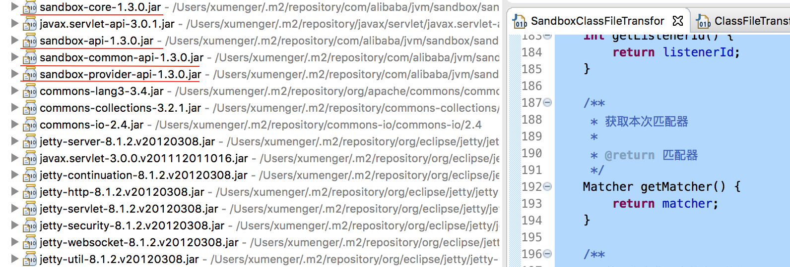

混沌工程框架ChaosBlade 就是在JVM Sandbox 的基础上构建的

## JVM TI 原理

JVM TI（JVM TOOL INTERFACE，JVM 工具接口）是JVM 提供的一套对JVM 进行操作的工具接口。通过JVMTI 可以实现对JVM 的多种操作，它通过接口注册各种事件勾子，在JVM 事件触发的同时触发预定义的勾子，以实现对各个JVM 事件的响应

事件包括类文件加载、异常产生与捕获、线程启动和结束、进入和退出临界区、成员变量修改、GC 开始和结束、方法调用进入和退出、临界区竞争与等待、VM 启动与退出等等

当JVM 加载类文件时会触发类文件加载钩子事件ClassFileLoadHook，从而触发Instrumentation 类库中的ClassFileTransformer (字节码转换器)的transform 方法，在transfrom 方法中可以对字节码进行转换

## Java Agent 案例

Java Agent 是一种Java 技术，它可以在JVM（Java虚拟机）启动时或运行时加载，并附加到目标应用程序中。通过拦截、监控和修改类加载、方法调用、对象创建等操作，Java Agent 能够在不修改原始代码的情况下，对应用程序的行为进行修改或增强

Java Agent 主要通过Java 的Instrumentation API 来实现其功能。Instrumentation API 提供了一套用于修改Java类文件字节码的接口，使得Java Agent 可以在类加载到JVM之前或之后对其进行修改

编写Agent 程序，可以是premain 模式，也可以是agentmain 模式：

* premain模式：-javaagent 启动脚本中直接挂载
* agentmain 模式：利用attach api 在运行时挂载

```java
public class MyAgent 
{
    // 使用 premain 可以在类第一次加载之前修改
    public static void premain(String agentArgs, 
                               Instrumentation inst) 
    {
        System.out.println("agentArgs : " + agentArgs);
        //加入自定义转换器
        inst.addTransformer(new MyTransformer(), true);
    }

    // agentmain 方式依赖于 Attach API，它允许在程序运行时，将一个新的 Agent 附加到正在运行的 JVM 上
    // 与 premain 模式不同的是，agentmain 模式并不需要在程序启动时就指定，而是可以在程序运行中后期动态地附加进去
    public static void agentmain(String agentArgs, 
    	                         Instrumentation inst) throws UnmodifiableClassException 
    {
        System.out.println("Agent Main called");
        System.out.println("agentArgs : " + agentArgs);
        inst.addTransformer(new MyTransformer(), true);
        inst.retransformClasses(Account.class); 
    }
}
```

如上段代码所示，需要调用addTransformer() 方法，添加转换器，这个转换器就是对字节码处理的关键所在：

```java
public class MyTransformer implements ClassFileTransformer 
{
    @Override
        public byte[] transform(ClassLoader loader, 
    	                    String className, 
    	                    Class<?> classBeingRedefined,
                            ProtectionDomain protectionDomain, 
                            byte[] classfileBuffer) 
    {
        // 检查是否是我们想要修改的类
        if (!className.equals("com/xum/TestService")) {
            return null; //不是我们关心的类，直接返回原始字节码
        }

        try {
            // 借助JavaAssist 工具，进行字节码插桩
            ClassPool pool = ClassPool.getDefault();
            CtClass cc = pool.get("com.xum.TestService");
            CtMethod personFly = cc.getDeclaredMethod("doBusiness");

            //在目标方法前后，插入代码
            personFly.insertBefore("System.out.println(\"--- before doBusiness ---\");");
            personFly.insertAfter("System.out.println(\"--- after doBusiness ---\");");

            return cc.toBytecode();

        } catch (Exception ex) {
            ex.printStackTrace();
        }

        return null;
    }
}
```

## JVM Sandbox 原理

在Sandbox 中，核心类SandboxClassFileTransformer 就是ClassFileTransformer 的一个实现类

在SandboxClassFileTransformer.\_transform() 方法中主要就是当类加载或者重新定义时匹配是不是我们要增强的目标类和目标方法，如果是的话则利用沙箱的代码增强框架进行字节码生成，如果不是则忽略不处理

```java
/**
 * 沙箱类形变器
 *
 * @author luanjia@taobao.com
 */
public class SandboxClassFileTransformer implements ClassFileTransformer {

    private final Logger logger = LoggerFactory.getLogger(getClass());

    private final int watchId;
    private final String uniqueId;
    private final Matcher matcher;
    private final EventListener eventListener;
    private final boolean isEnableUnsafe;
    private final Event.Type[] eventTypeArray;

    private final String namespace;
    private final int listenerId;
    private final AffectStatistic affectStatistic = new AffectStatistic();

    SandboxClassFileTransformer(final int watchId,
                                final String uniqueId,
                                final Matcher matcher,
                                final EventListener eventListener,
                                final boolean isEnableUnsafe,
                                final Event.Type[] eventTypeArray,
                                final String namespace) {
        this.watchId = watchId;
        this.uniqueId = uniqueId;
        this.matcher = matcher;
        this.eventListener = eventListener;
        this.isEnableUnsafe = isEnableUnsafe;
        this.eventTypeArray = eventTypeArray;
        this.namespace = namespace;
        this.listenerId = ObjectIDs.instance.identity(eventListener);
    }

    // 获取当前类结构
    private ClassStructure getClassStructure(final ClassLoader loader,
                                             final Class<?> classBeingRedefined,
                                             final byte[] srcByteCodeArray) {
        return null == classBeingRedefined
                ? createClassStructure(srcByteCodeArray, loader)
                : createClassStructure(classBeingRedefined);
    }

    @Override
    public byte[] transform(final ClassLoader loader,
                            final String internalClassName,
                            final Class<?> classBeingRedefined,
                            final ProtectionDomain protectionDomain,
                            final byte[] srcByteCodeArray) {

        try {

            // 这里过滤掉Sandbox所需要的类，防止ClassCircularityError的发生
            if (null != internalClassName
                    && internalClassName.startsWith("com/alibaba/jvm/sandbox/")) {
                return null;
            }

            // 这里过滤掉来自SandboxClassLoader的类，防止ClassCircularityError的发生
            if (loader == SandboxClassFileTransformer.class.getClassLoader()) {
                return null;
            }

            // 过滤掉来自ModuleJarClassLoader加载的类
            if (loader instanceof ModuleJarClassLoader) {
                return null;
            }

            return _transform(
                    loader,
                    internalClassName,
                    classBeingRedefined,
                    srcByteCodeArray
            );

        } catch (Throwable cause) {
            logger.warn("sandbox transform {} in loader={}; failed, module={} at watch={}, will ignore this transform.",
                    internalClassName,
                    loader,
                    uniqueId,
                    watchId,
                    cause
            );
            return null;
        }
    }

    private byte[] _transform(final ClassLoader loader,
                              final String internalClassName,
                              final Class<?> classBeingRedefined,
                              final byte[] srcByteCodeArray) {
        // 如果未开启unsafe开关，是不允许增强来自BootStrapClassLoader的类
        if (!isEnableUnsafe
                && null == loader) {
            logger.debug("transform ignore {}, class from bootstrap but unsafe.enable=false.", internalClassName);
            return null;
        }

        final ClassStructure classStructure = getClassStructure(loader, classBeingRedefined, srcByteCodeArray);
        final MatchingResult matchingResult = new UnsupportedMatcher(loader, isEnableUnsafe).and(matcher).matching(classStructure);
        final Set<String> behaviorSignCodes = matchingResult.getBehaviorSignCodes();

        // 如果一个行为都没匹配上也不用继续了
        if (!matchingResult.isMatched()) {
            logger.debug("transform ignore {}, no behaviors matched in loader={}", internalClassName, loader);
            return null;
        }

        // 开始进行类匹配
        try {
            final byte[] toByteCodeArray = new EventEnhancer().toByteCodeArray(
                    loader,
                    srcByteCodeArray,
                    behaviorSignCodes,
                    namespace,
                    listenerId,
                    eventTypeArray
            );
            if (srcByteCodeArray == toByteCodeArray) {
                logger.debug("transform ignore {}, nothing changed in loader={}", internalClassName, loader);
                return null;
            }

            // statistic affect
            affectStatistic.statisticAffect(loader, internalClassName, behaviorSignCodes);

            logger.info("transform {} finished, by module={} in loader={}", internalClassName, uniqueId, loader);
            return toByteCodeArray;
        } catch (Throwable cause) {
            logger.warn("transform {} failed, by module={} in loader={}", internalClassName, uniqueId, loader, cause);
            return null;
        }
    }


    /**
     * 获取观察ID
     *
     * @return 观察ID
     */
    int getWatchId() {
        return watchId;
    }

    /**
     * 获取事件监听器
     *
     * @return 事件监听器
     */
    EventListener getEventListener() {
        return eventListener;
    }

    /**
     * 获取事件监听器ID
     *
     * @return 事件监听器ID
     */
    int getListenerId() {
        return listenerId;
    }

    /**
     * 获取本次匹配器
     *
     * @return 匹配器
     */
    Matcher getMatcher() {
        return matcher;
    }

    /**
     * 获取本次监听事件类型数组
     *
     * @return 本次监听事件类型数组
     */
    Event.Type[] getEventTypeArray() {
        return eventTypeArray;
    }

    /**
     * 获取本次增强的影响统计
     *
     * @return 本次增强的影响统计
     */
    public AffectStatistic getAffectStatistic() {
        return affectStatistic;
    }

}
```

## JVM Sandbox 内核启动器

上面讲到了agentmain 模式是利用attach api 在运行时挂载，在JVM Sandbox 中对应的是CoreLauncher，代码如下：

```java
/**
 * 沙箱内核启动器
 * Created by luanjia@taobao.com on 16/10/2.
 */
public class CoreLauncher {


    public CoreLauncher(final String targetJvmPid,
                        final String agentJarPath,
                        final String token) throws Exception {

        // 加载agent
        attachAgent(targetJvmPid, agentJarPath, token);

    }

    /**
     * 内核启动程序
     *
     * @param args 参数
     *             [0] : PID
     *             [1] : agent.jar's value
     *             [2] : token
     */
    public static void main(String[] args) {
        try {

            // check args
            if (args.length != 3
                    || StringUtils.isBlank(args[0])
                    || StringUtils.isBlank(args[1])
                    || StringUtils.isBlank(args[2])) {
                throw new IllegalArgumentException("illegal args");
            }

            new CoreLauncher(args[0], args[1], args[2]);
        } catch (Throwable t) {
            t.printStackTrace(System.err);
            System.err.println("sandbox load jvm failed : " + getCauseMessage(t));
            System.exit(-1);
        }
    }

    // 加载Agent
    private void attachAgent(final String targetJvmPid,
                             final String agentJarPath,
                             final String cfg) throws Exception {

        VirtualMachine vmObj = null;
        try {

            vmObj = VirtualMachine.attach(targetJvmPid);
            if (vmObj != null) {
                vmObj.loadAgent(agentJarPath, cfg);
            }

        } finally {
            if (null != vmObj) {
                vmObj.detach();
            }
        }
    }
}
```

## JVM Sandbox 结构

下面是sandbox 相关的依赖



## 参考材料

* [透过 JVM-SANDBOX 源码, 了解字节码增强技术原理](https://xie.infoq.cn/article/c5be9834709f7eb48cfa683b1)
* [【Java进阶】Java进阶-手撕java agent](https://blog.csdn.net/wendao76/article/details/142863621)
