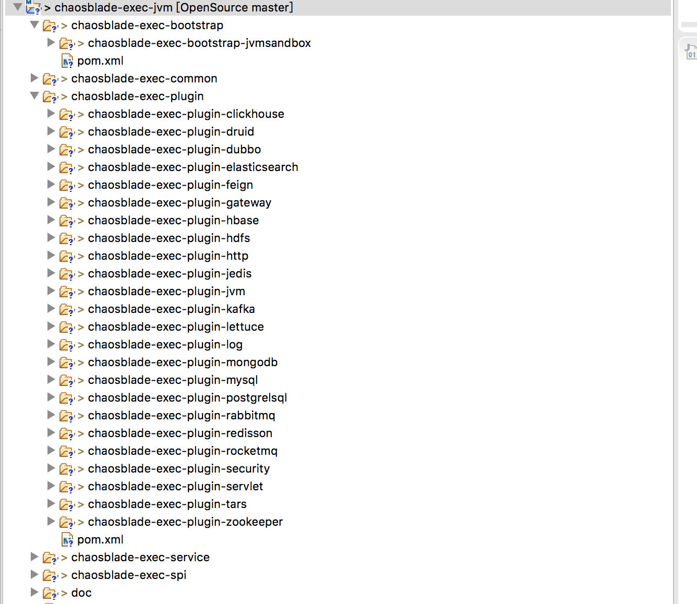

整个chaosblade-exec-jvm 的体系结构如下所示：

本文从chaosblade-exec-jvm 的架构设计，并以一个chaosblade-exec-plugin-mysql 插件为例研究ChaosBlade 是怎么实现的！

之前两篇文章是

## chaosblade-exec-jvm 模型设计

chaosblade-exec-jvm 是基于jvm-sandbox 开发的，本章先分析一下jvm-sandbox。jvm-sandbox 理解为一个javaagent 框架，基于它可以快速开发javaagent 程序

## chaosblade 中如何模拟MySQL 故障

## chaosblade-exec-plugin-mysql 插件分析

## 参考材料

* [ChaosBlade源码（一）blade命令行](https://juejin.cn/post/7419223935004459034)
* [ChaosBlade源码（二）box控制台](https://juejin.cn/post/7430352433745559562)
* [ChaosBlade源码（三）jvm-sandbox](https://juejin.cn/post/7435460351917522959)
* [ChaosBlade源码（四）chaosblade-exec-jvm](https://juejin.cn/post/7443063096904892450)
