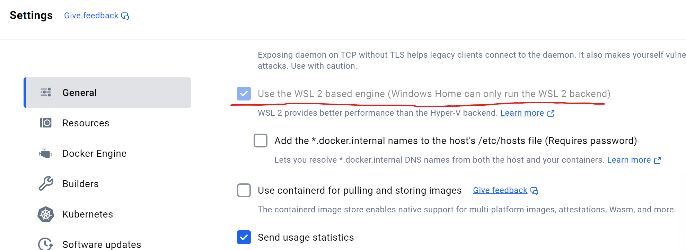
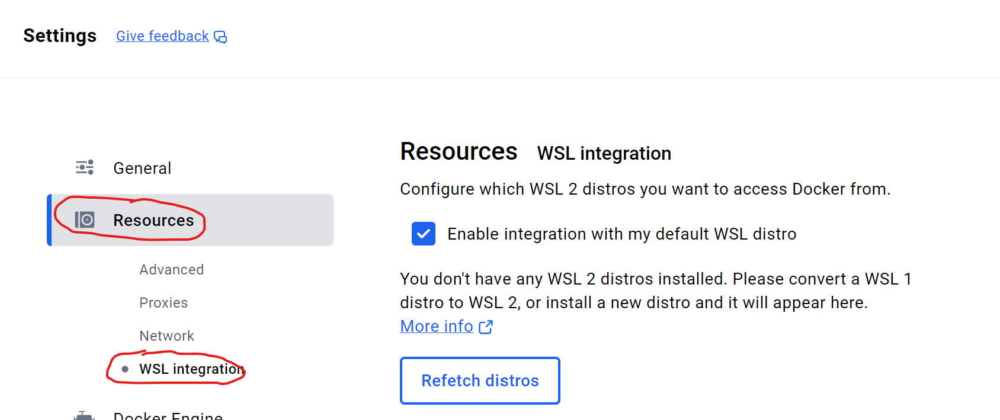
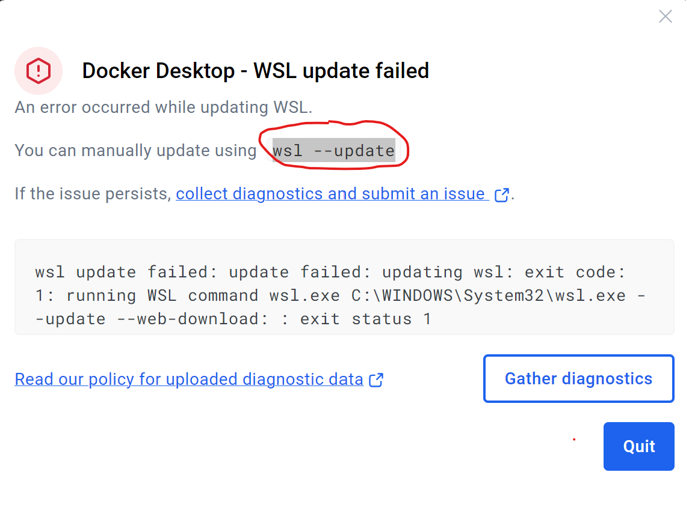

## 安装Docker

到[https://www.docker.com/](https://www.docker.com/)，为Windows 下载安装Docker Desktop

使用的是Windows 10 或更高版本，建议启用WSL 2后端以提高性能



命令行通过docker 命令验证是否安装成功




## 安装Open WebUI

Open WebUI 是一个用于与大模型交互的Web 界面，用下面的命令拉取镜像

```shell
docker pull ghcr.io/open-webui/open-webui:main
```

启动Open WebUI 容器，并连接到Ollama

```shell
docker run -d -p 3000:8080 --add-host=host.docker.internal:host-gateway -v open-webui:/app/backend/data --name open-webui --restart always ghcr.io/open-webui/open-webui:main
```

* -d 后台运行容器
* -p 3000:8080 将容器的8080 端口映射到主机的3000 端口
* --add-host=host.docker.internal:host-gateway 添加主机映射，使容器能够访问主机服务
* -v open-webui:/app/backend/data 将Open WebUI 的数据目录挂载到Docker 卷open-webui
* --name open-webui 为容器命名
* --restart always 设置容器始终自动重启
* ghcr.io/open-webui/open-webui:main 使用的Docker 镜像

通过浏览器访问[http://localhost:3000]（http://localhost:3000) 测试是否符合预期



## 对接Ollama

