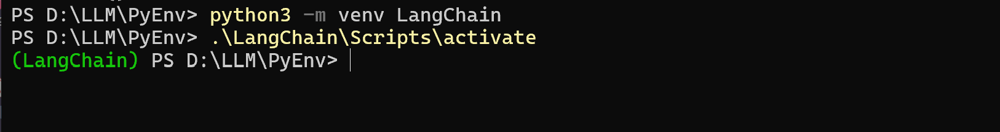

## 搭建Python 虚拟环境

Langchain 需要使用Python 编写程序，记得要先安装Python3，本人选择Python3.13（否则无法正常安装langchain-ollama）


创建Python虚拟环境，在虚拟环境中执行，可以避免各种软件包版本依赖问题

创建D:\LLM\PyEnv\LangChain，作为虚拟文件夹

```shell
> cd D:\LLM\PyEnv\
> python3 -m venv LangChain
> .\LangChain\Scripts\activate
```



## LangChain

接着在虚拟环境中安装langchain

```shell
d:\llm\pyenv\langchain\scripts\python.exe -m pip install --upgrade pip
pip3 install langchain
pip3 install langchain_community
```

LangChain框架由以下开源库组成：

* langchain-core：基础抽象和LangChain表达式语言
* langchain-community：第三方集成。合作伙伴包（如langchain-openai、langchain-anthropic等），一些集成已经进一步拆分为自己的轻量级包，只依赖于langchain-core
* langchain：构成应用程序认知架构的链、代理和检索策略
* langgraph：通过将步骤建模为图中的边和节点，使用 LLMs 构建健壮且有状态的多参与者应用程序
* langserve：将 LangChain 链部署为 REST API
* LangSmith：一个开发者平台，可让您调试、测试、评估和监控LLM应用程序，并与LangChain无缝集成

LangChain 是一个旨在促进llm 与应用程序集成的框架。它广泛支持包括Ollama 在内的各种聊天模型，并为链式（chaining）操作提供了一种表达语言（LangChain Expression Language）

## LangChain 对接Ollama

将Ollama和Langchain整合集成需要安装Langchain及其依赖，需要安装

```shell
pip3 install -U langchain-ollama
```

## 编写Python 程序实现最简单的提示词效果

>注意需要使用虚拟环境下的python.exe，不能使用全局环境的Python，否则会报错依赖包没有安装！

```python
from langchain_community.llms import Ollama
from langchain_core.messages import HumanMessage, SystemMessage

llm = Ollama(model="qwen:1.8b")

messages = [
    SystemMessage("比较如下两个数字的大小。"),
    HumanMessage("9.9和9.11"),
]
print(llm.invoke(messages))


messages = [
    SystemMessage("请比较一下下面两种水果的区别"),
    HumanMessage("香蕉和火龙果"),
]
print(llm.invoke(messages))
```

运行效果如下：


