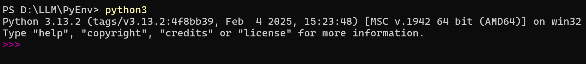

在Windows 环境下搭建大模型环境，机器本身的配置如下：




## 安装ollama

官网[https://ollama.com/](https://ollama.com/) 下载比较慢，可以通过[https://ollama.zhike.in/](https://ollama.zhike.in/) 快速下载

下载后正常安装，安装完成后可以看到ollama 命令已经生效


>以上也是ollama 的一些常用的命令，可以尝试去用一下！

## 相关配置

设置ollama 大模型下载的本地地址，我设置在D 盘，防止C 盘空间快速用完

```
> setx OLLAMA_MODELS "D:\LLM\Ollama"
```


>否则默认会下载到`C:\Users\<用户名>\.ollama\models` 下面

>还需要注意，配置完环境变量后，需要重启电脑，否则还是会下载到默认路径下！

## 本地运行大模型

[https://ollama.com/search](https://ollama.com/search) 可以搜索各种大模型，比如千问、deepseek-r1 等


本文搭建千问模型，选择1.8b，一共1.1G 大小


```shell
ollama run qwen:1.8b
```


下载时间大概是10分钟，可以看到按照预期下载到D:\LLM\Ollama 目录下


然后尝试提一些问题，可以看到大模型的回答


## Web方式

POST 方式访问[http://localhost:11434/api/generate](http://localhost:11434/api/generate)

请求为：

```
{
 "model": "qwen:1.8b",
 "prompt":"你是谁"
}
```


应答为：

```
{
    "model": "qwen:1.8b",
    "created_at": "2025-03-09T08:49:50.4649611Z",
    "response": "我是",
    "done": false
}
{
    "model": "qwen:1.8b",
    "created_at": "2025-03-09T08:49:50.4839516Z",
    "response": "来自",
    "done": false
}
{
    "model": "qwen:1.8b",
    "created_at": "2025-03-09T08:49:50.5054233Z",
    "response": "阿里",
    "done": false
}
{
    "model": "qwen:1.8b",
    "created_at": "2025-03-09T08:49:50.5266711Z",
    "response": "云",
    "done": false
}
{
    "model": "qwen:1.8b",
    "created_at": "2025-03-09T08:49:50.5501598Z",
    "response": "的大",
    "done": false
}
{
    "model": "qwen:1.8b",
    "created_at": "2025-03-09T08:49:50.5719503Z",
    "response": "规模",
    "done": false
}
{
    "model": "qwen:1.8b",
    "created_at": "2025-03-09T08:49:50.5931274Z",
    "response": "语言",
    "done": false
}
{
    "model": "qwen:1.8b",
    "created_at": "2025-03-09T08:49:50.6140495Z",
    "response": "模型",
    "done": false
}
{
    "model": "qwen:1.8b",
    "created_at": "2025-03-09T08:49:50.6340566Z",
    "response": "，",
    "done": false
}
{
    "model": "qwen:1.8b",
    "created_at": "2025-03-09T08:49:50.6536502Z",
    "response": "我",
    "done": false
}
{
    "model": "qwen:1.8b",
    "created_at": "2025-03-09T08:49:50.6754928Z",
    "response": "叫",
    "done": false
}
{
    "model": "qwen:1.8b",
    "created_at": "2025-03-09T08:49:50.6971446Z",
    "response": "通",
    "done": false
}
{
    "model": "qwen:1.8b",
    "created_at": "2025-03-09T08:49:50.7188078Z",
    "response": "义",
    "done": false
}
{
    "model": "qwen:1.8b",
    "created_at": "2025-03-09T08:49:50.7392321Z",
    "response": "千",
    "done": false
}
{
    "model": "qwen:1.8b",
    "created_at": "2025-03-09T08:49:50.7596602Z",
    "response": "问",
    "done": false
}
{
    "model": "qwen:1.8b",
    "created_at": "2025-03-09T08:49:50.7792397Z",
    "response": "。",
    "done": false
}
{
    "model": "qwen:1.8b",
    "created_at": "2025-03-09T08:49:50.800022Z",
    "response": "我可以",
    "done": false
}
{
    "model": "qwen:1.8b",
    "created_at": "2025-03-09T08:49:50.8203415Z",
    "response": "回答",
    "done": false
}
{
    "model": "qwen:1.8b",
    "created_at": "2025-03-09T08:49:50.8427487Z",
    "response": "各种",
    "done": false
}
{
    "model": "qwen:1.8b",
    "created_at": "2025-03-09T08:49:50.8626947Z",
    "response": "问题",
    "done": false
}
{
    "model": "qwen:1.8b",
    "created_at": "2025-03-09T08:49:50.8835555Z",
    "response": "、",
    "done": false
}
{
    "model": "qwen:1.8b",
    "created_at": "2025-03-09T08:49:50.9048156Z",
    "response": "撰写",
    "done": false
}
{
    "model": "qwen:1.8b",
    "created_at": "2025-03-09T08:49:50.9244717Z",
    "response": "代码",
    "done": false
}
{
    "model": "qwen:1.8b",
    "created_at": "2025-03-09T08:49:50.9455104Z",
    "response": "和",
    "done": false
}
{
    "model": "qwen:1.8b",
    "created_at": "2025-03-09T08:49:50.9672237Z",
    "response": "文本",
    "done": false
}
{
    "model": "qwen:1.8b",
    "created_at": "2025-03-09T08:49:50.9882648Z",
    "response": "创作",
    "done": false
}
{
    "model": "qwen:1.8b",
    "created_at": "2025-03-09T08:49:51.0098168Z",
    "response": "等",
    "done": false
}
{
    "model": "qwen:1.8b",
    "created_at": "2025-03-09T08:49:51.0303479Z",
    "response": "任务",
    "done": false
}
{
    "model": "qwen:1.8b",
    "created_at": "2025-03-09T08:49:51.0501072Z",
    "response": "。\n\n",
    "done": false
}
{
    "model": "qwen:1.8b",
    "created_at": "2025-03-09T08:49:51.0741688Z",
    "response": "我还",
    "done": false
}
{
    "model": "qwen:1.8b",
    "created_at": "2025-03-09T08:49:51.1047749Z",
    "response": "能够",
    "done": false
}
{
    "model": "qwen:1.8b",
    "created_at": "2025-03-09T08:49:51.1313981Z",
    "response": "根据",
    "done": false
}
{
    "model": "qwen:1.8b",
    "created_at": "2025-03-09T08:49:51.1519466Z",
    "response": "上下",
    "done": false
}
{
    "model": "qwen:1.8b",
    "created_at": "2025-03-09T08:49:51.1726288Z",
    "response": "文",
    "done": false
}
{
    "model": "qwen:1.8b",
    "created_at": "2025-03-09T08:49:51.1935339Z",
    "response": "和",
    "done": false
}
{
    "model": "qwen:1.8b",
    "created_at": "2025-03-09T08:49:51.2149275Z",
    "response": "训练",
    "done": false
}
{
    "model": "qwen:1.8b",
    "created_at": "2025-03-09T08:49:51.2348468Z",
    "response": "数据",
    "done": false
}
{
    "model": "qwen:1.8b",
    "created_at": "2025-03-09T08:49:51.2558042Z",
    "response": "的",
    "done": false
}
{
    "model": "qwen:1.8b",
    "created_at": "2025-03-09T08:49:51.2770361Z",
    "response": "启发",
    "done": false
}
{
    "model": "qwen:1.8b",
    "created_at": "2025-03-09T08:49:51.2976444Z",
    "response": "，",
    "done": false
}
{
    "model": "qwen:1.8b",
    "created_at": "2025-03-09T08:49:51.3181051Z",
    "response": "进行",
    "done": false
}
{
    "model": "qwen:1.8b",
    "created_at": "2025-03-09T08:49:51.3384221Z",
    "response": "自我",
    "done": false
}
{
    "model": "qwen:1.8b",
    "created_at": "2025-03-09T08:49:51.3597278Z",
    "response": "学习",
    "done": false
}
{
    "model": "qwen:1.8b",
    "created_at": "2025-03-09T08:49:51.3799235Z",
    "response": "和",
    "done": false
}
{
    "model": "qwen:1.8b",
    "created_at": "2025-03-09T08:49:51.4002694Z",
    "response": "优化",
    "done": false
}
{
    "model": "qwen:1.8b",
    "created_at": "2025-03-09T08:49:51.4211647Z",
    "response": "，",
    "done": false
}
{
    "model": "qwen:1.8b",
    "created_at": "2025-03-09T08:49:51.4424005Z",
    "response": "从而",
    "done": false
}
{
    "model": "qwen:1.8b",
    "created_at": "2025-03-09T08:49:51.4632858Z",
    "response": "不断提高",
    "done": false
}
{
    "model": "qwen:1.8b",
    "created_at": "2025-03-09T08:49:51.4846896Z",
    "response": "我的",
    "done": false
}
{
    "model": "qwen:1.8b",
    "created_at": "2025-03-09T08:49:51.5046685Z",
    "response": "回答",
    "done": false
}
{
    "model": "qwen:1.8b",
    "created_at": "2025-03-09T08:49:51.5252655Z",
    "response": "质量",
    "done": false
}
{
    "model": "qwen:1.8b",
    "created_at": "2025-03-09T08:49:51.5467586Z",
    "response": "和服务",
    "done": false
}
{
    "model": "qwen:1.8b",
    "created_at": "2025-03-09T08:49:51.5679187Z",
    "response": "水平",
    "done": false
}
{
    "model": "qwen:1.8b",
    "created_at": "2025-03-09T08:49:51.5885355Z",
    "response": "。\n\n",
    "done": false
}
{
    "model": "qwen:1.8b",
    "created_at": "2025-03-09T08:49:51.6083483Z",
    "response": "总的来说",
    "done": false
}
{
    "model": "qwen:1.8b",
    "created_at": "2025-03-09T08:49:51.6296107Z",
    "response": "，",
    "done": false
}
{
    "model": "qwen:1.8b",
    "created_at": "2025-03-09T08:49:51.6500435Z",
    "response": "作为",
    "done": false
}
{
    "model": "qwen:1.8b",
    "created_at": "2025-03-09T08:49:51.6712906Z",
    "response": "阿里",
    "done": false
}
{
    "model": "qwen:1.8b",
    "created_at": "2025-03-09T08:49:51.6917233Z",
    "response": "云",
    "done": false
}
{
    "model": "qwen:1.8b",
    "created_at": "2025-03-09T08:49:51.7132519Z",
    "response": "研发",
    "done": false
}
{
    "model": "qwen:1.8b",
    "created_at": "2025-03-09T08:49:51.7369172Z",
    "response": "的语言",
    "done": false
}
{
    "model": "qwen:1.8b",
    "created_at": "2025-03-09T08:49:51.7546622Z",
    "response": "模型",
    "done": false
}
{
    "model": "qwen:1.8b",
    "created_at": "2025-03-09T08:49:51.7766868Z",
    "response": "，",
    "done": false
}
{
    "model": "qwen:1.8b",
    "created_at": "2025-03-09T08:49:51.8015535Z",
    "response": "通",
    "done": false
}
{
    "model": "qwen:1.8b",
    "created_at": "2025-03-09T08:49:51.8233333Z",
    "response": "义",
    "done": false
}
{
    "model": "qwen:1.8b",
    "created_at": "2025-03-09T08:49:51.844034Z",
    "response": "千",
    "done": false
}
{
    "model": "qwen:1.8b",
    "created_at": "2025-03-09T08:49:51.8651813Z",
    "response": "问",
    "done": false
}
{
    "model": "qwen:1.8b",
    "created_at": "2025-03-09T08:49:51.8848791Z",
    "response": "具备",
    "done": false
}
{
    "model": "qwen:1.8b",
    "created_at": "2025-03-09T08:49:51.9045311Z",
    "response": "强大的",
    "done": false
}
{
    "model": "qwen:1.8b",
    "created_at": "2025-03-09T08:49:51.9255999Z",
    "response": "自然",
    "done": false
}
{
    "model": "qwen:1.8b",
    "created_at": "2025-03-09T08:49:51.9470258Z",
    "response": "语言",
    "done": false
}
{
    "model": "qwen:1.8b",
    "created_at": "2025-03-09T08:49:51.9699993Z",
    "response": "处理",
    "done": false
}
{
    "model": "qwen:1.8b",
    "created_at": "2025-03-09T08:49:51.9890286Z",
    "response": "能力",
    "done": false
}
{
    "model": "qwen:1.8b",
    "created_at": "2025-03-09T08:49:52.0104799Z",
    "response": "，",
    "done": false
}
{
    "model": "qwen:1.8b",
    "created_at": "2025-03-09T08:49:52.031313Z",
    "response": "能够",
    "done": false
}
{
    "model": "qwen:1.8b",
    "created_at": "2025-03-09T08:49:52.0523826Z",
    "response": "帮助",
    "done": false
}
{
    "model": "qwen:1.8b",
    "created_at": "2025-03-09T08:49:52.073182Z",
    "response": "用户",
    "done": false
}
{
    "model": "qwen:1.8b",
    "created_at": "2025-03-09T08:49:52.09388Z",
    "response": "解决",
    "done": false
}
{
    "model": "qwen:1.8b",
    "created_at": "2025-03-09T08:49:52.1145737Z",
    "response": "各种",
    "done": false
}
{
    "model": "qwen:1.8b",
    "created_at": "2025-03-09T08:49:52.1351395Z",
    "response": "复杂",
    "done": false
}
{
    "model": "qwen:1.8b",
    "created_at": "2025-03-09T08:49:52.1567296Z",
    "response": "的问题",
    "done": false
}
{
    "model": "qwen:1.8b",
    "created_at": "2025-03-09T08:49:52.1801943Z",
    "response": "。",
    "done": false
}
{
    "model": "qwen:1.8b",
    "created_at": "2025-03-09T08:49:52.2016407Z",
    "response": "",
    "done": true,
    "done_reason": "stop",
    "context": [
        151644,
        872,
        198,
        105043,
        100165,
        151645,
        198,
        151644,
        77091,
        198,
        104198,
        101919,
        102661,
        99718,
        104197,
        100176,
        102064,
        104949,
        3837,
        35946,
        99882,
        31935,
        64559,
        99320,
        56007,
        1773,
        109944,
        102104,
        100646,
        86119,
        5373,
        110479,
        46100,
        33108,
        108704,
        104223,
        49567,
        88802,
        1773,
        198,
        198,
        107228,
        100006,
        100345,
        102285,
        16744,
        33108,
        104034,
        20074,
        9370,
        110502,
        3837,
        71817,
        104049,
        100134,
        33108,
        103983,
        3837,
        101982,
        106217,
        97611,
        102104,
        99570,
        106510,
        100021,
        1773,
        198,
        198,
        116880,
        3837,
        100622,
        102661,
        99718,
        100048,
        109824,
        104949,
        3837,
        31935,
        64559,
        99320,
        56007,
        102094,
        104795,
        99795,
        102064,
        54542,
        99788,
        3837,
        100006,
        100364,
        20002,
        100638,
        100646,
        102181,
        103936,
        1773
    ],
    "total_duration": 1804974600,
    "load_duration": 37535900,
    "prompt_eval_count": 10,
    "prompt_eval_duration": 28193000,
    "eval_count": 83,
    "eval_duration": 1736505000
}
```
