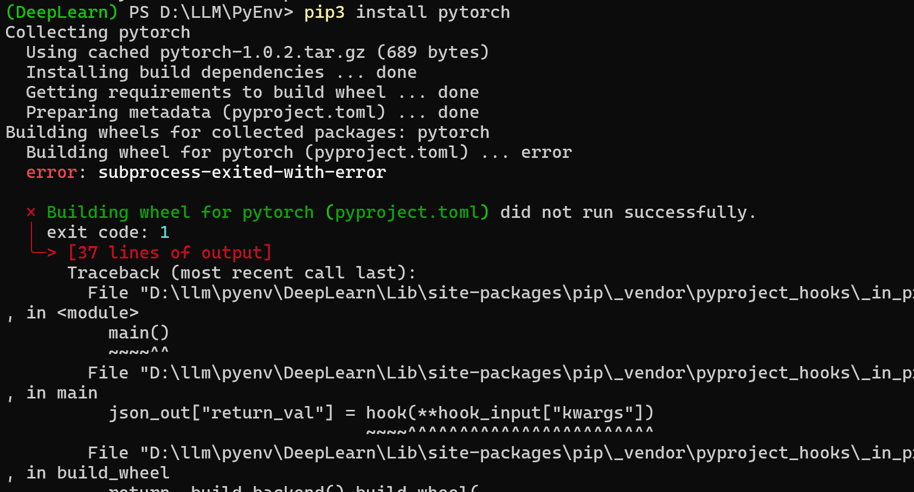
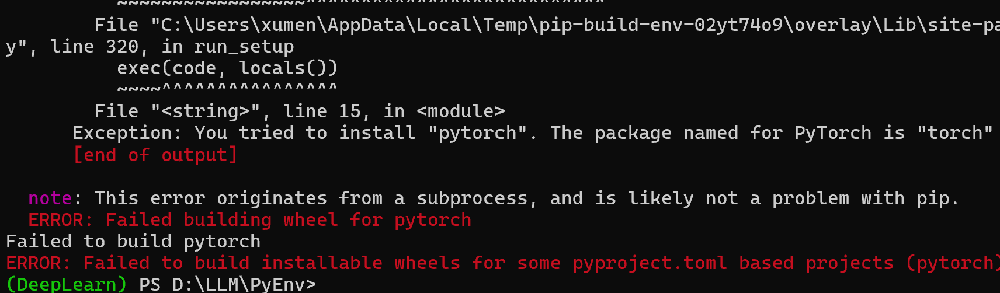

>正常的大模型应用开发中并不需要使用PyTorch，PyTorch 主要是做神经网络开发、模型训练，这里主要是初步学习一下，为后续自己训练模型、微调模型、了解神经网络起个引子！

>本文涉及到的神经网络是十分简单的，相比于当前的那些复杂的模型，这个只是一个玩具例子

## 搭建开发环境

创建D:\LLM\PyEnv\DeepLearn，作为虚拟文件夹

```shell
> cd D:\LLM\PyEnv\
> python3 -m venv DeepLearn
> .\DeepLearn\Scripts\activate
```

安装PyTorch 依赖

```shell
d:\llm\pyenv\DeepLearn\scripts\python.exe -m pip install --upgrade pip
pip3 install --upgrade setuptools
pip3 install pytorch
```

但是可能会出现报错





## 安装报错解决


## 编写测试程序

```python

```

## 调试分析

