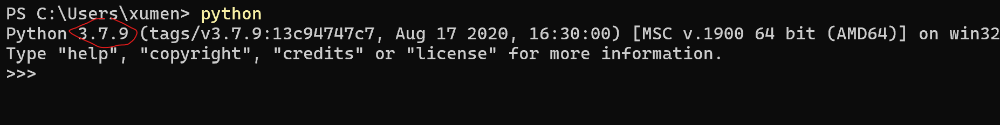
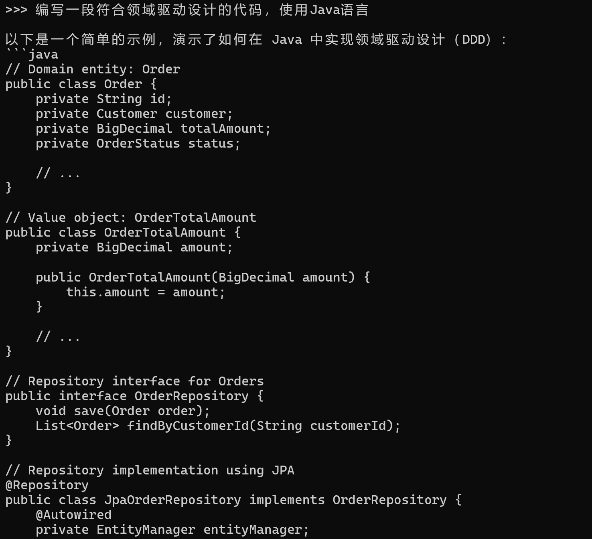

## 搭建Python 虚拟环境

Langchain 需要使用Python 编写程序，记得要先安装Python3，本人选择Python3.13（否则无法正常安装langchain-ollama）



创建Python虚拟环境，在虚拟环境中执行，可以避免各种软件包版本依赖问题

创建D:\LLM\Python\20250311_LangChain，作为虚拟文件夹

```shell
> cd D:\LLM\Python\
> python3 -m venv 20250311_LangChain
> .\20250311_LangChain\Scripts\activate
```



## LangChain

接着在虚拟环境中安装langchain、langchain_community

```shell
d:\llm\python\20250311_langchain\scripts\python.exe -m pip install --upgrade pip
pip3 install langchain
pip3 install langchain_community
```

LangChain框架由以下开源库组成：

* langchain-core：基础抽象和LangChain表达式语言
* langchain-community：第三方集成。合作伙伴包（如langchain-openai、langchain-anthropic等），一些集成已经进一步拆分为自己的轻量级包，只依赖于langchain-core
* langchain：构成应用程序认知架构的链、代理和检索策略
* langgraph：通过将步骤建模为图中的边和节点，使用 LLMs 构建健壮且有状态的多参与者应用程序
* langserve：将 LangChain 链部署为 REST API
* LangSmith：一个开发者平台，可让您调试、测试、评估和监控LLM应用程序，并与LangChain无缝集成

LangChain 是一个旨在促进llm 与应用程序集成的框架。它广泛支持包括Ollama 在内的各种聊天模型，并为链式（chaining）操作提供了一种表达语言（LangChain Expression Language）

## LangChain 对接Ollama

将Ollama和Langchain整合集成需要安装Langchain及其依赖，需要安装

```
pip3 install -U langchain-ollama
```

