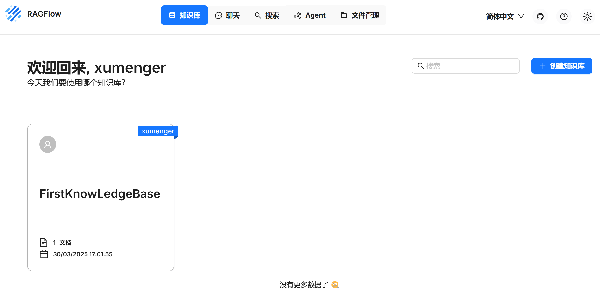
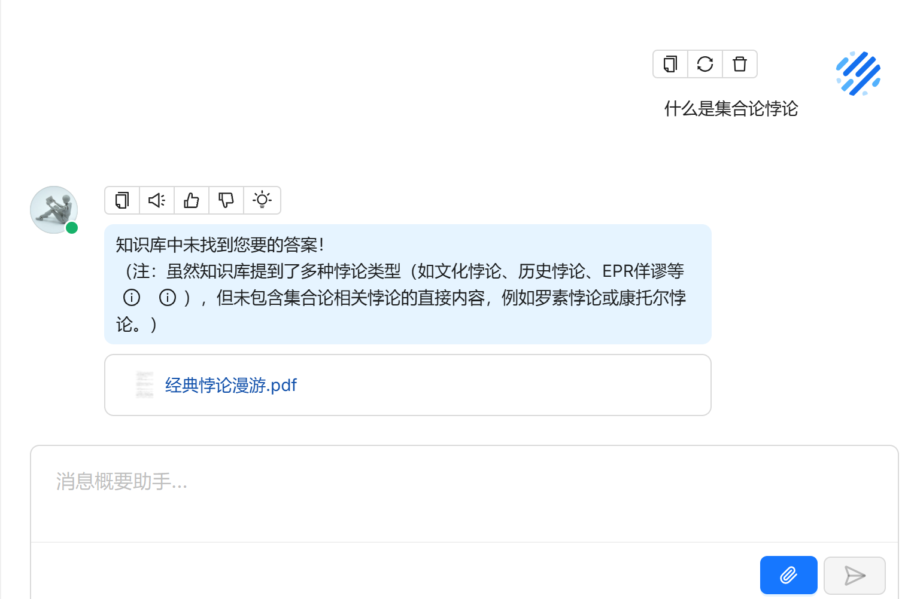
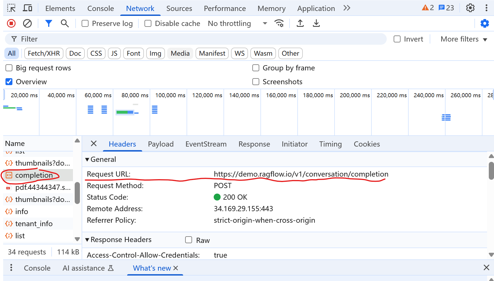
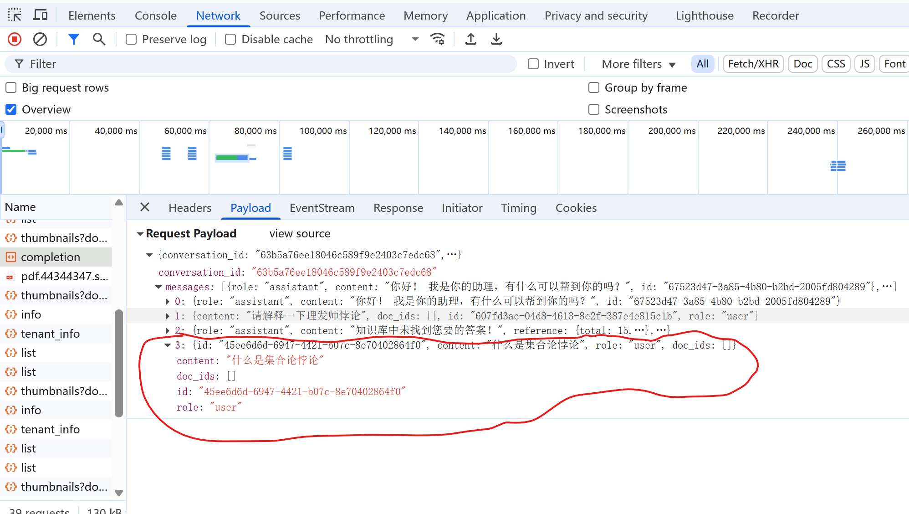

>RAGFlow 基于深度文档理解引擎，能够从PDF、Word、Excel、网页等50+ 格式的非结构化数据中提取语义特征

>项目github 地址为：[https://github.com/infiniflow/ragflow](https://github.com/infiniflow/ragflow)

>官网地址为：[https://ragflow.io/docs/dev/category/guides](https://ragflow.io/docs/dev/category/guides)

关键的业务流程：

1. 文件上传、解析、解析结果存储
2. 问题解析、知识库检索、大模型生成流程

## 试用RAGFlow

互联网试用地址为：[https://demo.ragflow.io/](https://demo.ragflow.io/)



主要的流程包括：

1. 新建知识库
2. 知识库配置
3. 文件上传和解析
4. 对话功能

## 目录结构

```
agent            ==> 编排相关
    component    ==> 可以编排的一些组件
    templates
    test
agentic_reasoning
api                ==> HTTP 入口
deepdoc            ==> 核心逻辑，解析文档的关键代码
    parser         ==> 文档解析
    vision         ==> 视频，基于OCR实现
    docx_parser.py ==> word文档解析
    pdf_parser.py  ==> pdf文档解析。依赖ragflow/vision/ocr.py
                       ocr模型文件也需要部署到服务器上
                       HuggingFace为程序提供OCR模型服务
graphrah           ==> 基于图的RAG
helm
intergrations
rag                ==> 核心逻辑
sdk                ==> 
web                ==> 前端界面
```

## 怎么看代码

主要的结构还是一个BS 架构的系统，前端浏览器访问，后端服务器接收到请求对应进行处理

后端对于HTTP 请求的处理代码对应在api 目录下面，相关对外接口的代码实现都在/ragflow/api/apps/下面的_app.py结尾的Python源文件中

哪个前功能对应后端的什么接口，可以利用浏览器的F12 功能查看，比如提交一个问题



对应F12 可以看到请求的URL 为：https://demo.ragflow.io/v1/conversation/completion



请求的内容如下：



另外还有一些其他的关键URL

1. https://demo.ragflow.io/v1/kb/create 创建知识库
2. https://demo.ragflow.io/v1/document/upload 文档上传
3. https://demo.ragflow.io/v1/document/run 文档解析

## 一些问题

1. 文档怎么切片，怎么切片合理，文档解析有什么注意事项、技巧？
2. PDF切片，怎么像一个领域专家一样做切片
3. 怎么实现按照语义切片？分块不好就会失去上下文信息，给出的答案肯定不好
4. RAGFlow 的OCR 使用的是什么方案，在代码层面是怎么封装的？
5. RAGFlow 内部对于Embedding 模型是如何进行封装的
6. 什么是ReRank？ReRank 模型的作用是什么？
7. RAGFlow 在哪里用到了OCR 模型？可以扩展学习Paddle OCR 的内容！
8. RAGFlow 有哪些中间件依赖？
9. 多路召回是怎么实现的？
10. word文档中有图片的内容，如何实现解析？

## 参考资料

* [爆改RagFlow](https://blog.csdn.net/weixin_43008312/article/details/144752437)
* [来自工业界的知识库 RAG 服务(二)，RagFlow 源码全流程深度解析](https://hustyichi.github.io/2024/05/15/ragflow/)
