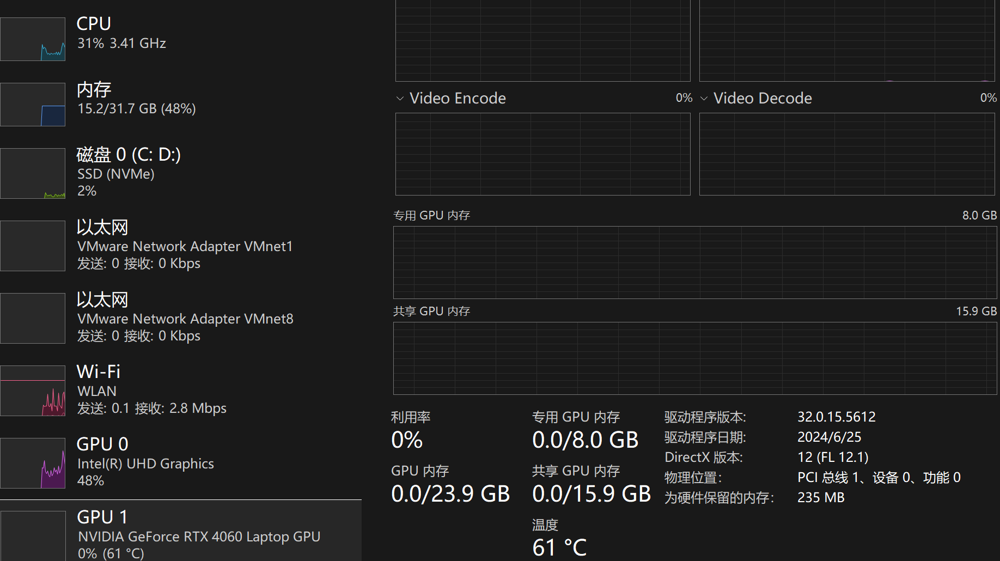

>参考[https://www.bilibili.com/video/BV1As4y127HW/](https://www.bilibili.com/video/BV1As4y127HW/)

目前开源社区中90%以上的拓展插件都是基于SD WebUI开发的

SD 算上内置的各种功能组件和后续放入的各种模型，大小最后可能会有几十到几百G，所以磁盘空间要足够大。另外安装路径要保证没有中文字符

我的机器配置如下

