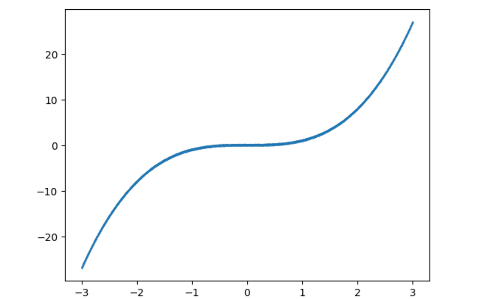
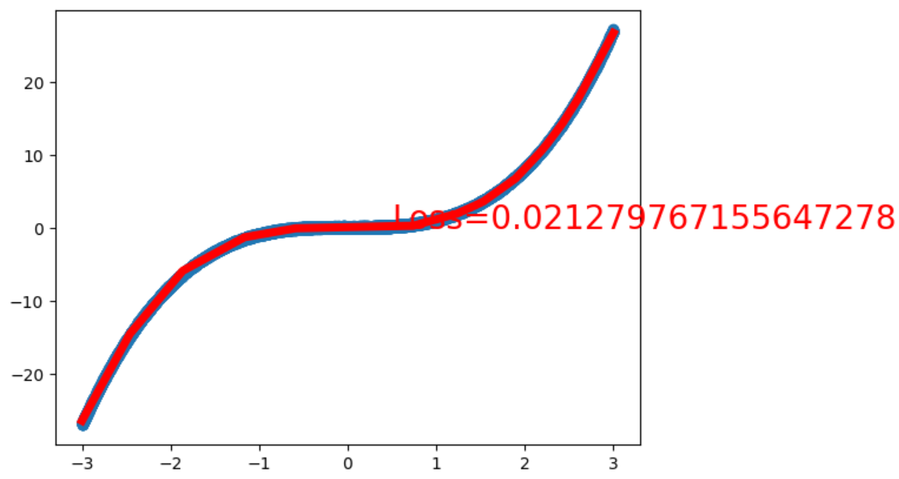

用Python 程序根据一元三次方程自动生成一批数据样本

```python
# 根据一元三次方程自动生成一批数据样本

import torch
import matplotlib.pyplot as plt

x = torch.unsqueeze(torch.linspace(-3, 3, 10000), dim = 1)
y = x.pow(3) + 0.3 * torch.rand(x.size())

plt.scatter(x.numpy(), y.numpy(), s=0.01)
plt.show()
```



编写神经网络，以及进行训练

```python
# 绘图函数
def draw(output, loss):
    plt.cla()
    plt.scatter(x.numpy(), y.numpy())
    plt.plot(x.numpy(), output.data.numpy(), 'r-', lw=5)
    plt.text(0.5, 0, 'Loss=%s' % (loss.item()), fontdict={'size':20, 'color':'red'})
    plt.pause(0.005)
    

# 设计神经网络模型，一个输入层，一个隐藏层，一个输出层
from torch import nn, optim
import torch.nn.functional as F

class Net(nn.Module):
    def __init__(self, input_feature, num_hidden, outputs):
        super(Net, self).__init__()
        self.hidden = nn.Linear(input_feature, num_hidden)
        self.out = nn.Linear(num_hidden, outputs)

    def forward(self, x):
        x = F.relu(self.hidden(x))
        x = self.out(x)
        return x

# 输入为1维，隐藏层节点数为20，输出为1维
net = Net(input_feature=1, num_hidden=20, outputs=1)
inputs = x
target = y

# 将优化器设置为随机梯度下降，损失函数设为均方误差
optimizer = optim.SGD(net.parameters(), lr=0.01)
criterion = nn.MSELoss()

# 训练函数
def train(model, criterion, optimizer, epochs):
    for epoch in range(epochs):
        output = model(inputs)
        loss = criterion(output, target)

        optimizer.zero_grad()
        loss.backward()
        optimizer.step()

        if epoch % 80 == 0:
            draw(output, loss)

    return model, loss


# 训练10000次，并打印最终的损失值
net, loss = train(net, criterion, optimizer, 10000)
print("final loss:", loss.item())
```

层层拟合，最终的结果如下


