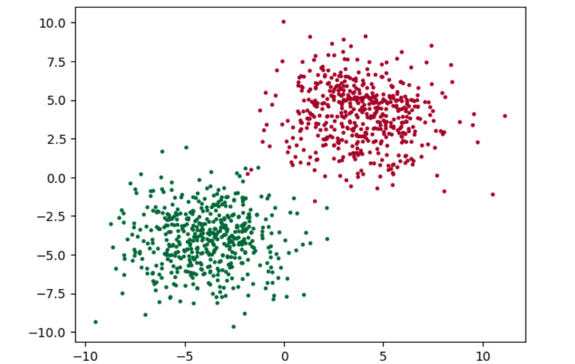
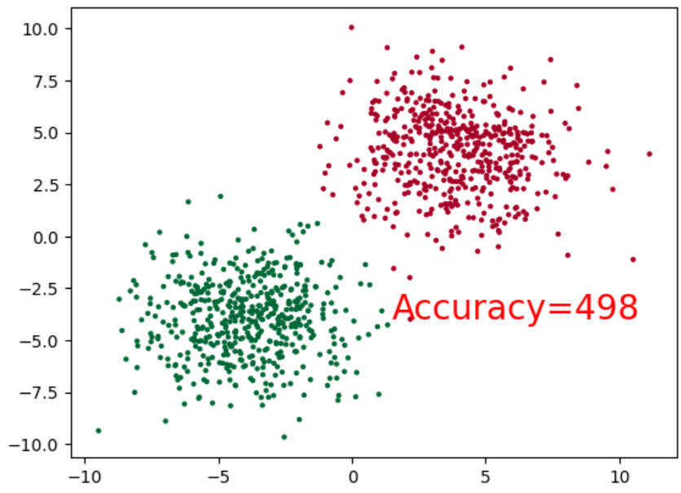

准备测试数据

```python
# 构造样本数据

import torch
import matplotlib.pyplot as plt

cluster = torch.ones(500, 2)
data0 = torch.normal(4*cluster, 2)
data1 = torch.normal(-4*cluster, 2)
label0 = torch.zeros(500)
label1 = torch.ones(500)

x = torch.cat((data0, data1), ).type(torch.FloatTensor)
y = torch.cat((label0, label1), ).type(torch.LongTensor)

plt.scatter(x.numpy()[:, 0], x.numpy()[:, 1], c=y.numpy(), s=10, lw=0, cmap='RdYlGn')
plt.show()
```



编写神经网络，以及进行训练

```python
# 定义神经网络类
class Net(nn.Module):
    def __init__(self):
        super(Net, self).__init__()
        self.linear = nn.Linear(2, 2)

    def forward(self, x):
        x = self.linear(x)
        x = torch.sigmoid(x)
        return x

net = Net()
inputs = x
target = y

# 将优化器设置为随机梯度下降，学习率设置为0.02
# 由于这是一个分类问题，所以交叉熵作为损失函数
optimizer = optim.SGD(net.parameters(), lr=0.01)
criterion = nn.CrossEntropyLoss()


# 绘图函数
def draw(output):
    plt.cla()
    output  = torch.max((output), 1)[1]
    pred_y = output.data.numpy().squeeze()
    target_y = y.numpy()
    plt.scatter(x.numpy()[:, 0], x.numpy()[:, 1], c=pred_y, s=10, lw=0, cmap='RdYlGn')
    accuracy = sum(pred_y == target_y / 1000.0)
    plt.text(1.5, -4, 'Accuracy=%s' % (accuracy), fontdict={'size':20, 'color': 'red'})
    plt.pause(0.1)


# 训练函数
def train(model, criterion, optimizer, epochs):
    for epoch in range(epochs):
        output = model(inputs)
        loss = criterion(output, target)

        optimizer.zero_grad()
        loss.backward()
        optimizer.step()

        if epoch % 40 == 0:
            draw(output)
            

# 训练1000次，并打印最终的损失值
train(net, criterion, optimizer, 1000)
```

层层拟合，最终的结果如下


