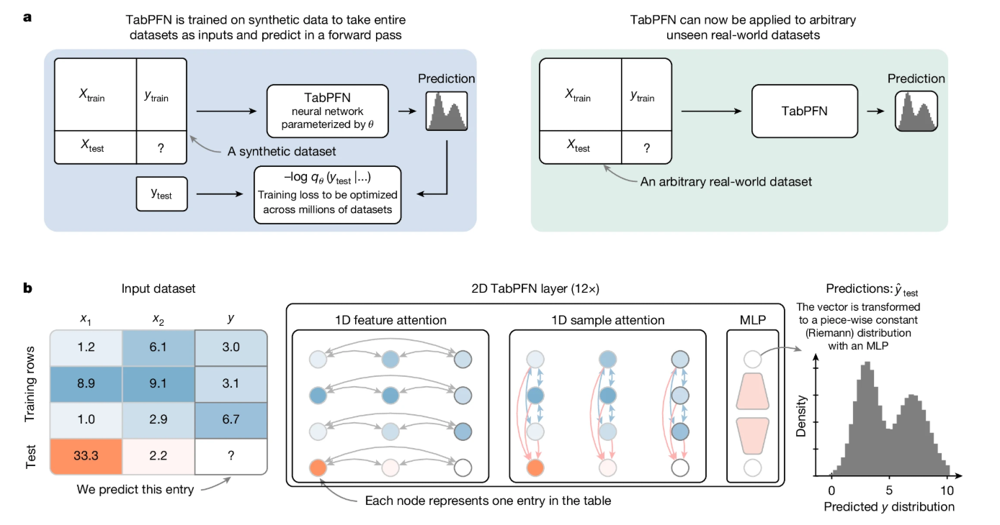
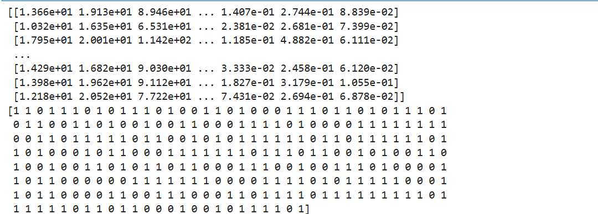
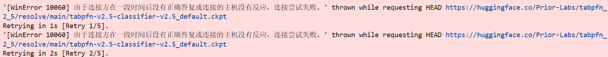
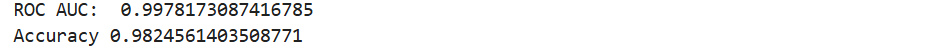

>参考材料：[二分类智能诊断全面对比：TabPFN、TAM、LightGBM等十余种算法一键评测！附完整源码](https://mp.weixin.qq.com/s/OS8xY4dxSG8pNmx3Ffg1hw)

>对应的github 仓库：[https://github.com/PriorLabs/TabPFN](https://github.com/PriorLabs/TabPFN)

>源码链接：[https://github.com/yandex-research/tabm/blob/main/example.ipynb](https://github.com/yandex-research/tabm/blob/main/example.ipynb)



TabPFN 是2025 年发表在Nature 正刊的一个算法，基于大规模的预训练，有点大模型那个味道，因为有大量的预训练，因此非常适合小样本数据的回归和分类，与其他LightGBM、CatBoost 模型相比都有一定的效果

## 快速上手

首先安装依赖

```shell
pip install tabpfn
```

参考官方案例，对应的代码如下

```python
from sklearn.datasets import load_breast_cancer
from sklearn.metrics import accuracy_score, roc_auc_score
from sklearn.model_selection import train_test_split

from tabpfn import TabPFNClassifier
from tabpfn.constants import ModelVersion

# 加载数据
X, y = load_breast_cancer(return_X_y=True)
X_train, X_test, y_train, y_test = train_test_split(X, y, test_size=0.5, random_state=42)

## 打印训练数据
print(X_train)
print(y_train)
```



```python
# 初始化分类器
clf = TabPFNClassifier()
clf.fit(X_train, y_train)

## 预测可能性
prediction_probabilities = clf.predict_proba(X_test)
print("ROC AUC: ", roc_auc_score(y_test, prediction_probabilities[:, 1]))

## 预测标签
predictions = clf.predict(X_test)
print("Accuracy", accuracy_score(y_test, predictions))
```

运行的时候出现如下报错



```
'[WinError 10060] 由于连接方在一段时间后没有正确答复或连接的主机没有反应，连接尝试失败。' thrown while requesting HEAD https://huggingface.co/Prior-Labs/tabpfn_2_5/resolve/main/tabpfn-v2.5-classifier-v2.5_default.ckpt
Retrying in 1s [Retry 1/5].
'[WinError 10060] 由于连接方在一段时间后没有正确答复或连接的主机没有反应，连接尝试失败。' thrown while requesting HEAD https://huggingface.co/Prior-Labs/tabpfn_2_5/resolve/main/tabpfn-v2.5-classifier-v2.5_default.ckpt
Retrying in 2s [Retry 2/5].
```

>[TabPFN在MacOS系统运行问题解决方案——下载模型](https://www.cnblogs.com/qhj384343045-/p/18835093)

是因为TanPFN 是类似大模型的思路，运行之前需要去huggingface 下载预训练的模型，以上是因为下载的时候报错了，所以可以把模型先下载到本地

可以去[镜像网站](https://hf-mirror.com/Prior-Labs/tabpfn_2_5/tree/main) 下载

安装huggingface

```shell
pip install -U huggingface_hub
pip install huggingface_cli
```

Windows 设置环境变量，设置为从huggingface 的镜像网站下载模型

```shell
$env:HF_ENDPOINT = "https://hf-mirror.com"
```

```shell
cd D:\LLM\Models\

hf download Prior-Labs/tabpfn_2_5 --local-dir ./tabpfn_2_5
hf download tabpfn_2_5 --local-dir ./tabpfn_2_5
```

下载的时候报错，因为需要huggingface 的token 认证

```
Error: Repository not found. Check the `repo_id` and `repo_type` parameters. If the repo is private, make sure you are authenticated.
```

如果不科学上网的话，暂时无法访问huggingface，暂时无法去获取token

可以在[https://www.modelscope.cn/models/Prior-Labs/tabpfn_2_5/files](https://www.modelscope.cn/models/Prior-Labs/tabpfn_2_5/files) 下载到D:\LLM\Models\tabpfn_2_5 目录下

然后运行程序如下

```python
# 初始化分类器
clf = TabPFNClassifier(model_path="D:\\LLM\\Models\\tabpfn_2_5\\tabpfn-v2.5-classifier-v2.5_default.ckpt")
clf.fit(X_train, y_train)

## 预测可能性
prediction_probabilities = clf.predict_proba(X_test)
print("ROC AUC: ", roc_auc_score(y_test, prediction_probabilities[:, 1]))

## 预测标签
predictions = clf.predict(X_test)
print("Accuracy", accuracy_score(y_test, predictions))
```

运行效果如下：


