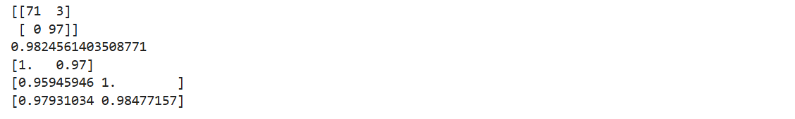

>参考材料：[二分类智能诊断全面对比：TabPFN、TAM、LightGBM等十余种算法一键评测！附完整源码](https://mp.weixin.qq.com/s/OS8xY4dxSG8pNmx3Ffg1hw)

首先安装依赖

```shell
pip install xgboost
```

准备数据

```python
import numpy as np
import pandas as pd

from scipy.stats import uniform, randint

from sklearn.datasets import load_breast_cancer
from sklearn.metrics import auc, accuracy_score, confusion_matrix, mean_squared_error
from sklearn.model_selection import cross_val_score, GridSearchCV, KFold, RandomizedSearchCV, train_test_split

import xgboost as xgb


## 数据导入
cancer = load_breast_cancer()
cancer.DESCR
```

数据切割与建模

```python
X = cancer.data
y = cancer.target

from sklearn.model_selection import train_test_split

X_train, X_test, y_train, y_test = train_test_split(X, y, test_size=0.3, random_state=1898)

xgb_model = xgb.XGBClassifier(objective="binary:logistic", random_state=1898)
xgb_model.fit(X_train, y_train)

y_pred = xgb_model.predict(X_test)
```

在机器学习和数据科学领域，混淆矩阵（Confusion Matrix）是一种常用的性能度量工具，尤其是在分类问题中。它提供了分类模型性能的可视化表示，帮助我们深入理解模型的分类效果。混淆矩阵以矩阵的形式展示了真实类别与模型预测类别之间的关系

confusion_matrix() 输出将是一个二维数组，表示每个类别的真正例、假正例、真反例和假反例的数量。

评价训练结果

```python
# 导入所需的sklearn库中的评估指标函数
from sklearn.metrics import accuracy_score, precision_score, recall_score, f1_score

# 混淆矩阵
print(confusion_matrix(y_test, y_pred))

# 计算准确率
# 准确率是所有预测正确的样本数占总样本数的比例
print(accuracy_score(y_test, y_pred))

# 计算每个类别的精确率
# 精确率是指预测为正例的样本中真正为正例的比例
# average=None表示返回每个类别的精确率，而不是平均值
print(precision_score(y_test, y_pred, average=None))

# 计算每个类别的召回率
# 召回率是指真正为正例的样本中被预测为正例的比例
# average=None同样表示返回每个类别的召回率，而不是平均值
print(recall_score(y_test, y_pred, average=None))

# 计算每个类别的F1分数
# F1分数是精确率和召回率的调和平均值，用于综合评估模型的性能
# average=None表示返回每个类别的F1分数，而不是平均值
print(f1_score(y_test, y_pred, average=None))
```


