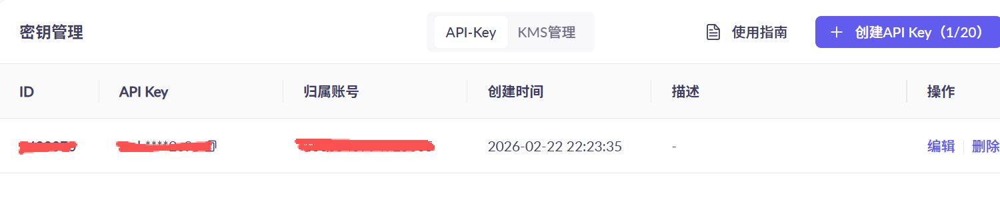
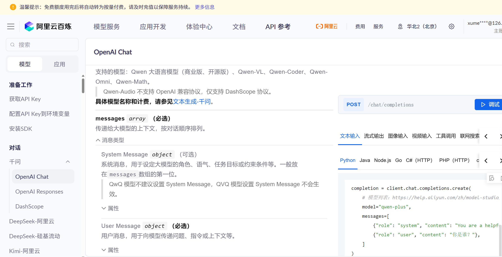
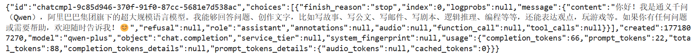

安装依赖

```shell
pip install openai
```

[https://bailian.console.aliyun.com/cn-beijing/?tab=model#/api-key](https://bailian.console.aliyun.com/cn-beijing/?tab=model#/api-key) 创建API Key



参考官方文档，给出了不同的API 调用示例



编写测试程序

```python
import os
from openai import OpenAI

client = OpenAI(
    # 若没有配置环境变量，请用百炼API Key将下行替换为：api_key="sk-xxx"
    api_key=DASHSCOPE_API_KEY,
    base_url="https://dashscope.aliyuncs.com/compatible-mode/v1",
)

completion = client.chat.completions.create(
    # 模型列表：https://help.aliyun.com/zh/model-studio/getting-started/models
    model="qwen-plus",
    messages=[
        {"role": "system", "content": "You are a helpful assistant."},
        {"role": "user", "content": "你是谁？"},
    ]
)
print(completion.model_dump_json())
```

运行效果如下

