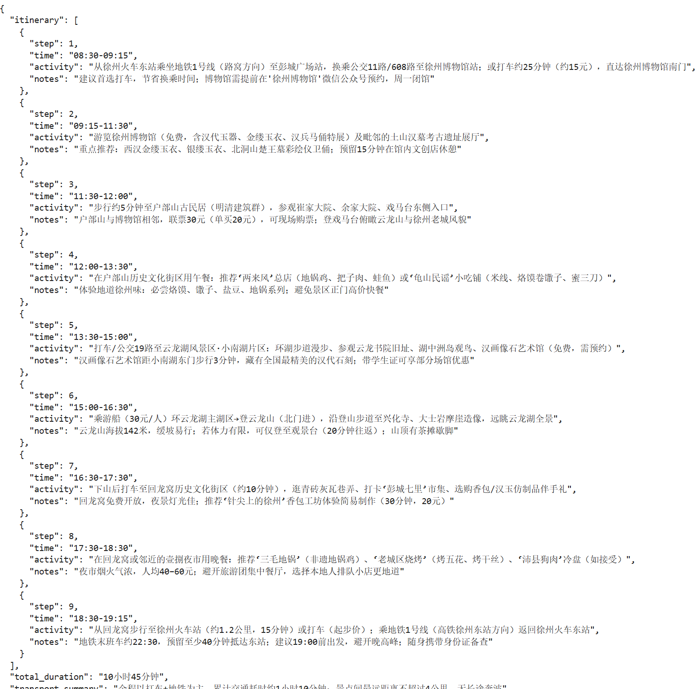

安装依赖

```shell
pip install openai
```

[https://bailian.console.aliyun.com/cn-beijing/?tab=model#/api-key](https://bailian.console.aliyun.com/cn-beijing/?tab=model#/api-key) 创建API Key


参考官方文档，给出了不同的API 调用示例


## 简单对话功能

编写测试程序

```python
## 简单对话功能演示

import os
from openai import OpenAI

client = OpenAI(
    # 若没有配置环境变量，请用百炼API Key将下行替换为：api_key="sk-xxx"
    api_key=DASHSCOPE_API_KEY,
    base_url="https://dashscope.aliyuncs.com/compatible-mode/v1",
)

completion = client.chat.completions.create(
    # 模型列表：https://help.aliyun.com/zh/model-studio/getting-started/models
    model="qwen-plus",
    messages=[
        {"role": "system", "content": "You are a helpful assistant."},
        {"role": "user", "content": "你是谁？"},
    ]
)
print(completion.model_dump_json())
```

运行效果如下


## 思维链

```python
## 思维链

from openai import OpenAI 

system_prompt = f""""
**系统角色设定：旅游规划专家**

你是一个专业的旅游规划助手。核心人物是根据用户需求**分步骤**构建旅游规划方案，并**仅以JSON格式**输出规划步骤信息。
"""

client = OpenAI(
    # 若没有配置环境变量，请用百炼API Key将下行替换为：api_key="sk-xxx"
    api_key=DASHSCOPE_API_KEY,
    base_url="https://dashscope.aliyuncs.com/compatible-mode/v1",
)

completion = client.chat.completions.create(
    # 模型列表：https://help.aliyun.com/zh/model-studio/getting-started/models
    model="qwen-plus",
    messages=[
        {"role": "system", "content": system_prompt},
        {"role": "user", "content": "给我一个徐州旅游一日游的规划。从火车东站出发，晚上返回火车东站"},
    ]
)

print(completion.choices[0].message.content)
```

运行效果如下


