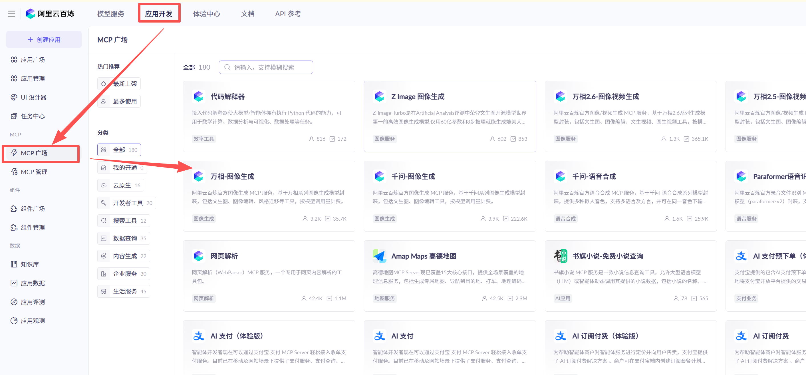
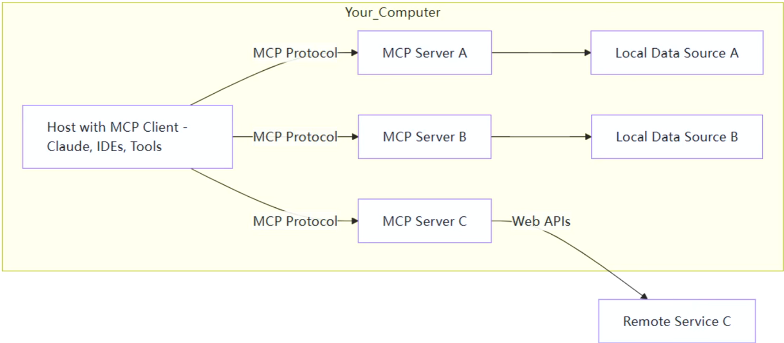
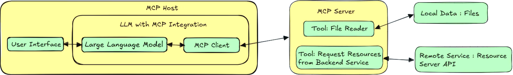
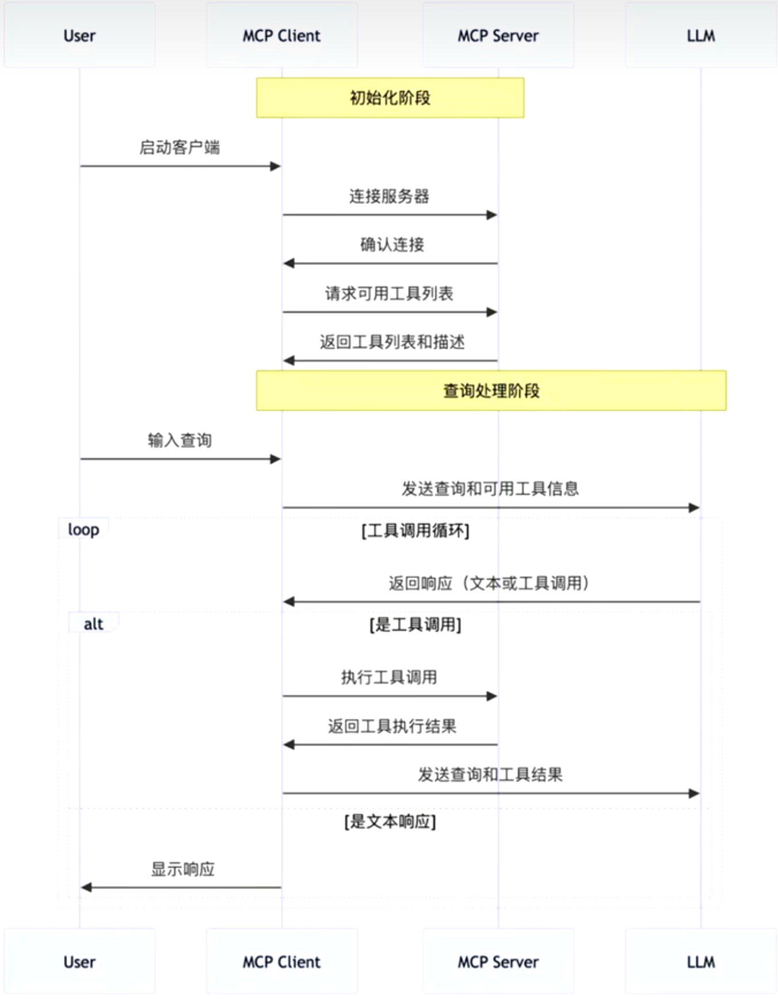

## MCP 简单介绍

MCP（Model Context Protocol，模型上下文协议），2014 年11 月底，由Anthropic 推出的一种开放标准。旨在为大峪言模型（LLM）提供统一的、标准化方式与外部数据源和工具之间进行通信

[阿里云百炼平台](https://bailian.console.aliyun.com/cn-beijing/?tab=app#/mcp-market)可以看到当前上架的各种MCP

另外可以在下面这些网址查找自己需要用的MCP

* [https://github.com/punkpeye/awesome-mcp-servers](https://github.com/punkpeye/awesome-mcp-servers)
* [https://mcp.so/zh](https://mcp.so/zh)
* [https://smithery.ai/](https://smithery.ai/)

## MCP 架构

>[MCP实战指南，mcp视频教程，2小时学透mcp](https://www.bilibili.com/video/BV1eK5DzHEWu)

>[https://mcpcn.com/](https://mcpcn.com/)

MCP 遵循客户端-服务器架构，其中包含以下几个核心概念

* MCP 主机（MCP Hosts）
* MCP 客户端（MCP Clients）
* MCP 服务器（MCP Servers）
* 本地资源（Local Resources）
* 远程资源（Remote Resources）

MCP 的工作流程如下所示

