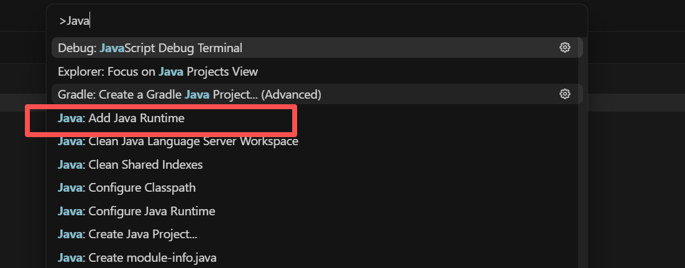
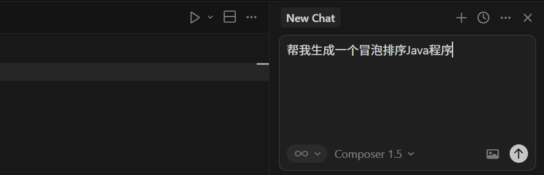
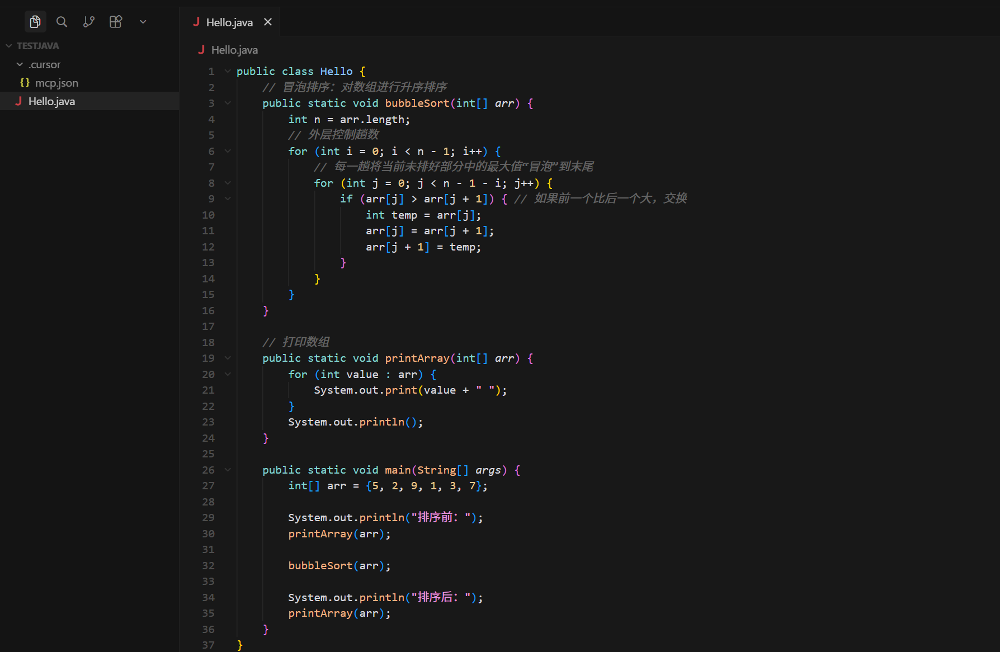
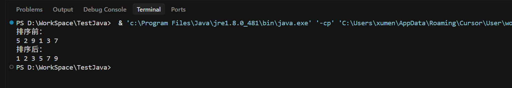
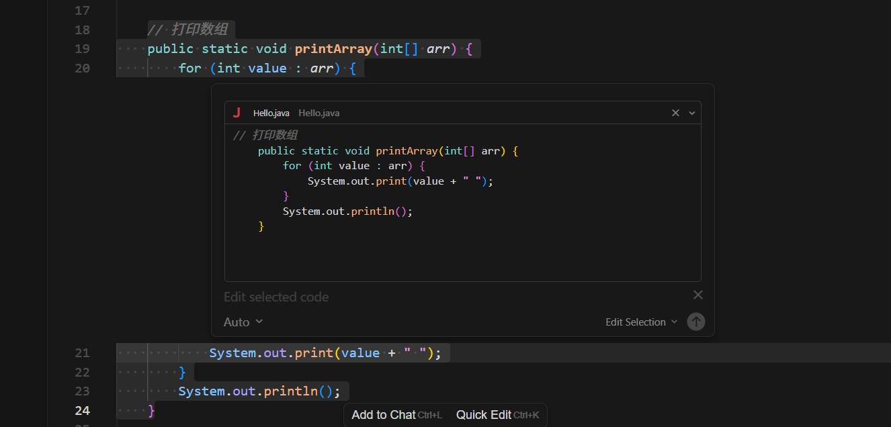

## 搭建Java 开发环境

[https://www.java.com/en/download/manual.jsp](https://www.java.com/en/download/manual.jsp) 下载安装Java 程序

Ctrl - Shift - P，将Java 的安装目录【C:\Program Files\Java\jre1.8.0_481】 配置为Java 运行时环境



然后指挥大模型帮忙生成一个冒泡排序Java 程序





然后运行Java 程序，在Hello.java 中右键 -> Run Java，然后运行结果如下：



## 搭建SpringBoot 开发环境

Ctrl - Shift - X 打开插件市场，安装以下插件

1. Extension Pack for Java
2. Spring Boot Extension Pack

Ctrl - Shift - P，找到Spring Initializr:Creat a Maven Project...，选择后，按照指引一路进行配置

默认只生成了一个DemoApplication.java 文件

```java
package com.xum.demo;

import org.springframework.boot.SpringApplication;
import org.springframework.boot.autoconfigure.SpringBootApplication;

@SpringBootApplication
public class DemoApplication {

	public static void main(String[] args) {
		SpringApplication.run(DemoApplication.class, args);
	}

}
```

继续编写提示词，让项目开放端口，可以让浏览器访问

```
这个项目是一个SpringBoot项目
需要开发一个Controller，通过浏览器访问8080端口，可以返回Hello World
```

Cursor 会帮忙生成一个

```java

package com.xum.demo;

import org.springframework.web.bind.annotation.GetMapping;
import org.springframework.web.bind.annotation.RestController;

@RestController
public class HelloController {

    @GetMapping("/")
    public String hello() {
        return "Hello World";
    }
}
```

在DemoApplication.java，右键 -> Run Java，启动这个程序

然后可以通过[http://localhost:8080/](http://localhost:8080/) 访问，看到浏览器返回Hello World

## 常用功能介绍

Ctrl - K 开启inline chat 功能，对选中的指定代码通过与大语言模型对话的方式进行重构、修改等



## 配置大模型

Cursor 支持来自OpenAI、Anthropic、Google 等的所有最新一代代码模型

