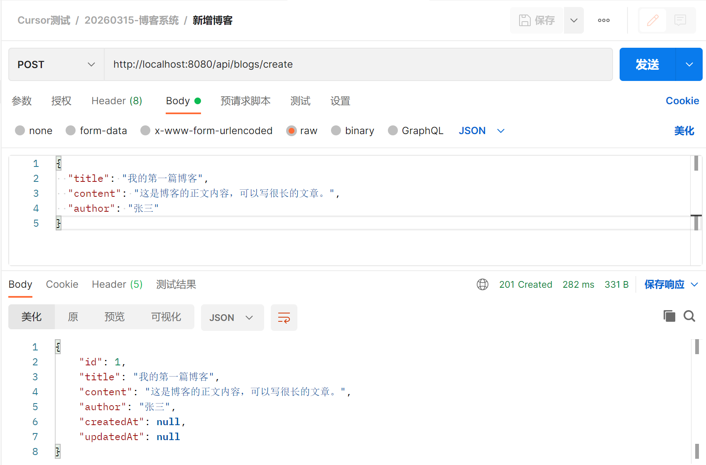
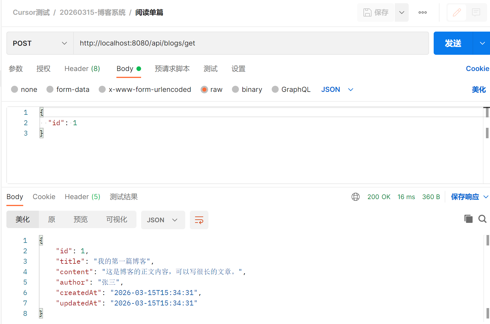

准备MySQL 开发环境（暂时先设置为root/root）


>具体可以参考[在Windows上安装MySQL数据库（全网最详细）](https://cloud.tencent.com/developer/article/2527777)

先通过提示词，让Cursor 帮我实现一个简单的需求

```
重构当前的项目，我要实现一个博客系统，这个系统的功能包括
1. 新增博客
2. 修改博客
3. 删除博客
4. 阅读博客

所有的接口都是POST请求的，不使用GET、PUT、DELETE

使用的技术栈包括
1. 使用SpringBoot开发后端业务逻辑
2. 使用MyBatis去访问数据库
3. 数据存储使用MySQL数据库

数据库的地址为localhost，端口为3306，用户名为root，密码为root

要求帮我生成基于SpringBoot的后端程序代码，并且生成需要的表结构
```

最终生成的项目结构、过程情况，大概如下所示


对应生成的建表语句如下

```sql
-- 博客系统数据库表结构
-- 使用前请先创建数据库: CREATE DATABASE blog_db DEFAULT CHARACTER SET utf8mb4 COLLATE utf8mb4_unicode_ci;

USE blog_db;

DROP TABLE IF EXISTS blog;

CREATE TABLE blog (
    id          BIGINT       NOT NULL AUTO_INCREMENT COMMENT '主键',
    title       VARCHAR(200) NOT NULL COMMENT '标题',
    content     TEXT         NOT NULL COMMENT '正文内容',
    author      VARCHAR(100) DEFAULT NULL COMMENT '作者',
    created_at  DATETIME     NOT NULL DEFAULT CURRENT_TIMESTAMP COMMENT '创建时间',
    updated_at  DATETIME     NOT NULL DEFAULT CURRENT_TIMESTAMP ON UPDATE CURRENT_TIMESTAMP COMMENT '更新时间',
    PRIMARY KEY (id),
    KEY idx_created_at (created_at)
) ENGINE=InnoDB DEFAULT CHARSET=utf8mb4 COLLATE=utf8mb4_unicode_ci COMMENT='博客表';
```

另外要求大模型针对这个接口生成对应的postman 测试报文（要求写的越清晰越好）

```
针对当前的博客系统的如下，分别帮我生成可以在postman中用于测试的请求报文
1. 阅读-列表
2. 阅读-单篇
3. 新增博客
4. 修改博客
5. 删除博客

每个接口的请求报文以JSON的格式分别展示
```

对应生成的各个接口的报文如下

```
1. 阅读-列表
http://localhost:8080/api/blogs/list

2. 阅读-单篇
http://localhost:8080/api/blogs/get
{
  "id": 1
}

3. 新增博客
http://localhost:8080/api/blogs/create
{
  "title": "我的第一篇博客",
  "content": "这是博客的正文内容，可以写很长的文章。",
  "author": "张三"
}

4. 修改博客
http://localhost:8080/api/blogs/update
{
  "id": 1,
  "title": "修改后的标题",
  "content": "修改后的正文内容。",
  "author": "李四"
}

5. 删除博客
http://localhost:8080/api/blogs/delete
{
  "id": 1
}
```

然后启动程序，可以基于Postman 进行测试





另外上面的过程中，Cursor 不光生成了SQL、Java 代码、Postman 报文，还生成了清晰的接口文档，所以Cursor 的功能是非常强大的

在日常的开发流程中，在所有工作流中如何深度使用Cursor

1. 需求分析
2. 概要设计、详细设计
3. 代码生成
4. 单元测试
5. 代码检视
6. 影响分析
7. 性能分析和调优
