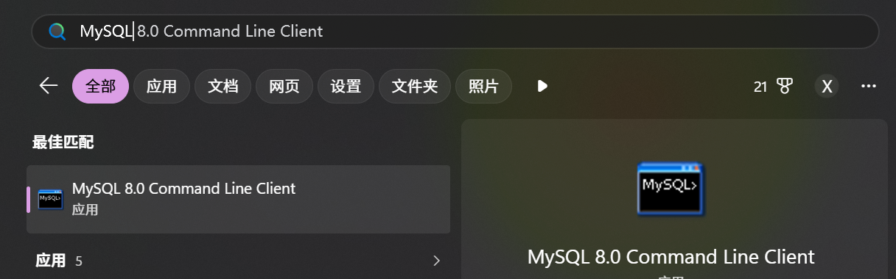
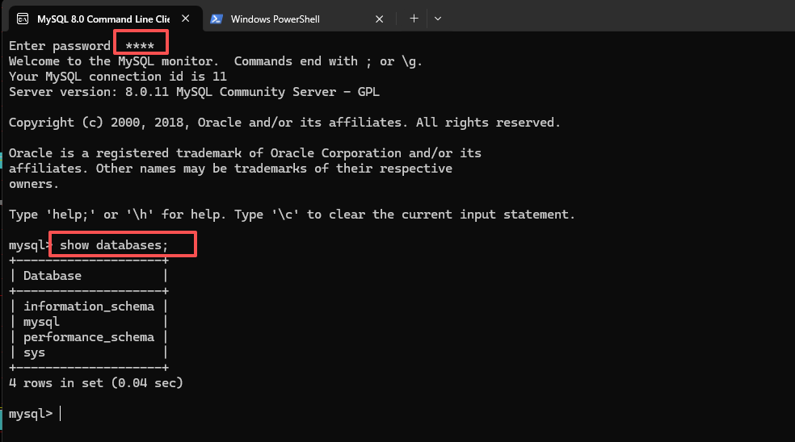
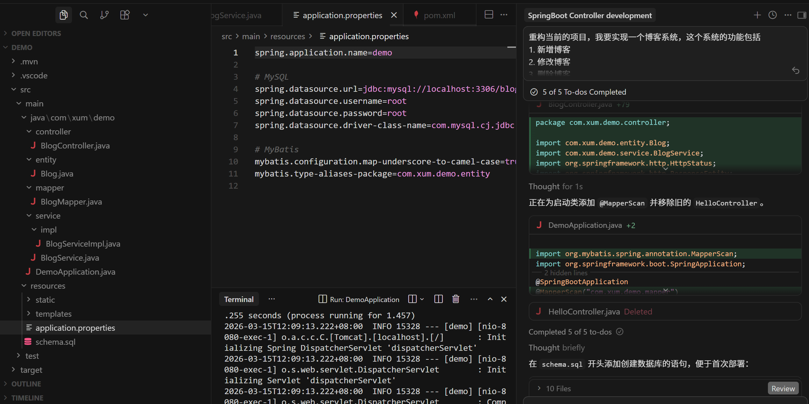

准备MySQL 开发环境（暂时先设置为root/root）





>具体可以参考[在Windows上安装MySQL数据库（全网最详细）](https://cloud.tencent.com/developer/article/2527777)

先通过提示词，让Cursor 帮我实现一个简单的需求

```
重构当前的项目，我要实现一个博客系统，这个系统的功能包括
1. 新增博客
2. 修改博客
3. 删除博客
4. 阅读博客

使用的技术栈包括
1. 使用SpringBoot开发后端业务逻辑
2. 使用MyBatis去访问数据库
3. 数据存储使用MySQL数据库

数据库的地址为localhost，端口为3306，用户名为root，密码为root

要求帮我生成基于SpringBoot的后端程序代码，并且生成需要的表结构
```

最终生成的项目结构、过程情况，大概如下所示



