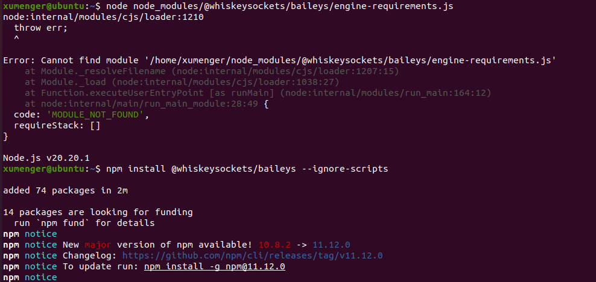
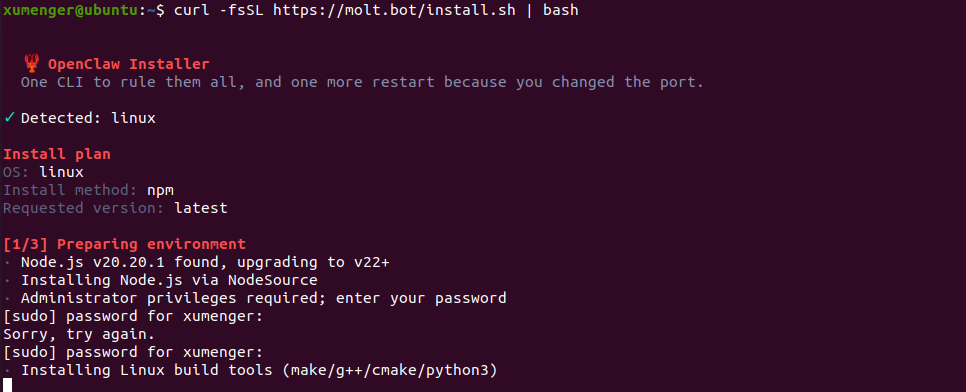
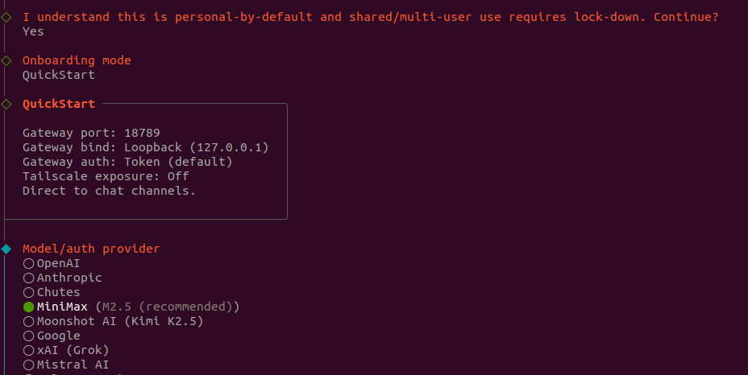

参考链接

1. [Ubuntu 虚拟机安装 OpenClaw 完整流程](https://github.com/spoto-team/openclaw-ubuntu-guide)
2. [OpenClaw 官方文档](https://docs.clawd.bot/)
3. [OpenClaw GitHub](https://github.com/openclaw/openclaw)

Ubuntu 快速安装node、npm、git 等依赖的基础工具命令

```shell
sudo apt-get upgrade
sudo apt-get install nodejs
sudo apt-get upgrade nodejs
sudo apt-get install npm
sudo apt-get upgrade npm
sudo apt-get install git
```

临时增大git http 缓冲区，这个方法能解决因缓冲区不足导致的克隆中断问题

```shell
# 增大 Git HTTP 缓冲区到 500MB（根据需要调整）
git config --global http.postBuffer 524288000

# 同时设置超时时间（单位：秒），避免网络慢导致超时
git config --global http.lowSpeedLimit 0
git config --global http.lowSpeedTime 999999
```

使用npm 安装openclaw

```shell
sudo npm install -g openclaw@latest
```

安装的过程中可能出现报错

```
npm ERR! code ELIFECYCLE
npm ERR! errno 1
npm ERR! @whiskeysockets/baileys@7.0.0-rc.9 preinstall: `node ./engine-requirements.js`
npm ERR! Exit status 1
npm ERR! 
npm ERR! Failed at the @whiskeysockets/baileys@7.0.0-rc.9 preinstall script.
npm ERR! This is probably not a problem with npm. There is likely additional logging output above.
```

Baileys（ WhatsApp 相关库）通常对 Node.js 版本有严格要求（比如需要 Node.js 18+，甚至 20+），也可能检查系统依赖（如 libgbinder、protobuf 等）。

可以执行下面的命令升级版本

```shell
# 安装 nvm（Node 版本管理器）
curl -o- https://raw.githubusercontent.com/nvm-sh/nvm/v0.39.7/install.sh | bash

# 重启终端后，安装 Node.js 20 LTS
nvm install 20
nvm use 20

# 验证版本
node -v  # 应输出 v20.x.x
npm -v   # 应输出 9.x+ 或 10.x+
```

然后安装还是上面的报错，然后执行下面的命令查看原因

```shell
# 直接运行预安装脚本，查看详细错误
node node_modules/@whiskeysockets/baileys/engine-requirements.js
# 如果上面的命令提示文件不存在，先临时安装（忽略脚本）：
npm install @whiskeysockets/baileys --ignore-scripts
```

执行第二个命令的时候，出现报错，需要升级npm 版本



升级npm 版本后，安装Baileys的底层依赖，重新安装

```shell
npm install -g npm@11.12.0

# Ubuntu/Debian 完整依赖包
sudo apt update && sudo apt install -y \
  build-essential \
  python3 \
  make \
  g++ \
  libgbinder-dev \
  libprotobuf-dev \
  protobuf-compiler \
  git \
  curl \
  wget

# 出现报错：Unable to locate package libgbinder-dev
# 先安装编译依赖
sudo apt update
sudo apt install -y build-essential git libglib2.0-dev dpkg-dev fakeroot
# 克隆源码
git clone https://github.com/waydroid/libglibutil.git
cd libglibutil
# 安装编译依赖
sudo apt build-dep .
# 编译并打包
dpkg-buildpackage -b -uc -us
# 回到上级目录，安装生成的 deb 包
cd ..
sudo apt install -y ./*.deb
# 克隆源码
git clone https://github.com/waydroid/libgbinder.git
cd libgbinder
# 安装编译依赖
sudo apt build-dep .
# 编译并打包
dpkg-buildpackage -b -uc -us
# 回到上级目录，安装生成的 deb 包
cd ..
sudo apt install -y ./*.deb

# 验证安装结果
pkg-config --modversion libgbinder  # 输出版本号即成功
ls /usr/lib/x86_64-linux-gnu/libgbinder.so  # 有文件即成功


# 重新安装openclaw
sudo npm install -g openclaw@latest
```

## 换一种方式安装

使用官方提供的一键安装脚本进行部署：

```shell
nvm install 22
nvm use 22
nvm alias default 22
curl -fsSL https://molt.bot/install.sh | bash
```



完整安装向导 + 安装系统服务

```shell
openclaw onboard --install-daemon
```

按照指示一路安装，注意配置模型这一步，暂时先选择MiniMax



可以选择的大模型如下：

1. MiniMax	https://www.minimaxi.com → 控制台 → API Keys
2. 智谱 AI	https://bigmodel.cn → 控制台 → API Keys

其他的内容也都先跳过，后续需要用到的时候再设置

## 简单使用

重启 Gateway

```shell
openclaw gateway restart
```

通过[http://127.0.0.1:18789/chat?session=main](http://127.0.0.1:18789/chat?session=main) 可以试用

比如需要更换大模型，或者更换API Key，可以重新执行，重新设置，并重启Gateway Service

```shell
openclaw onboard
openclaw gateway restart
```

可以试着去和OpenClaw 进行对话：


我希望通过我的Windows 电脑的浏览器访问Ubuntu 上的OpenClaw，OpenClaw 默认仅绑定 127.0.0.1（loopback），只能本机访问。需改为 lan（0.0.0.0）以监听所有网卡。

```shell
# 查看当前网关配置
openclaw config get gateway

# 设置为局域网可访问（监听 0.0.0.0）
openclaw config set gateway.bind lan

# 可选：修改端口（默认 18789）
# openclaw config set gateway.port 18789

openclaw config set gateway.controlUi.allowedOrigins '["*"]'

# 重启网关使配置生效
openclaw gateway restart
```

设置通过HTTPS 访问

```shell
# 创建证书目录
mkdir -p ~/.openclaw/certs
cd ~/.openclaw/certs

# 生成自签名证书（一路回车，无需填写额外信息）
openssl req -x509 -newkey rsa:4096 -keyout key.pem -out cert.pem -days 365 -nodes

# 设置 HTTPS 证书路径
openclaw config set gateway.tls.enabled true
openclaw config set gateway.tls.cert ~/.openclaw/certs/cert.pem
openclaw config set gateway.tls.key ~/.openclaw/certs/key.pem

# 重启网关
openclaw gateway restart
```

先查看当前网关的令牌

```shell
# 查看当前网关令牌
openclaw config get gateway.auth.token

# 如果没有令牌（输出 null/undefined），生成一个新令牌
openclaw config set gateway.auth.token "$(openssl rand -hex 16)"
```

在~/.openclaw/openclaw.json 中可以找到token

```
"auth": {
      "mode": "none",
      "token": "c5e02ced942d746e02c35f5840852d9c"
    }
```

然后在Windows 上就可以通过[https://192.168.6.128:18789](https://192.168.6.128:18789) 来访问并使用OpenClaw 了，输入token 即可访问

如果访问的时候出现pairing required 报错，则

```shell
openclaw devices list
```

预期输出

```
┌──────────────────────────────────────┬──────────────┬─────────────────────┐
│ Request ID                           │ Role         │ Created At          │
├──────────────────────────────────────┼──────────────┼─────────────────────┤
│ 4f9db1bd-a1cc-4d3f-b643-2c195262464e │ browser      │ 2026-02-11 12:22:01 │
│ b2f8c1de-9b4a-4e7c-8d21-3f5a9b7c2e1f │ node         │ 2026-02-11 14:14:40 │
└──────────────────────────────────────┴──────────────┴─────────────────────┘
```

复制你要批准的 Request ID（例如 4f9db1bd-a1cc-4d3f-b643-2c195262464e），执行：

```shell
openclaw devices approve 4f9db1bd-a1cc-4d3f-b643-2c195262464e
```

此时返回浏览器/客户端，错误应立即消失，连接自动恢复。

然后就可以使用OpenClaw 了，比如我问他：明天杭州的天气怎么样


