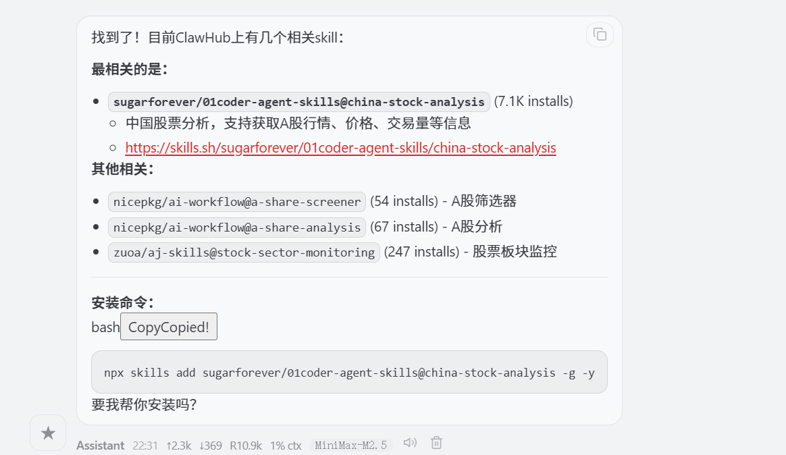
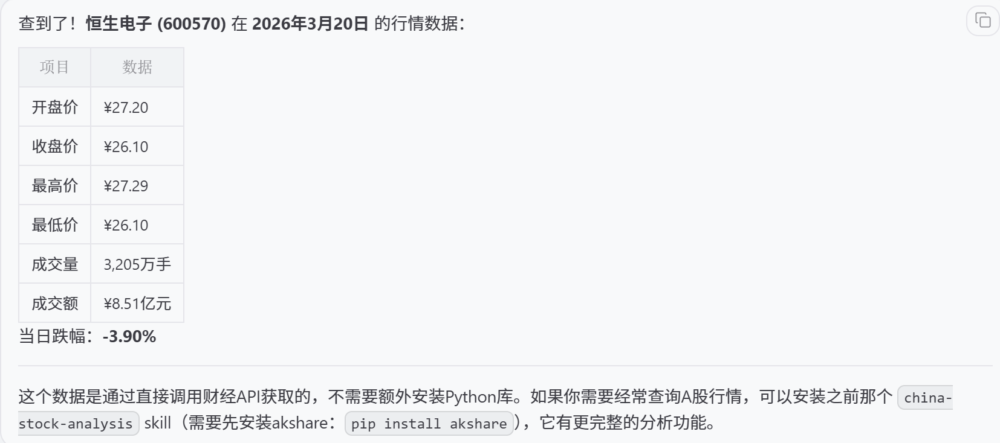
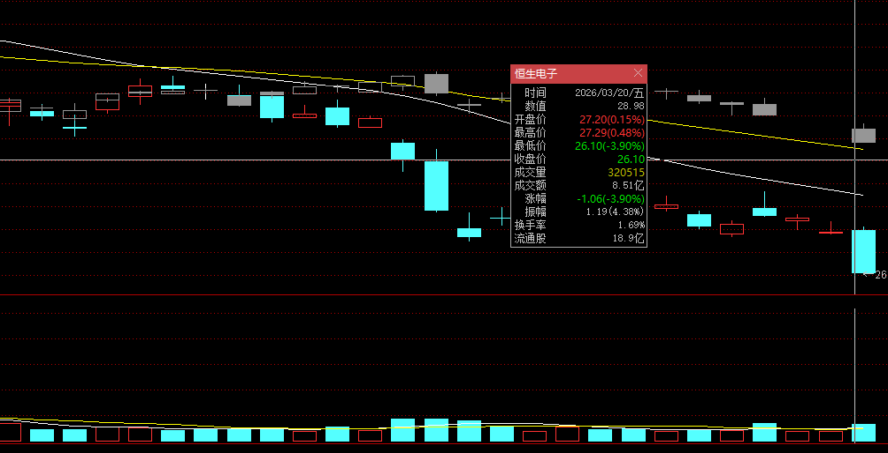

尝试去问OpenClaw：有什么可以拿到A股股票的价格、交易量等行情信息的skill？



执行下面的命令安装这个Skill

```shell
npx skills add sugarforever/01coder-agent-skills@china-stock-analysis -g -y
```

然后继续问一下这个问题：2026年3月20日，恒生电子的开盘价、收盘价、最高价、最低价、成交额、成交量分别是多少？




