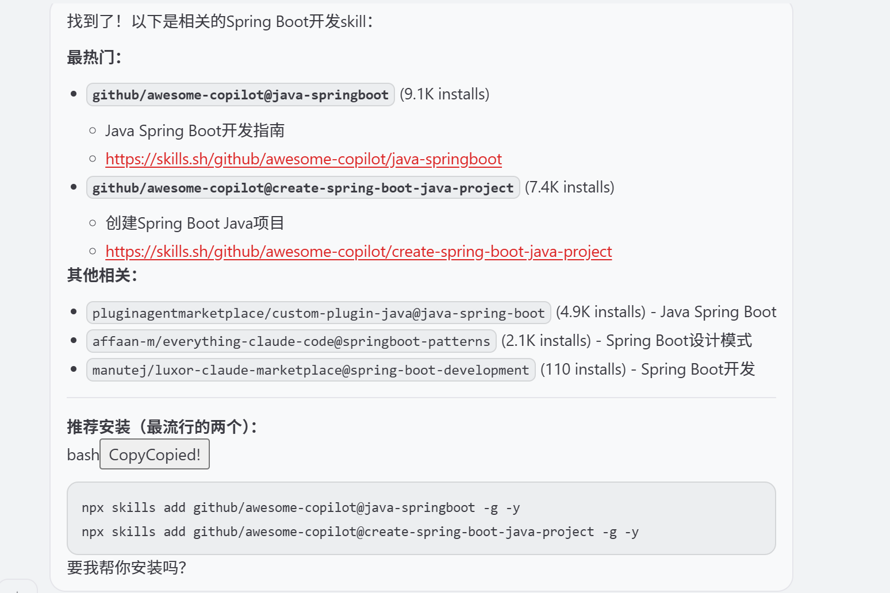
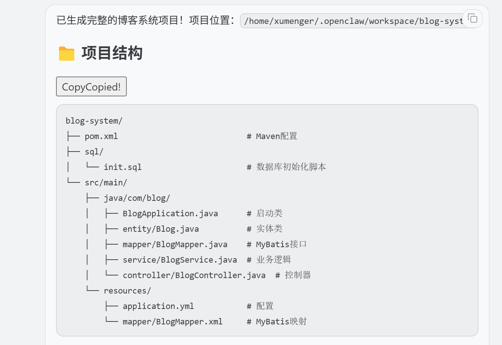
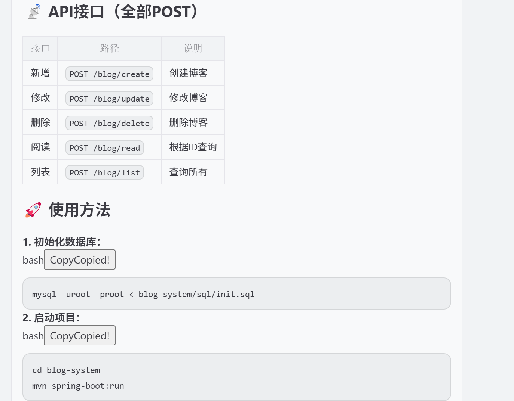
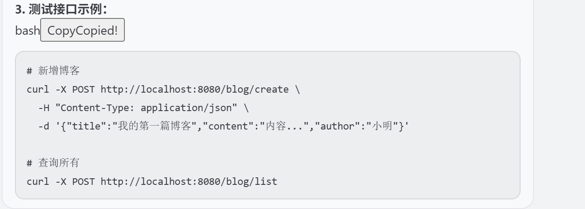

尝试去问OpenClaw：帮我查一下有什么编写SpringBoot应用的Skill？



执行下面的命令安装这个Skill

```shell
npx skills add github/awesome-copilot@java-springboot -g -y
npx skills add github/awesome-copilot@create-spring-boot-java-project -g -y
```

参考[《Cursor 辅助开发：Cursor 开发Spring 应用》](https://xumenger.github.io/01-cursor-develop-java-20260315/)

使用同样的对话内容告知OpenClaw：

```
我要实现一个博客系统，这个系统的功能包括
1. 新增博客
2. 修改博客
3. 删除博客
4. 阅读博客

所有的接口都是POST请求的，不使用GET、PUT、DELETE

使用的技术栈包括
1. 使用SpringBoot开发后端业务逻辑
2. 使用MyBatis去访问数据库
3. 数据存储使用MySQL数据库

数据库的地址为localhost，端口为3306，用户名为root，密码为root

要求帮我生成基于SpringBoot的后端程序代码，并且生成需要的表结构
```

最终生成如下代码：







对应的代码如下所示，可以基本是符合预期的

>当然到目前为止，AI 生成的代码都是比较简单的，如果编写一个非常复杂的业务逻辑呢？如果是对屎山代码进行重构呢？
