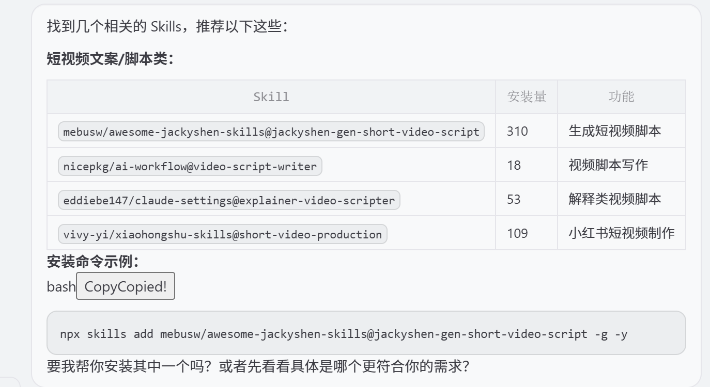
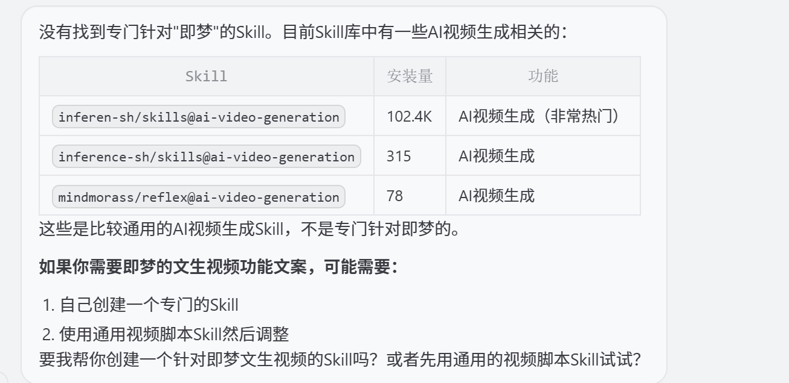

先问OpenClaw：帮我查一下有什么编写短视频文案、脚本的Skill？



执行下面的命令分别进行安装

```shell 
npx skills add mebusw/awesome-jackyshen-skills@jackyshen-gen-short-video-script -g -y
npx skills add vivy-yi/xiaohongshu-skills@short-video-production -g -y
```

继续问问题：帮我查一下有什么关于即梦文生视频功能文案的Skill



安装最热门的Skill

```shell
npx skills add inferen-sh/skills@ai-video-generation -g -y
```

输入下面的提示词

```
你是一个短视频创作博主，专门制作儿童寓言故事的短视频
要求是吉卜力、童话风格，以绿色治愈感为主
创作一个15s左右的视频脚本，要求给出明确的分镜脚本
故事的主题是：朋友、误会、和好
并且同步给出文生图、文生视频的提示词
```

-----

# OpenClaw的输出

朋友、误会、和好， 15秒儿童寓言

### 分镜脚本

| 时间 | 画面内容 | 文案/台词 |
|------|----------|-----------|
| **0-3s** | 【特写】小兔子生气转身，"哼！" | "我不跟你玩了！" |
| **3-6s** | 【闪回】小鸟说"叶子可以这样画" | 旁白："原来，小鸟只是想帮忙..." |
| **6-9s** | 【中景】小鸟飞到面前 | "我是说叶子可以更漂亮呀！" |
| **9-12s** | 【特写】兔子眨眼，明白了 | 旁白："原来，是误会~" |
| **12-15s** | 【全景】两人手拉手，萤火虫飞起 | "朋友要说出来呀~" |

### AI生成提示词

** 🎨 文生图，主画面：和好**
```
吉卜力动画风格，小兔子和小鸟手拉手站在草地上，萤火虫纷飞，森林背景，绿色治愈系，
夕阳暖光，童话故事感，温馨梦幻， 
Studio Ghibli, disney, heartwarming, fireflies, green palette, 8k
```

**🎬 文生视频**

```
Animated short, a little rabbit and bird reconcile after misunderstanding in a magical forest, 
Studio Ghibli style, green pastel colors,治愈系童话, gentle music, heartwarming moment, 
fireflies glowing, sunset scene, disney quality, 2D animation, 15 seconds, loopable, no dialogue 
--aspect 9:16 --duration 15s
```

**分镜片段**

1. **兔子生气**
```
Cute white rabbit turning away with angry expression, Studio Ghibli animation, 
green forest background, anime style 
--aspect 9:16 --duration 3s
```

2. **和好**
```
Two small animals holding hands, fireflies floating, magical forest sunset, 
Studio Ghibli aesthetic, warm green palette, disney quality 
--aspect 9:16 --duration 5s
```


# 豆包生成的内容

### 核心风格

吉卜力童话风，绿色治愈系（大片草地、嫩绿色树叶、浅绿背景），画面柔和通透，角色圆润可爱，色调温暖柔和，无尖锐线条，节奏舒缓不急促。

### 核心主题

朋友间的小误会，坦诚后终会和好，传递温暖友爱的内核。

### 角色设定

- 小兔：米白色绒毛，长耳朵带浅粉尖，圆眼睛，性格软萌，手里常抱一片三叶草。
- 小松鼠：浅棕色绒毛，大尾巴蓬松，圆脸蛋，手里常攥着一颗松果。

### 分镜脚本（总时长15s）

|镜号|时长|画面内容|音效/配音（儿童软萌音）|备注（画面重点）|
|---|---|---|---|---|
|1|0-3s|俯拍：嫩绿色草地，阳光透过梧桐树叶洒下光斑，小兔蹲在草地，手里举着三叶草，朝镜头方向挥手，小松鼠蹦蹦跳跳跑过来，手里攥着松果。|轻快的木吉他前奏，配音：“小兔小兔，你看我找到的松果～”|绿色为主色调，光斑柔和，角色动作圆润，贴合吉卜力治愈感。|
|2|3-6s|中景：小松鼠蹦跳时，松果不小心掉在小兔的三叶草上，三叶草叶片被压弯，小兔皱起眉头，把三叶草捡起来，噘着嘴转过身，不理小松鼠。|“啪嗒”松果掉落声，配音（小兔）：“你弄坏我的三叶草啦！”（语气委屈）|突出小兔的委屈，小松鼠的慌张，画面色调不变，细节到位（三叶草弯曲、小兔表情）。|
|3|6-9s|近景：小松鼠愣在原地，耳朵耷拉下来，手里攥着另一颗松果，小声道歉，小兔背对着它，肩膀微微耸起，手里紧紧攥着压弯的三叶草。|配音（小松鼠）：“对…对不起，我不是故意的…”（语气慌张、愧疚），背景音乐放缓。|侧重角色情绪，小松鼠的愧疚和小兔的小别扭，背景虚化，突出主体。|
|4|9-12s|中景：小松鼠蹲下来，小心翼翼地帮小兔把三叶草的叶片理直，又把手里的小松果递给小兔；小兔转过身，看着理直的三叶草和松果，表情缓和，嘴角微微上扬。|轻柔的碰触感音效，配音（小兔）：“没关系～”（语气变软）|治愈感拉满，小松鼠的小心翼翼，小兔的原谅，画面温暖柔和。|
|5|12-15s|全景：小兔和小松鼠并肩蹲在草地上，小兔举着理直的三叶草，小松鼠拿着松果，两人对着镜头微笑，背景是漫天飘落的梧桐叶（浅绿+浅黄），镜头慢慢拉远，定格在两人的背影。|背景音乐回升轻快，配音（合）：“好朋友，不吵架～”，结尾加轻柔的“叮”声。|结尾点题，画面干净治愈，绿色基调贯穿，呼应吉卜力风格。|

### 文生图/文生视频提示词（适配吉卜力+绿色治愈风）

**一、文生图提示词（每镜适配，核心统一）**

核心提示词：吉卜力工作室风格，儿童童话风，绿色治愈系，柔和通透色调，嫩绿色草地，梧桐树叶，光斑，圆润可爱的小动物，软萌小兔，蓬松小松鼠，线条柔和，无尖锐感，细节细腻，温暖阳光，高清8k，画面干净，治愈氛围拉满。

分镜适配补充：

- 镜1补充：俯拍视角，三叶草，松果，阳光洒下的光斑，角色互动感强。
- 镜2补充：中景，委屈的小兔，掉落的松果，压弯的三叶草，表情细腻。
- 镜3补充：近景，耷拉耳朵的小松鼠，愧疚表情，虚化背景，突出角色情绪。
- 镜4补充：中景，小松鼠整理三叶草，递松果，小兔微笑，温柔氛围。
- 镜5补充：全景，并肩的小兔和小松鼠，飘落的梧桐叶，背影，镜头拉远，治愈结尾。

**二、文生视频提示词（整体适配，贴合15s节奏）**

吉卜力工作室动画风格，儿童寓言短视频，15秒，绿色治愈系，嫩绿色草地背景，圆润软萌的小兔和小松鼠，动作流畅柔和，表情细腻，阳光透过树叶洒下光斑，画面通透温暖，色调柔和不刺眼，节奏舒缓，无激烈动作，传递友爱治愈的氛围，高清1080p，动画流畅，细节拉满，背景音乐为轻快木吉他曲，搭配儿童软萌配音，结尾定格温暖画面。

### 补充说明

1.  时长控制：每镜严格卡时，避免拖沓，确保15s内完成“相遇-误会-道歉-和好-结尾”的完整剧情；
2.  风格把控：全程围绕吉卜力治愈风，拒绝鲜艳刺眼的颜色，以浅绿、米白、浅棕为主，画面柔和，符合儿童审美；
3.  提示词适配：文生图/视频提示词可直接复制使用，补充部分可根据实际生成效果微调，重点突出“吉卜力”“绿色治愈”“软萌角色”三个核心。
