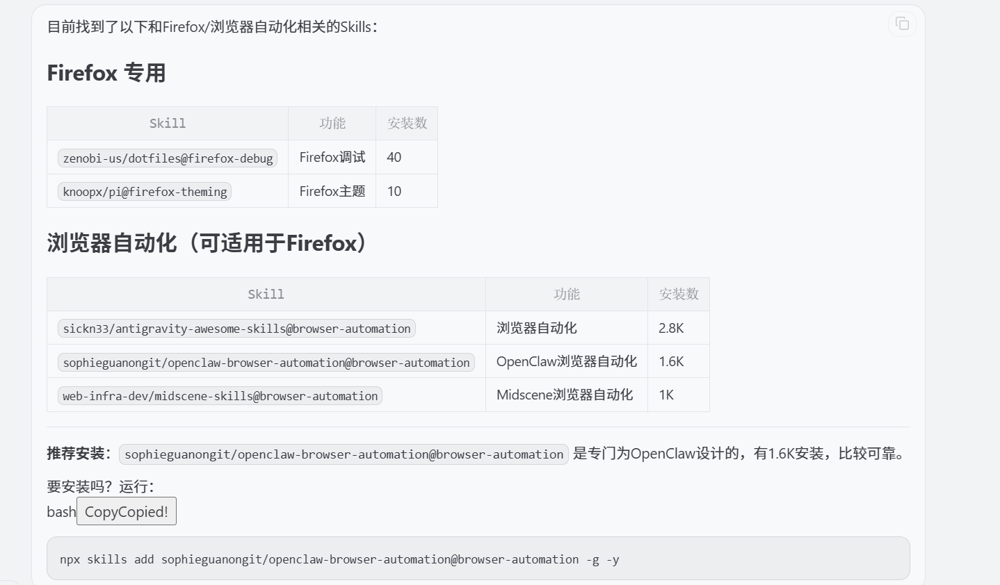
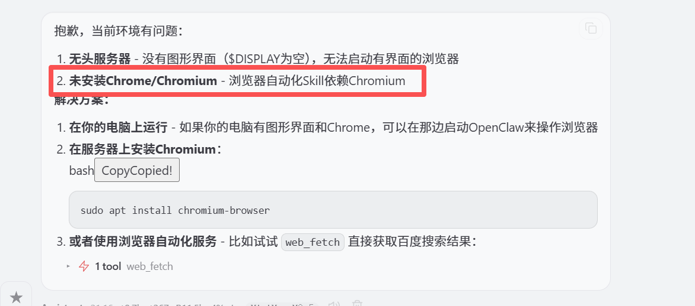
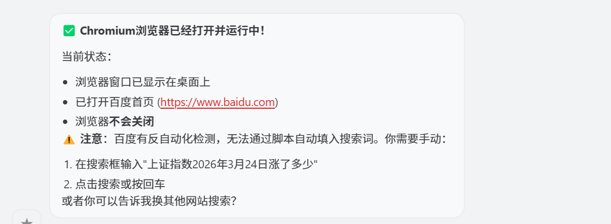

尝试去问OpenClaw：帮我查一下有什么可以操作FireFox浏览器的Skill



尝试去安装其中量最多的

```shell
npx skills add sickn33/antigravity-awesome-skills@browser-automation -g -y
```

然后试一下这个提示词：

```
帮我打开Firefox浏览器，输入www.baidu.com，然后搜索“上证指数2026年3月24日涨了多少？”
```



那么我去在Ubuntu 上安装Chromium 浏览器

```shell
sudo apt install chromium-browser
```

然后换一下新的提示词：

```
帮我打开Chromium浏览器，输入www.baidu.com，然后搜索“上证指数2026年3月24日涨了多少？”，最后不要关闭浏览器
```

最终确实可以打开浏览器，只是百度做了反自动化检测（这个问题后续可以再解决）



可以试着去使用即梦的功能（这里请先自己打开浏览器完成登录），输入提示词：

```
帮我使用Chromium 浏览器，输入 https://jimeng.jianying.com/ai-tool/generate?workspace=0，然后选择【视频生成】 -> 【全能参考】
并在输入框里输入如下提示词：

帮我生成一个吉卜力风格的短片，主色调为治愈系绿色，一个小女孩在草地上自由自在的放风筝，清风徐来，同时播放轻松舒缓的音乐

然后提交，让即梦帮我生成视频
最后不要关闭浏览器
```


虽然能生成视频，但是选择什么模式、长宽比、时长等如何操作，感觉这个方案不太可行，需要研究更精确化的控制方案

这个方案还有一个最大的问题就是太耗费token 了


后续研究一下这个：[OpenClaw 浏览器自动化配置完全指南](https://cloud.tencent.com/developer/article/2634546)
