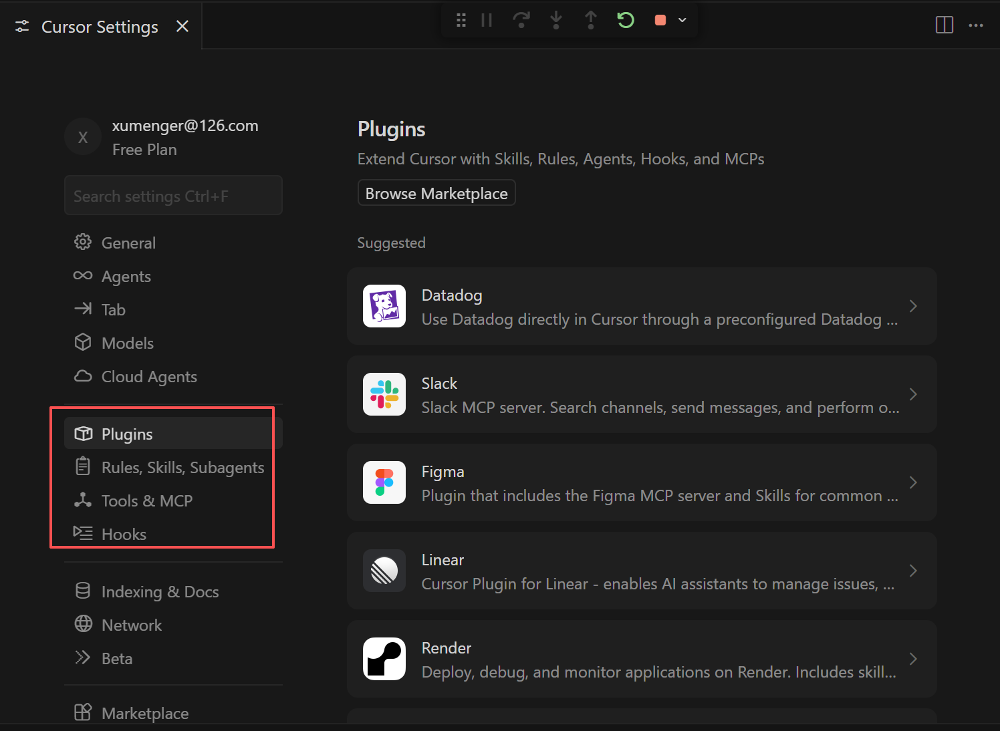
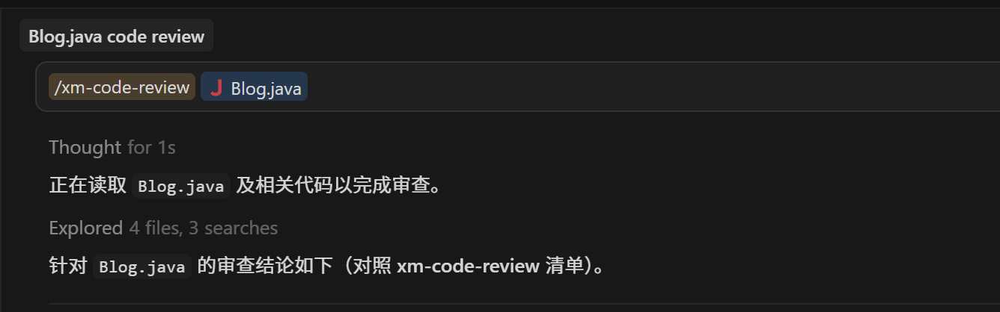
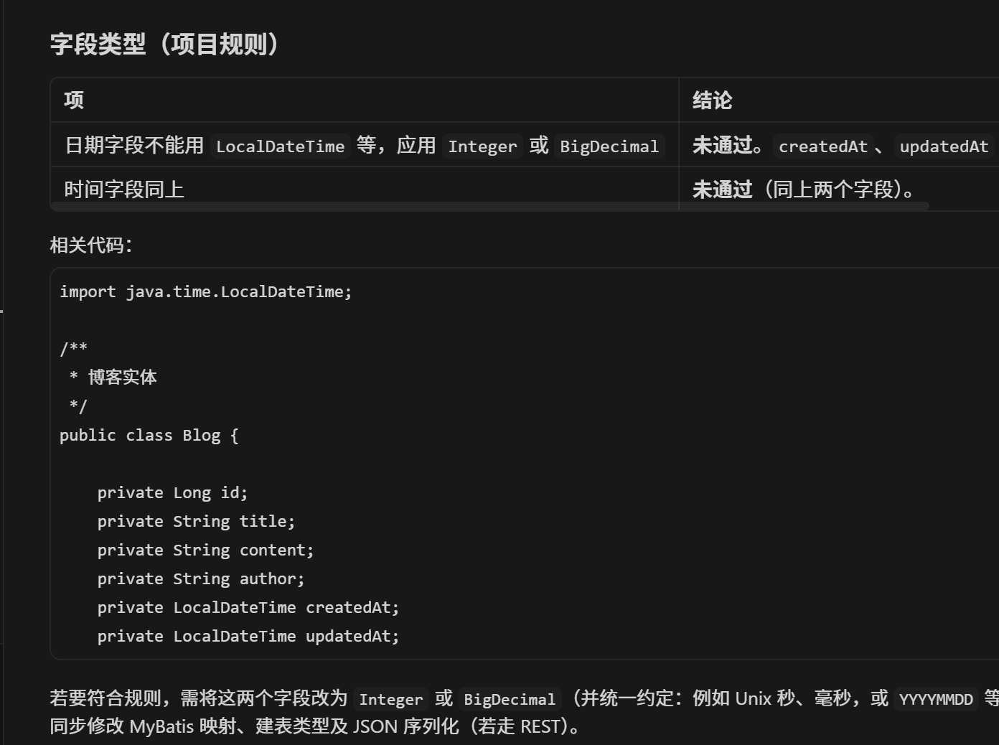
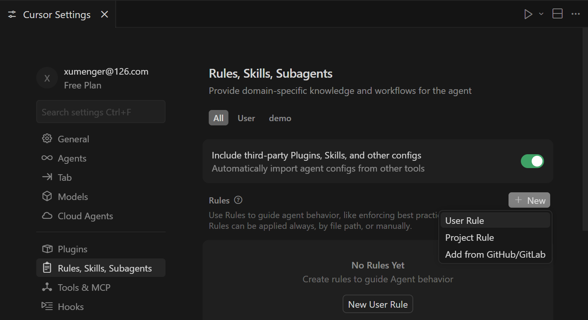
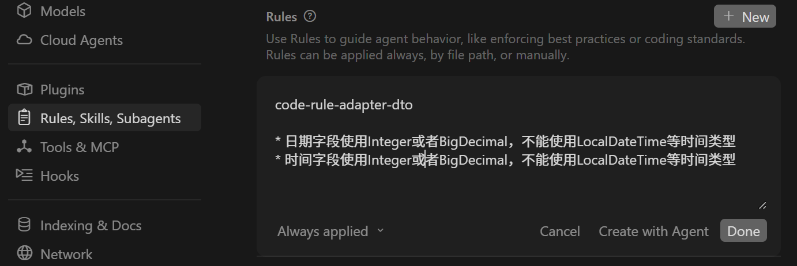
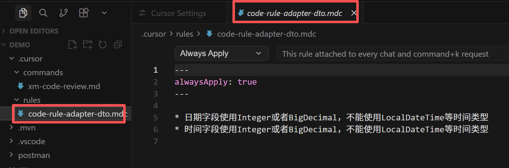
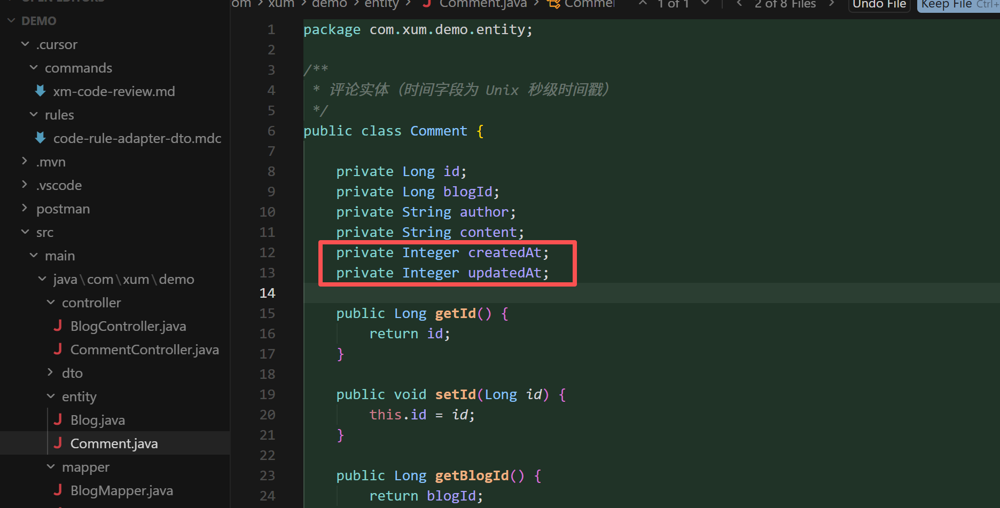

## 参考资料

* [https://github.com/xiaoweidotnet/awesome-cursor-rules-mdc](https://github.com/xiaoweidotnet/awesome-cursor-rules-mdc)
* [https://github.com/modelcontextprotocol/servers](https://github.com/modelcontextprotocol/servers)
* [浅析为什么要用Cursor Commands及在日常开发中如何使用的最佳实践](https://www.cnblogs.com/goloving/p/19400929)

## 代码库搜索

代码库搜索是Cursor 最强大的功能之一。它通过为代码文件创建嵌入向量，帮助AI 全面理解你的项目。这个功能让AI 能“看见”整个代码库，而不仅仅是当前打开的文件


代码会分成小块上传到服务器计算嵌入向量，所有明文代码在请求后会立即删除，只有嵌入向量和元数据（如哈希值、文件名）会存储在数据库中，源代码本身不会被保存

Cursor Settings 可以对插件、规则、技能、MCP、工具、钩子进行配置



## command

>本质是把你常用的提示词保存成 .md 文件，需要时一键调用

对于一些相似度很高的编码，可以自定义command，把步骤和约束形成文档，后面使用，来一键生成代码，省的重复沟通，核心也是文档驱动

比如创建一个xm-code-review 的command，然后编写命令（默认创建的是项目级command，放在.cursor/commands/


```
# xm-code-review

请对当前代码进行审查，检查以下方面：

## 功能性
- [ ] 代码按预期运行
- [ ] 边界情况已处理
- [ ] 错误处理适当

## 代码质量
- [ ] 函数小而专注
- [ ] 变量命名清晰
- [ ] 无重复代码

## 字段类型

- [] 日期字段使用Integer或者BigDecimal，不能使用LocalDateTime等时间类型
- [] 时间字段使用Integer或者BigDecimal，不能使用LocalDateTime等时间类型

## 安全性
- [ ] 无硬编码密钥
- [ ] 输入已验证
```

可以用这样的方式来触发对某个文件的代码检视





比如对于DDD 架构的SpringBoot 应用，后续可以针对适配器层（包括DTO 等）、应用层、领域层（实体、领域服务）、基础设施层（PO、SQL 等）分别编写对应的代码检视命令，并且逐步沉淀足够多的代码检视规则

所以核心还是在于你要对每一层代码需要关注哪些点、可能有什么风险有足够的经验，并且进行清晰的总结！

## rule

比如每次沟通都要约束“不要生成中文注释、改代码前先经过我同意”，那么可以把这个约束放到rules 中作为全局约束

Command 与Rule 的区别？Rules 可以理解为“你应该始终这样做”、Command 可以理解为“当我说这个词时，帮我做这件事”

|  维度     | Command           |  Rule |
|  ----    | ----               |  --- |
| 触发方式  | 手动输入/命令       | 自动生效，无需触发 |
| 作用时机  | 执行特定任务时      | 每次对话都生效 |
| 本质      | 任务模板           | 行为约束 |
| 类比      | 菜谱（做特定菜时看）| 厨房规章（始终遵守） |

可以先去创建一个Rule 规则文件，为了测试，我先创建一个Project Rule





```
* 日期字段使用Integer或者BigDecimal，不能使用LocalDateTime等时间类型
* 时间字段使用Integer或者BigDecimal，不能使用LocalDateTime等时间类型
```



在[Cursor 辅助开发：Cursor 开发Spring 应用](https://xumenger.github.io/01-cursor-develop-java-20260315/) 测试项目的基础上继续使用Cursor 辅助增加更多功能

```
继续完善当前项目，增加评论相关的功能，包括：
1. 新增评论
2. 修改评论
3. 删除评论
4. 阅读评论

所有的接口都是POST请求的，不使用GET、PUT、DELETE

使用的技术栈包括
1. 使用SpringBoot开发后端业务逻辑
2. 使用MyBatis去访问数据库
3. 数据存储使用MySQL数据库

数据库的地址为localhost，端口为3306，用户名为root，密码为root

要求帮我生成基于SpringBoot的后端程序代码，并且生成需要的表结构
```



看到这个时候生成的实体对象，日期字段就是用的我们要求的Integer 类型
