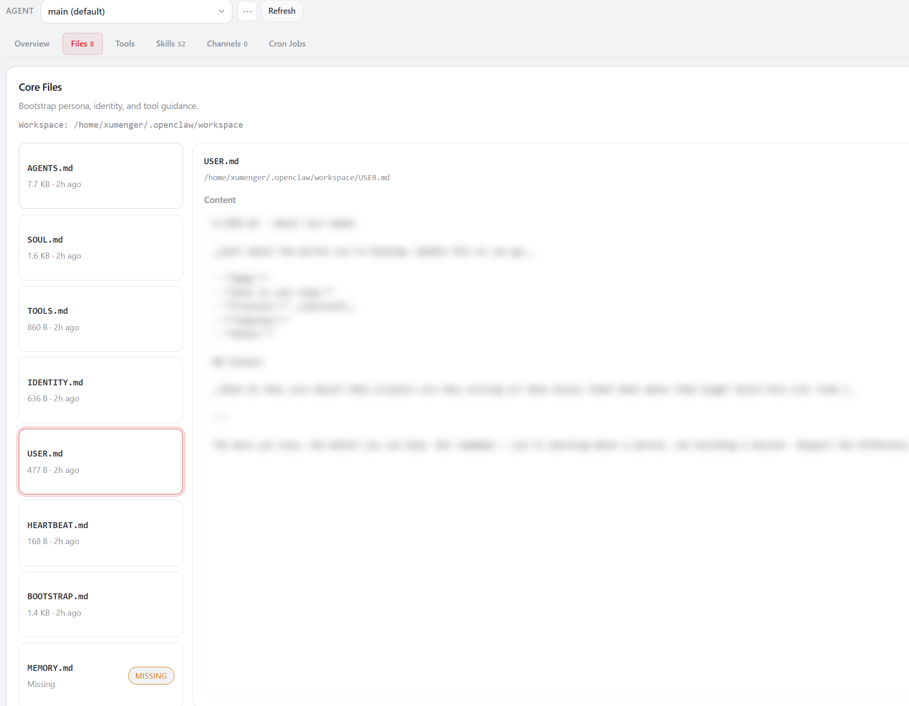
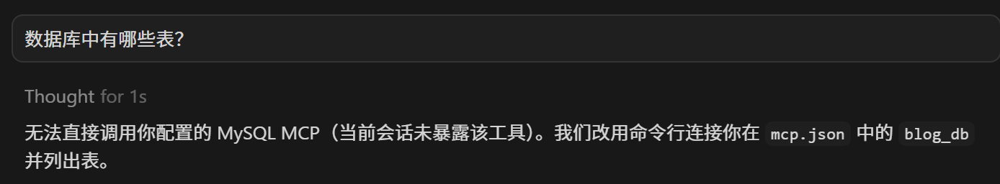

## 参考内容

* [ai code工具](https://blog.csdn.net/w_t_y_y/category_13139783.html)
* [工具Cursor（三）MCP（1）配置方法和调用链](https://blog.csdn.net/w_t_y_y/article/details/157020464)
* [知识体系——MCP（一）介绍](https://blog.csdn.net/w_t_y_y/article/details/154487059)
* [工具Cursor（三）MCP（2）在cursor中使用mcp](https://blog.csdn.net/w_t_y_y/article/details/157021419)
* [AI Agent 开发实战：MCP 的工作原理](https://xumenger.github.io/03-agent-20260223/)

## MCP

mcpServers 是Cursor 作为MCP Host 的进程启动与管理配置，它解决的不是MCP 协议本身，而是：如何启动一个MCP Server 进程，并通过stdio 与它通信，所以它的本质是“进程启动描述符”，其结构为

```json
{
  "mcpServers": {
    "<server-id>": {
      "command": "<executable>",
      "args": [ "<arg1>", "<arg2>", ... ],
      "env": { "<key>": "<value>" }
    }
  }
}
```

比如我用[designcomputer/mysql_mcp_server](https://github.com/designcomputer/mysql_mcp_server) 进行测试

Windows 先[安装node.js](https://nodejs.org/zh-cn/)

```shell
# 查看node是否安装完成
node -v
npm -v

# 全局安装（推荐）MySQL MCP
npm install -g @benborla29/mcp-server-mysql
```

然后在Cursor 中配置



```json
{
  "mcpServers": {
    "mysql": {
      "command": "npx",
      "args": [
        "-y",
        "@benborla29/mcp-server-mysql",
        "--host", "localhost",
        "--port", "3306",
        "--user", "root",
        "--password", "root",
        "--database", "blog_db"
      ],
      "autoApprove": ["query", "execute", "describe_table"],
      "enabled": "true",
      "expose_to_session": "true"
    }
  }
}
```

注意需要重启Cursor！可以查看这个MCP 的功能


然后可以在Cursor 中通过自然语言来操作数据库，但是出现这个报错：无法直接调用你配置的 MySQL MCP（当前会话未暴露该工具）。



修改为这样的配置

```json
{
  "mcpServers": {
    "mysql": {
      "command": "npx",
      "args": [
        "-y",
        "@benborla29/mcp-server-mysql"
      ],
      "env": {
        "MYSQL_HOST": "127.0.0.1",
        "MYSQL_PORT": "3306",
        "MYSQL_USER": "root",
        "MYSQL_PASS": "root",
        "MYSQL_DB": "blog_db",
        "ALLOW_INSERT_OPERATION": "true",
        "ALLOW_UPDATE_OPERATION": "true",
        "ALLOW_DELETE_OPERATION": "true"
      }
    }
  }
}
```

试用效果如下：


>基于这个MCP Tool，后续是否可以进一步完善，比如可以实现在开发环境分析报错信息，主动去数据库查询相关信息，自动化排错

